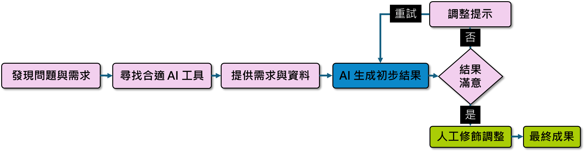
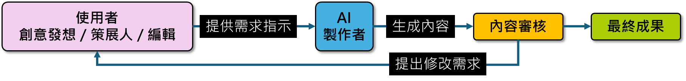
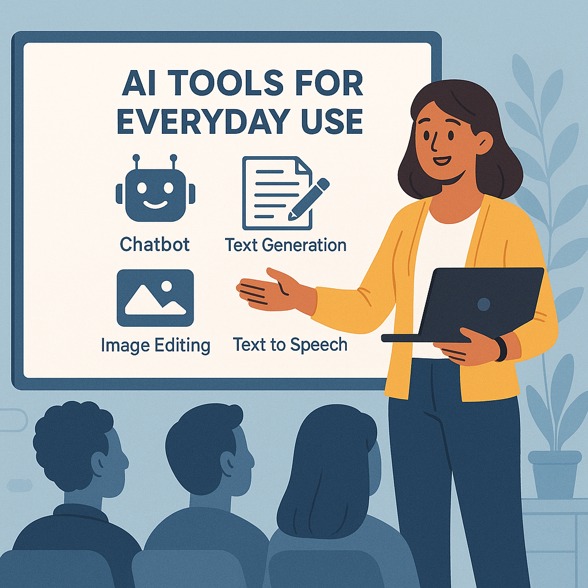
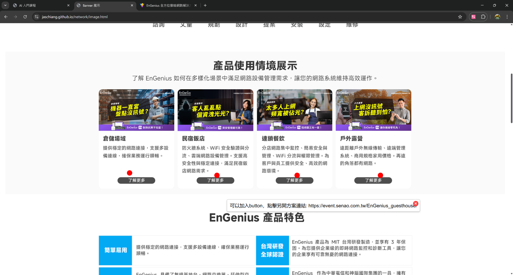
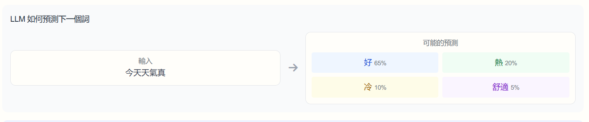

> [!info] 本文由來
> 這篇是我內部分享簡報「2025 年版 AI 使用經歷」的整理版，記錄這一年我實際把 AI 工具用在工作上的方法與選擇。

## 我運用 AI 的工作流程

我使用 AI 的方式很簡單：先發現工作上的痛點或需求，再對應到合適的一種或多種 AI 服務上。

整體流程大致如下：

1. **發現問題與需求**
2. **尋找合適 AI 工具**
3. **提供需求與資料**
4. **調整提示**
5. **AI 生成初步結果**
6. **不滿意 → 重試；滿意 → 人工修飾調整**
7. **最終成果**

### 我和 AI 的關係：誰是創作者？

對我來說，**我是創意發想者、策展人、編輯、最終內容審核者**；AI 是製作者。我提供需求指示，AI 生成內容，我提出修改需求，這個循環會持續到我滿意為止。

當第一次生成不理想時，我有三種選擇：

1. **給予新提示**（接著繼續對話）
2. **編輯上一次提示重新生成**（修正原始 prompt）
3. **開新對話串**（重新來過，避免上下文污染）

哪一種都不是萬能的，要看狀況選擇。一般來說，方向錯了用 3，細節不對用 2，要繼續細化用 1。

---

## 日常使用的 AI 工具

我把日常使用的場景分成七大類：

1. 模仿文風生成初稿
2. 快速取得資料與摘要
3. 分析既有資料與摘要
4. 圖片生成
5. 外語翻譯工具
6. 程式開發協助
7. 簡報排版設計

下面分別介紹每個場景我主要用的工具與心得。

---

### 1. 模仿文風生成初稿 — Claude Projects

**主推工具**：Claude Projects（需訂閱）  
**相關工具**：ChatGPT 專案

**使用場景**：
- 快速生成拍攝腳本
- 快速生成文章初稿
- 快速生成 YouTube 影片描述
- 快速生成社群貼文

**流程**：
1. 上傳過往腳本 / 文章建立專案
2. 設定專案指令（語氣、結構、禁忌詞等）
3. 提供新需求或資料
4. 編修生成的腳本

> [!warning] 注意
> AI 生成的內容必須校稿，特別要修飾「AI 腔」、改掉非台灣用語（例如「視頻」改「影片」、「軟件」改「軟體」）。

> [!tip] 進階技巧
> 用 **Claude Desktop 搭配 Notion MCP**，可以把生成的文本自動儲存到 Notion，省下手動複製貼上的時間。

---

### 2. 快速取得資料與摘要 — Gemini Deep Research

**主推工具**：Gemini Deep Research（額度限制）  
**相關工具**：ChatGPT 深入研究、Grok DeepSearch、Perplexity 研究

**使用場景**：整理資料與製作研究報告。

**流程**：
1. 輸入需求
2. **確認研究計畫**（這步很重要，可以細讀計畫加強搜尋方向）
3. 等待報告完成
4. 根據報告內容繼續對話深挖

> [!warning] 注意
> 搜尋資料的品質會依服務和需求不同。記得**查核**重要事實。中文資料品質有限時，可以**指定英文搜尋、中文回應**。

> [!tip] 進階技巧
> 用 Canvas 功能可以把研究報告直接生成為網頁，方便分享。

---

### 3. 分析既有資料與摘要 — NotebookLM

**主推工具**：NotebookLM（免費）  
**相關工具**：Hetabase、MacWhisper、ollama + Open WebUI、LM Studio

**使用場景**：學習、分析 PDF、網站、影片、音訊等資料。

**流程**：
1. 上傳一筆或多筆資料
2. 等待分析完成
3. 透過對話詢問
4. 視需要生成心智圖、語音摘要

> [!warning] 注意
> 建議在對資料**有一定程度了解後**，做為複習工具使用。否則 AI 的摘要可能漏掉你不知道但其實重要的細節。

> [!tip] 進階技巧
> 沒有機敏資料的會議錄音，可以丟進去快速生成會議紀錄。

---

### 4. 圖片生成

#### 自行訓練：本地 ComfyUI

**主推工具**：本地 ComfyUI（免費）  
**相關工具**：雲端 ComfyUI、DrawThings

**使用場景**：
- 快速發想視覺示意
- 減少尋找示意圖的時間
- 降低因文字溝通誤會的成本

**流程**：
1. 收集 30~40 張相關圖片
2. 根據圖片內容打標並訓練（LoRA）
3. 在 ComfyUI 使用訓練好的模型
4. 根據結果調整提示詞
5. 遴選出品質較佳的圖片

> [!warning] 注意
> 自行在本機訓練需要一定規格的設備（VRAM 12GB+ 比較舒服）。

> [!tip] 進階技巧
> 可以用 ChatGPT 輔助生成提示詞；記住生成結果較佳的參數配置，下次直接套用。

#### 雲端方案：FLUX.1 Kontext

**主推工具**：FLUX.1 Kontext（額度限制，2025/5/31 推出）  
**相關工具**：Midjourney、4o 圖像生成、Sora、Gemini 圖像生成、fal.ai、Replicate

**特點**：免訓練、可保持高度一致性。

**流程**：
1. 挑選適合的既有圖片
2. 根據需求編寫提示詞
3. 根據結果調整
4. 遴選出品質較佳的圖片

實測：生成速度約 13.44 秒，成本約 0.08 美元。

---

### 5. 外語翻譯 — 沉浸式翻譯

**主推工具**：沉浸式翻譯（免費，瀏覽器擴充套件）

**特點**：
- 免費版預設使用 Google 翻譯
- 訂閱可使用 AI 翻譯
- **可使用自己的 OpenAI API 金鑰**

**流程**：
1. 安裝擴充套件
2. 打開想翻譯的網站
3. 點選擴充套件選擇翻譯服務

> [!tip] 進階技巧
> 如果不想付費訂閱又想用 AI 翻譯，可以透過 ollama 跑地端模型，搭配沉浸式翻譯使用。

---

### 6. 程式開發協助 — AI IDE 系列

**主推工具**：Windsurf / Cursor / Trae / Kiro（有試用期）  
**相關工具**：Claude Artifacts / Claude Code、ChatGPT 畫布 / Codex、Gemini Canvas / CLI、GitHub Copilot、Cline、Perplexity Labs

**使用場景**：自己就能完成簡單的小專案，不會程式設計也能開發。

**流程**：
1. 拆分需求輸入，或先與 AI 討論架構
2. 等待 AI IDE 開發
3. 測試並確認功能
4. 提出調整需求
5. **使用 GitHub / Git 版本控制**（讓你能隨時回溯）

> [!tip] 關鍵技巧
> 使用**自訂規則與 README** 訂定專案規範，盡量避免 AI 超出需求範圍亂加功能。

#### 實際案例

我用這個方式做出了好幾個內部工具：

- **EnGenius 活動頁設計示意**
- **活動頁調整備註器**
- **AI 入門課程對外版**
- **UTM 網址與短網址產生器**：[https://jaschiang.github.io/marketing/](https://jaschiang.github.io/marketing/)

延伸閱讀關鍵字：搜尋「**Vibe Coding**」。

---

### 7. 簡報排版設計 — Claude Artifacts

**主推工具**：Claude Artifacts（免費可用）  
**相關工具**：Gamma、Napkin、Gemini Canvas、ChatGPT 畫布

**使用場景**：快速取得多種簡報模板想法。

**流程**：
1. 提供需求或資料
2. 等待簡報設計完成
3. 根據生成結果提出調整需求
4. 至 PowerPoint 中重現你喜歡的設計

> [!warning] 注意
> 機敏資料記得隱藏或替換掉再丟給 AI。

---

## 評估中的 AI 工具

這幾個工具我目前還在評估，還沒納入日常工作流，但已經有實際嘗試。

### 影片生成 — Sora + Veo 2

**流程**：用 Sora 等工具生成圖片 → 至 Google Veo 2 生成影片 → 根據結果調整

**相關工具**：Kling AI、Runway、Hailuo AI

> [!tip] 技巧
> 可搭配多種生成工具或運用剪輯技巧藏拙。完美的單一鏡頭很難，但分段生成 + 剪接可以做出可看的成果。

延伸閱讀：[華爾街日報運用 AI 生成電影的體驗](https://youtu.be/US2gO7UYEfY)

### 語音複製生成 — Index-TTS

**特點**：免訓練即可複製生成，節省配音時間。

**流程**：
1. 選擇 15 秒左右的過往配音
2. 將需求文本轉為簡中
3. 等待生成結果
4. 若有需要則調整生成參數

**相關工具**：GPT-SoVITS、ElevenLabs、CosyVoice 2、VoAI 絕好聲創

> [!tip] 技巧
> **數字需轉成國字**，否則只會一個一個唸。**分段生成**效果較佳。

### 3D 模型製作 — Hunyuan3D

**特點**：只要圖片即可快速生成 3D 模型。

**使用場景**：
- 將模型列印出做為拍攝道具
- 生成具陰影或 3D 質感的圖片素材

**相關工具**：Tripo 3D、Trellis

---

## 如何面對 AI 工具

工具是次要的，**心態才是主要的**。我覺得有四件事比工具更重要。

### 1. 了解 Gen AI 的原理與侷限

生成式 AI（Gen AI）的本質是一種基於大量資料訓練的系統，原理是**預測接下來最可能出現的內容**，就像「接龍」的進階版。

舉例：當你輸入「今天天氣真」，模型可能的預測：
- 好（65%）
- 熱（20%）
- 冷（10%）
- 舒適（5%）

> [!warning] 重要認知
> 目前主流的 AI 服務多半已有聯網搜尋資料能力，可以提供最新資訊，但仍請注意資料的準確性。「會接龍」不等於「知道對的答案」。

延伸閱讀：[台大李宏毅教授【生成式 AI 導論】](https://www.youtube.com/@HungyiLeeNTU)

### 2. 了解訂閱 AI 服務的好處

付費訂閱能使用訂閱專屬功能，取得更多高階模型額度，盡可能讓使用者更快地取得成果。

| 比較項目 | 免費 | 訂閱 |
|---|---|---|
| 使用額度 | 有限 | 更高 |
| 模型版本 | 較舊或輕量版 | 最新最強的模型 |
| 專屬功能 | 基本功能 | 專案等進階功能 |
| 回應速度 | 高峰期可能較慢 | 回應較快 |

我的比喻：免費版像「**猴子打字員**」，理論上拿著打字機或許能敲出莎士比亞，但可能得花上很長一段時間。訂閱版則像用合理薪資請到的優秀員工。**一點小錢就能節省大量時間**。

### 3. 好奇心是使用 AI 的關鍵

不要等別人告訴你「這個工具怎麼用」。看到新的 AI 工具或新功能，就動手試試看。AI 領域變化太快，等待教學的人永遠跟不上自己嘗試的人。

### 4. 如何獲取 AI 資訊

透過 **X**（前 Twitter）和 **YouTube** 可以最快速地取得 AI 相關新訊息。

#### 知識類（X）

- **@AndrewYNg**：AI 教育家和研究者，Coursera 聯合創始人，分享 AI 教育和技術見解
- **@linyiLYi**：AI 研究者，分享中文 AI 知識和技術解析

#### 綜合資訊（X）

- **@imxiaohu**：分享 AI 產品和應用的最新動態
- **@aigclink**：分享 AI 生成內容和工具的最新資訊
- **@dotey**：分享 AI 生成內容和工具的最新資訊
- **@Gorden_Sun**：每日出刊 AI 資訊日報
- **@op7418**：分享 AI 工具和應用的使用心得
- **@GitHub_Daily**：分享 GitHub 上的 AI 工具

#### 圖像相關（X）

- **@ZHO_ZHO_ZHO**：分享 AI 圖像影像生成的最新技術和作品
- **@toyxyz3**：分享 AI 圖像影像生成的應用和工具
- **@8co28**：分享 ACG 相關的 AI 圖像影像生成應用

#### YouTube

- **@HungyiLeeNTU**：台灣大學李宏毅教授，提供深入淺出的機器學習和生成式 AI 課程，特別適合中文學習者

---

## 延伸閱讀

- **Anthropic 提示詞庫資源**：學習怎麼寫好的 prompt
- **WSJ — We Tested Google Veo and Runway to Create This AI Film**：影片 AI 的真實體驗
- **Andrej Karpathy — How I use LLMs**：LLM 使用心得
- **GAIconf 2025**：[https://live.gaiconf.com/courses/gaiconf2025](https://live.gaiconf.com/courses/gaiconf2025)

---

## 結語

AI 工具一年比一年多，**但選擇困難往往來自不知道用在哪**。我的建議是：先想清楚自己工作上有什麼痛點，再去找工具，而不是看到新工具就硬塞使用場景。

工具會持續變動（這篇文章提到的工具，半年後可能有更新或被取代），但**把 AI 當成協作夥伴的心態**不會變。
