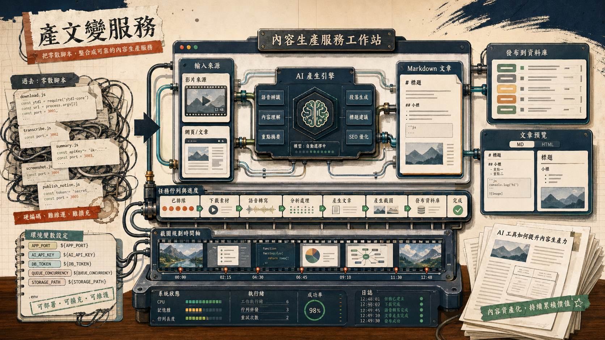

> [!info] 本文由來
> 這是一份由 **Claude Code 整理的草稿**，內容尚未經作者人工審稿，可能有不準確的地方。
>
> 整理依據，
>
> - GitHub repo, `article-generation-service`（private repo） 的 README（若有）、commit 歷史與原始碼
> - Claude Code 工作 session 紀錄, `~/.claude/projects/-Users-jaschiang-Documents-GitHub-article-generation-service/`
> - Codex CLI session 紀錄（2026-01-27，2 sessions），處理了 `htmlToMarkdown` 異步與 port 動態化，內容與 Claude session 高度重疊
>
> 文章開頭的 hero 圖由 **Codex CLI 內建的 image_gen 工具**生成（OpenAI gpt-image-2 模型）。

## 起因

在工作上我們有一個反覆出現的需求，把 YouTube 影片或指定網址的內容，透過 AI 整理成格式固定的 Markdown 文章，再發布到 Notion。

一開始這件事是靠幾支各自獨立的 Node.js 腳本完成，每次改 prompt 或接新的輸入格式，就要去不同地方改程式。改完還要叫同事跑本地環境，操作門檻不低。

更早的前身是 `ai-video-writer`，那個版本的文章生成邏輯和影片處理耦合在一起，兩件事攪在同一個 repo 裡難以維護。`article-generation-service` 就是把文章生成這塊獨立抽出來，做成一個專屬的後端 API 加前端工作台。

後來決定把這套流程做成一個獨立服務，前後端一起，讓不懂程式的人也能直接用瀏覽器操作。

## 主要功能

這個服務目前支援的功能大致分幾塊。

**文章生成**，可以輸入 YouTube 影片連結或任意網址，由後端擷取內容後呼叫 Gemini API，產出 SEO 標題、description 以及完整 Markdown 正文。也支援上傳參考檔案或補充參考網址，讓產出更貼近目標主題。

**截圖時間點規劃**，對於 YouTube 影片，服務會根據文章段落建議截圖時間點，並透過 `yt-dlp` 加 `ffmpeg` 自動截圖，產出可直接嵌入文章的圖片檔。

**Notion 發布整合**，串接 Notion OAuth，可以在工作台直接把文章推送到指定的 Notion 資料庫，不用再手動複製貼上。

**AEO / HTML 輸出**，後來加入了結構化 HTML 格式，針對 AI 搜尋引擎最佳化（AEO）的需求，可在工作台切換 Markdown 和 HTML 預覽。

## 開發過程

初始版本就只是把幾個核心 API route 組在一起，前端用 React 做一個很簡單的表單。

**任務佇列的由來**，影片下載加 AI 呼叫合計可能跑 30–90 秒，同步 API 直接 timeout。第一個真正的架構決策，就是把所有「會跑很久」的工作推進 `taskQueue.js`，前端改成輪詢 `GET /api/task/:taskId`，每秒問一次，直到收到 `status: done` 才渲染結果。這個改動讓 UX 從「等到 timeout 然後白畫面」變成「有進度感的等待」。

**`htmlToMarkdown` 的 async 坑**，Markdown 轉換函數一開始寫成同步，後來改成 async（加入了比較重的 HTML 解析邏輯），但有兩個地方忘了跟上。一個是 `handlePublishToNotion()` 裡沒有 `await`，結果傳給 Notion API 的是一個 Promise 物件；另一個更隱蔽，是 `useMemo` 裡直接呼叫 async 函數，React 的 `useMemo` 不支援 async 回呼，只會拿到 Promise 而不是字串。後者的修法是把 `useMemo` 改成 `useEffect` + `useState`，讓轉換結果非同步更新到 state 裡。這個 bug 本來沒有 UI 報錯，只是 Notion 那邊收到奇怪的內容，找起來花了一點時間。

**Port 寫死的清查**，某次想改部署 port，才發現整個 codebase 至少有六個地方寫死了 3000 或 3001，包含 `vite.config.ts`、`index.tsx`、`serverBaseUrl.ts` 以及幾個 API service 檔案。統一補了環境變數（`VITE_PORT`、`PORT`、`VITE_API_URL`、`VITE_SERVER_BASE_URL`），`.env.example` 也同步更新，這樣換部署環境才不用到處找數字。

**Notion OAuth state 的處理**，OAuth 流程需要一個 state 參數防 CSRF，token 跟 state 都存在 server 記憶體，加了過期清除邏輯，避免記憶體一直長大。這是刻意不用 Redis 的折衷，因為這個服務重啟頻率低，且 Notion token 有效期夠長，用記憶體存就夠。

再後面加了 AEO HTML 模板、文章結構顯示、以及可從環境變數切換 Gemini 模型名稱，讓部署時不用改程式碼。

## 技術選擇

**為什麼做成 service 而不是 CLI，** 最主要的原因是使用者範圍。CLI 只有工程師用得順，但這套流程最後的使用者是內容團隊。做成有前端的服務，他們可以直接在瀏覽器輸入連結、調整參數、預覽結果、一鍵發 Notion，不需要 terminal。

**前後端同一個 repo，** 用 Vite + React 跑前端（port 3000），Express 跑後端（port 3001），`npm run dev:all` 一個指令同時起兩個 process。這樣程式碼好管理，部署也可以直接 `npm run build` 把前端靜態檔產出，再讓 Express 一起 serve。Port 號統一走環境變數，不寫死在程式碼裡，換部署環境不用翻程式碼。

**Gemini 而不是 OpenAI，** 主要是測試下來 Gemini 2.5 Flash 處理長影片逐字稿的速度和成本都比較合適，也支援比較大的 context window，對長影片更友善。模型名稱也做成環境變數，不需要改程式碼就能切換版本。

**ffmpeg + yt-dlp 做截圖，** 這兩個工具穩定成熟，截圖品質夠用，不需要引入其他依賴。唯一的缺點是需要在本機或伺服器上安裝，不是純 JavaScript 方案。截圖時間點由 AI 根據段落建議，不是隨機擷取，品質比定時截圖好很多。

**任務佇列用 in-memory，** 沒有用 Redis 或資料庫，是刻意決策，因為這是內部工具，不需要跨 process 持久化，也不需要排程重試。重啟服務任務就清掉，夠用。如果將來需要讓多個 server instance 共享任務狀態，換 Redis 是最直接的升級路徑。

**AEO HTML 模板的由來，** 原本只輸出 Markdown，後來有了把文章貼到網站 SEO 結構化的需求，才加了 HTML 輸出。格式參考了 FAQ schema 和 HowTo schema 的慣例，讓 AI 搜尋引擎更容易解析段落語意。前端用 tab 切換 Markdown 和 HTML 預覽，兩個格式同時存在，按需選用。

## 心得

做這個專案最有趣的部分，是很多「看起來簡單」的決策背後都有具體的坑。`useMemo` 裡不能用 async 這種事，文件有寫，但實際踩到才會真的記住。Port 寫死也是，平常開發不會感覺到問題，直到要換環境才一口氣發現六個地方要改。

另一個收穫是，「夠用就好」也是一種架構決策。in-memory 任務佇列、記憶體存 OAuth token，這些在一般教學文章裡會被說「不夠 production ready」，但放在這個使用情境下，它們是合理的取捨，維護成本低，不需要額外的基礎設施。要升級的時候路徑也很清楚，不是走不出去的死角。

用 Claude Code 做這個專案的開發輔助，體感上速度提升最明顯的是「搜尋型工作」，像是找出所有寫死 port 的地方、確認所有 async 函數的呼叫是否都有 await，這類需要全 codebase 掃描的任務，交給 AI 做比自己 grep 快很多，也比較不容易漏掉。

## 結語

做成服務之後最明顯的差異是，改 prompt 或加功能只需要改一個地方，使用者不需要動本地環境，整個流程的維護成本降低很多。

這個 repo 後來其實沒有繼續長下去。1/16-17 兩天衝完核心後，我隔幾天就開了 `article-suite` 把這套東西當骨架直接演進，commit 就停在 1/17。事後比對程式碼，**`article-suite` 跟 `article-generation-service` 有十多個檔案 SHA 完全相同**（包含 `services/notionService.js`、`tsconfig.json`、`config.ts`、`taskPollingService.ts`、`prompts/templates/*` 等），所以這個 repo 比較像「短命的中間態」，正式存活下來的是 `article-suite`。

如果想看後續的演進故事，看 [[article-suite|把文章生產線塞進一個工作台，article-suite 開發記]]。
