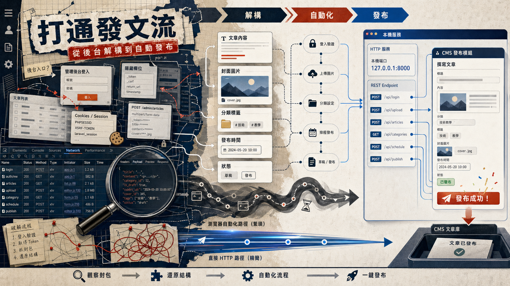

> [!info] 本文由來
> 這是一份由 **Claude Code 整理的草稿**，內容尚未經作者人工審稿，可能有不準確的地方。
>
> 整理依據，
>
> - GitHub repo, [JasChiang/article-publish-senao](https://github.com/JasChiang/article-publish-senao) 的 README（若有）、commit 歷史與原始碼
>
> 文章開頭的 hero 圖由 **Codex CLI 內建的 image_gen 工具**生成（OpenAI gpt-image-2 模型）。

## 起因

我們公司有一套內容管理後台，行銷人員每次要發文都要手動打開後台、填標題、貼內文、上傳縮圖、選分類、設發布時間，然後按送出。一篇文章頂多五分鐘，但如果一週要發十幾篇，加起來就是不小的時間成本，而且這種重複操作特別容易出錯。

我一直想做一個工具，讓這個流程可以從外部直接呼叫 API 觸發，這樣就可以接上 LLM 工具，做到從「AI 生成文章草稿」到「直接推上後台」的完整自動化。問題是，公司後台沒有對外文件，也沒有開放的 API，想串接得自己想辦法。

## 主要功能

這個工具的核心是一個本地跑的 HTTP 服務，對外暴露一個發布端點。只要傳入標題、摘要、HTML 格式的正文、分類標籤、發布時間，工具就會自動登入後台、建立文章、上傳縮圖，搞定整個發布流程。

幾個我用起來比較實用的功能：

- **自動處理文章內圖片**，偵測正文裡的本地圖片路徑，自動上傳並把路徑替換成線上 URL，這樣在本地寫好的文章直接推上去，圖片也不會壞掉
- **支援草稿與正式發布兩種狀態**，可以先推上去當草稿，確認沒問題再在後台點上架
- **排程發布時間**，可以指定未來的時間發布，不用守在電腦前

## 開發過程

最有趣的部分是逆向工程後台 API 這段，這幾乎是全部讓 Claude Code 來做的。

我的做法是打開 Chrome DevTools 的 Network 頁，自己手動操作後台，登入、開新文章、填資料、上傳圖片、送出，同時讓 Claude Code 看著錄下來的 network log。Claude Code 負責分析請求的順序、格式、認證方式，還有後台回應裡藏的各種隱性欄位，然後直接用 Node.js 把整個流程重現出來。

這個過程來回了好幾輪。第一版 Claude Code 用 Playwright 做，直接啟動瀏覽器模擬人工操作，這樣最保險，畢竟不確定哪些欄位、哪個流程順序是必要的。跑起來是跑起來了，但每次發一篇要等 15 秒左右，記憶體吃很多，部署也麻煩。

有了 Playwright 版作為參考之後，Claude Code 再把流程重寫成純 HTTP 請求版。因為已經知道後台的認證機制和 API 結構，這次可以直接用 axios 發請求，速度從 15 秒降到 3 秒，記憶體降了 90%，部署也簡單多了。現在 Playwright 版留著當備用方案，平常主要跑 HTTP 版。

## 技術選擇

整個工具用 Node.js 寫，對外是一個標準的 REST API 伺服器。選 Node.js 主要是因為這類 HTTP 整合工作 JS 的生態很成熟，`axios` 加 `tough-cookie` 就能輕鬆管理 session 和 cookie，處理後台的登入狀態。

對外的 API 設計刻意做得很乾淨，輸入就是文章的幾個基本欄位，不暴露任何後台內部的細節，這樣接上 LLM 工具的時候，提示詞只要描述「標題、摘要、內文、分類」就夠了，不需要知道後台是怎麼運作的。

Playwright 版保留下來是有意為之的決策。逆向工程過程中難免有些後台行為不確定，有個「人工模擬」的備用版本，出問題時可以打開瀏覽器視覺化除錯，會方便很多。

## 心得

（TODO 補上）

## 結語

這個工具本身不大，但它代表的是一種工作流思維，把 AI 生成的東西真正接上業務系統，而不是停在「生成完貼上去」這一步。Claude Code 在其中扮演的角色不是寫功能，而是做逆向分析，把我自己看 Network tab 費力拼湊的過程，直接壓縮成可以跑的程式碼。

對我來說，這類「讓 AI 幫你串接沒有文件的系統」的能力，可能才是 vibe coding 最有用的地方，不是生成樣板程式碼，而是去搞定那些原本要花很多時間才能弄懂的整合細節。
