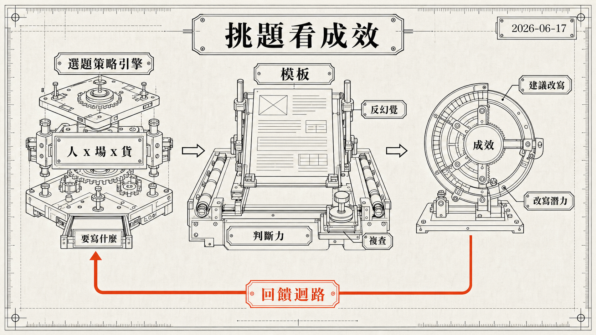

> [!info] 本文由來
> 這是一份由 **Claude Code 整理的草稿**，內容尚未經作者人工審稿，可能有不準確的地方。
>
> 整理依據：
>
> - GitHub repo, `article-suite`（private repo）的 README、CHANGELOG、commit 歷史與原始碼
> - Claude Code 工作 session 紀錄, `~/.claude/projects/` 中 2026/05–06 的 article-suite session
> - Codex CLI 工作 session 紀錄, `~/.codex/sessions/`（2026/05–06 用 Codex 做複查的幾次 session）
>
> 這是 [[article-suite|前一篇 article-suite 開發記]] 的續篇，接續 4 月底那篇之後的故事。
>
> 文章開頭的 hero 圖由 **Codex CLI 內建的 image_gen 工具**生成（OpenAI gpt-image-2 模型）。

## 前情提要

4 月底寫過一篇，記錄這個工具怎麼從「丟一條 YouTube 連結幫我寫文章」的小實驗，長成含生成、編輯、配圖、發布、成效追蹤的內容工作台。那篇寫完時 repo 大約 290 個 commit，故事停在 4 月。

現在是 6 月中，commit 數來到 751。這兩個月又疊了一百多個有實質功能的提交，但重點不在「產文更快」。如果說前三個月在蓋產線，這兩個月工具開始往兩個我原本沒預期的方向長，一個是往前，幫我決定「要寫什麼」，一個是往後，回頭看「寫了到底有沒有用，怎麼改才會更好」。

換句話說，當產文這件事本身變得夠快之後，瓶頸就不再是速度，而是判斷力。這篇就是記錄工具怎麼開始長出這兩塊。

## 最大的轉向，從「幫我寫」到「幫我決定寫什麼」

這兩個月最重要的一塊，是**選題策略引擎**。

起因是我讀到一篇講內容行銷的貼文，講「人 x 場 x 貨」的選題框架，核心概念是去想，什麼樣的人、在什麼場景下遇到什麼問題，剛好可以用我們的商品解決。配合 AEO / GEO 跟 JTBD（Jobs To Be Done）的思路，我突然意識到一件事：工具的模板和產文流程其實已經夠用了，真正缺的不是「寫得更好」，而是「一開始就選對題目」。

（這個框架是那篇貼文啟發的，但當時是直接把文字貼進對話，沒留下原始連結，這裡就不附來源了。這次的開發也沒有 bundle 任何外部的開源程式碼，選題引擎是照著這個概念自己刻的。）

於是做了一個選題策略引擎，丟一個網址或一個主打頁進去，它會分析內容，推導出 5 種受眾、5 種使用場景，再交叉商品，組成最多 5 x 5 x 5、上百個候選題目，然後可以批次生成草稿。它有一個 hybrid 模式，受眾可以自己指定，也可以讓 AI 幫你生。後續還補了幾個強化：本頁主打商品掛載、角度注入、單一題目重生，以及一個可以關掉的 Google 搜尋 grounding 開關。

這個轉向對我來說滿關鍵的。在這之前，工具的價值是「把我想好的題目寫成文章」，我還是得自己坐下來想要寫什麼。有了選題引擎之後，連「想題目」這件最花腦力的事，都能先讓工具丟一整面牆的候選出來，我從裡面挑。

## 成效儀表板長成了改稿工作台

前一篇裡，成效儀表板的功能還停在「看流量」，串 GA4 跟 Google Search Console，列出高流量文章的曝光、點擊、CTR、排名。這兩個月它變成一個會主動叫你改稿的工作台。

加了一條**建議改寫**的分流，每篇文章算一個分數、貼上標籤、列出有機會但還沒拿到點擊的關鍵字（gap query）。一開始的改寫分數公式有問題，用的是「曝光 x (1 - CTR) x 1/排名」，但 CTR 那一項在篩選之後幾乎恆等於 1，沒有鑑別力，而且它假設你能把所有曝光都變成點擊，高估了上限。後來改成一個有單位、看得懂的模型，先建一條「排名對應基準 CTR」的經驗曲線，每個關鍵字的預估增益就是「曝光 x (基準 CTR - 目前 CTR)」，整頁加總，前端直接顯示「改寫潛力 +N 點擊/月」。實測一篇排在第 3 名但 CTR 偏低的文章，估出來有數千點擊的潛力，這個數字可以解讀、可以拿來排序，知道該先改哪一篇。

接著把這條路打通成閉環，在儀表板看到「建議改寫」，點進去直接帶資料進編輯器，AI 依照成效資料只改標題跟描述，改完記錄改版時間，之後再回頭看改版前後的成效對比。

這裡有一個我自己覺得很值得記下來的轉念。過程中發現，與其一直寫新文章，不如把新資訊改寫進「本來就表現好的舊文」，因為舊文已經有排名跟流量基礎，補上新東西的投報率，往往比從零寫一篇還高。儀表板從一個「看板」變成「改稿入口」，就是這個想法的具體化。

幾個實作上的小決定也記一下，儀表板改成完全手動載入，因為原本一切換到那個分頁就自動打 API 很煩；GA4 選文有時會撞到 Google 回一頁「Error 502」，所以加了自動重試；還有改版時間的紀錄要做 fallback，因為這個 repo 偶爾會在不同電腦上跑，本機的 log 不會跟著走。

## 模板與反幻覺的拉鋸

AEO 模板這兩個月推進到 **v5**，更強調 GEO（讓內容更容易被 AI 摘要引用）。設計 v5 時學到的一件事是，模板不能只當成提示詞來調，要連後面的後處理一起想，例如發布時自動注入的 JSON-LD schema。v5 穩定之後，舊的幾套模板就可以收起來了。

但 v5 也直接引爆了一個很典型的反幻覺問題，而且很值得寫下來。

我發現，**就算我把即時搜尋 grounding 關掉，模型還是會寫出我從來沒給過的數字**，像是「實測過濾 80% 噪音」「多項評測顯示提升近 20%」這種句子。一開始很困惑，搜尋不是關了嗎，資料哪來的。

追下去才理解，關掉 grounding 只是停用即時搜尋，但 v5 模板裡有一條「每一段都要有資料、有實測佐證」的要求，當手上根本沒有來源時，這條要求反而是在逼模型自己編一個數字出來，而且「不可捏造」這條規則的優先序，被「每段要有資料」蓋過去了。另外也釐清了一個容易混淆的點，模型有時候是透過 Gemini 的 URL context 去讀我附的網址，而不是用我以為的那份抓回來的資料，所以才會冒出我沒主動給的內容。

修法是在角度注入的最前面加一段「事實限制」，把它的優先序設到最高，凌駕模板的資料要求，規則大致是：只能用參考資料、商品頁、提示裡明確出現的事實，嚴禁編造百分比、效能、實測、評測引用，沒有資料就改成定性描述、不准寫「實測」「評測顯示」，而且沒開 grounding 時額外禁止引用任何外部來源。client 跟 server 兩版同步改。

這件事其實呼應了前一篇就提過的教訓，模板規則加得越多、約束越強，模型反而越容易在你沒注意的地方出狀況。約束不是越多越好，而是要分優先序，並且把能在後端用程式碼擋的，盡量別只靠提示詞硬撐。

## 把零件磨順，工具的成熟化

除了往前長選題、往後長成效，這兩個月也花了不少時間把既有的零件磨順，從「能動」變成「順手」。

**一次 UI 大重構。** 把散落各處的 `window.alert` / `confirm` / `prompt` 全面換成 Dialog 跟 Toast，手刻的 modal 換成通用 Modal 元件，補了 Select / Tabs / Skeleton 這些基礎元件，生成流程接上分階段的進度清單跟取消按鈕，定義了以 Noto Sans TC 為首的繁體中文字型 fallback chain，連 Tailwind 管不到的硬寫色值都收進色票常數。這些單看都是小事，加起來是工具終於有了一致的操作手感。

**YouTube 授權根治。** 之前每隔一小時、或重新整理頁面就要重連一次 YouTube，很煩。原因是舊的授權走 GIS 的 implicit token model，拿不到 refresh token，而所謂的「靜默續期」實際上會開一個瞬間彈窗，又被瀏覽器擋掉。後來改走 authorization code flow，授權一次，refresh token 存後端、過期自動續，這個惱人的問題才算根治。

**商品卡候選牆。** 插商品卡時，希望能從一個活動頁把商品全部抓出來挑，而不是只給我一小撮。這裡來回了好幾次，「為什麼我看還是只有 24 個」，先把上限拉到 100，最後乾脆預設全抓、上限可調。配套還做了候選牆可以重選圖、切換卡片類型、就地插卡跟移除。

**站內導流跟配圖細節。** 加了自動推薦站內「閱讀更多」連結並做存在性健檢；縮圖的風格選擇改成「抽候選 + 歷史輪替」，避免每次都收斂到同一種風格、或跨批次撞風格（因為內容多半是消費電子，放著不管縮圖就會一直長一個樣）。

## 一個工具寫，另一個工具複查

這兩個月有個工作方式上的變化值得記，我開始固定用 **Codex CLI 當第二雙眼睛**。

commit 歷史裡有好幾筆「Codex 複查修正」，就是這麼來的。整個 repo 跟 GitHub Actions 主要是用 Claude Code（Opus）寫的，但寫到一個段落，我會另外開 Codex 對同一份程式碼做唯讀的複查，請它讀完整個流程再給改進建議。這兩個月大概做了六次，從整個 repo 的架構審查、插卡子系統的重新設計建議，到選題策略精靈的 UI 跟服務層複查都有。

Codex 抓到的東西會回頭變成具體修正，例如有一筆就是它複查選題引擎時發現的，換 URL 不應該蓋掉舊的策略、生成過程中要鎖住編輯、URL 要去重正規化。重點是它不是「Claude Code 寫不出來才找的備胎」，而是平行的另一個審查者，兩個工具看同一份程式碼，會注意到不一樣的問題。

## 心得

回頭看這兩個月，最大的體會是，**工具的瓶頸會移動**。

前三個月在解「產文太慢」，等到產文夠快了，瓶頸自然往兩端跑，往前變成「到底該寫什麼」，往後變成「寫了有沒有用、怎麼改更好」。所以這兩個月加的東西，幾乎都不是產線上的零件，而是大腦（選題引擎）和回饋迴路（成效改寫閉環）。如果工具只會越做越快，其實會撞牆，因為快不是真正稀缺的東西，判斷才是。

第二個體會是反幻覺真的是一場沒有終點的拉鋸。你越要求模型「言之有物、每段都有資料」，它在沒有來源時就越會編。解法不是再加更多「不准捏造」的句子，而是把約束排優先序，並且能用程式碼在後端擋的就別只靠提示詞。

第三，用一個 AI 工具寫、另一個 AI 工具複查，是這兩個月意外好用的習慣。Codex 複查抓到的，常常是我用 Claude Code 一路寫下來時，因為太熟而忽略掉的狀態管理問題。

前一篇結尾我說，這樣的 AI 文章 Google 到底買不買單，答案要再跑幾個月才會清楚。現在算是有了一部分答案，至少成效資料已經夠用，足以讓儀表板從看板變成改稿工作台，也讓我得出一個具體的行為改變：**與其一直寫新的，不如回頭把表現好的舊文改得更好**。

## 結語

這個工具還是一個私人工具，沒有要開源或變產品。但它的形狀已經跟三個月前不一樣了，從一條「生產線」，變成「生產線 + 一顆會選題的大腦 + 一條看成效回頭改的回饋迴路」。

完整的起源故事在前一篇，[[article-suite|把文章生產線塞進一個工作台，article-suite 開發記]]。
