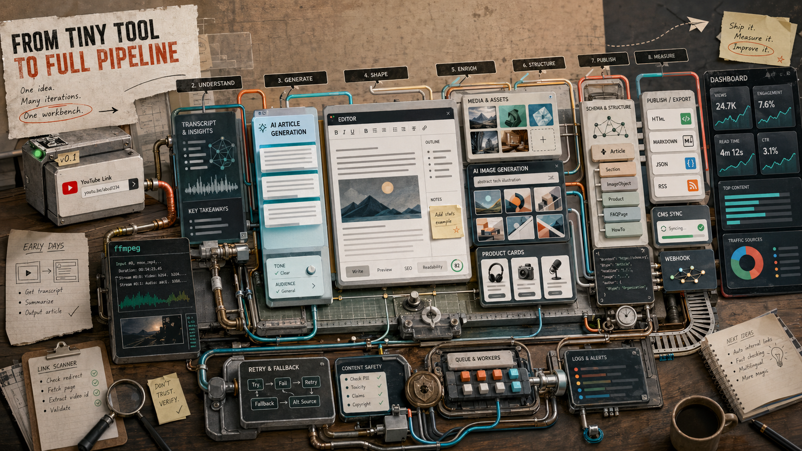

> [!info] 本文由來
> 這是一份由 **Claude Code 整理的草稿**，內容尚未經作者人工審稿，可能有不準確的地方。
>
> 整理依據，
>
> - GitHub repo, [JasChiang/article-suite](https://github.com/JasChiang/article-suite) 的 README（若有）、commit 歷史與原始碼
> - Claude Code 工作 session 紀錄, `~/.claude/projects/-Users-jaschiang-Documents-GitHub-article-suite/`
> - Codex CLI 工作 session 紀錄, `~/.codex/sessions/`（2026/02–04 的 article-suite 相關 session）
>
> 文章開頭的 hero 圖由 **Codex CLI 內建的 image_gen 工具**生成（OpenAI gpt-image-2 模型）。

## 起因

工作上有個重複性極高的任務，每週都要寫 SEO 文章，流程大概是，找題目、找素材（YouTube 影片或競品文章）、起草、加商品連結、生圖、貼進 CMS、補 schema、發布。每個步驟都不難，但加起來就很耗時。

剛好 Google 開放 Gemini API 的 YouTube URL 直接輸入，可以讓模型看影片內容再產文，這個能力太適合拿來解這個問題。所以在 2026 年 1 月中，用 vibe coding 的方式起了一個最陽春的版本，初始目標就一個，丟一條 YouTube 網址，讓 Gemini 幫我寫完整文章。

結果就是把這個「小工具」越加越大，直到現在變成一條從素材輸入到成效追蹤的完整生產線。

## 主要功能

整個工作台分成三個主要分頁。

**生成新文章**，支援四種素材來源，YouTube 公開或非公開影片、一般網址、純主題文字、上傳 PDF 或圖片檔。Gemini 讀完素材後產出完整 HTML 文章，並一併給三個 SEO 標題備選和 meta description。影片來源還能讓 AI 規劃截圖時間點，用 ffmpeg 截出圖片插入文章。文章配圖走 fal.ai SDK（`@fal-ai/client`），可在 **`nano-banana-pro`** 跟 **`gpt-image-2`** 之間切換，預設用 nano-banana-pro，會先讓 LLM 根據文章內容生提示詞再送去生圖，縮圖跟內文圖都能一次生好。

**編輯既有文章**，輸入 CMS 文章 ID 就能把文章拉回來，在 CKEditor 4.8 裡修改，修完再推回 CMS。插入商品卡的功能也在這裡，貼上商品或分類頁 URL，程式抓資料後 AI 生成卡片文案，選好插入位置，預覽確認後一鍵寫入文章並同步更新 CMS。商品卡連結會自動帶上自製追蹤 query param，讓成效資料可以歸因到哪篇文章帶來的導流。

**成效儀表板**，整合 GA4 和 Google Search Console 的資料，把過去 N 天流量最高的文章列出來，可以看曝光、點擊、CTR、工作階段等指標。每週一 GitHub Actions 會自動掃一次高流量文章裡的商品連結，找到失效的就把那列標紅，點一下就跳進編輯介面，直接換掉壞掉的連結。

## 開發過程

**1 月 17 日，最初版本**，就是一個 React + Express，前端輸入 YouTube URL，後端打 Gemini API，把結果顯示出來。架構很薄，但核心跑通了。

說「最初」其實也不是完全從零，這支工具是直接拿前一天剛切出來的 `article-generation-service` 當骨架繼續往上長，再往前追一層的話，那個 repo 又是從 `ai-video-writer` 拆出來的文章生成模組。事後比對檔案 SHA，可以看到清楚的繼承鏈，`services/notionService.js`、`tsconfig.json`、`config.ts` 這三個檔在 `ai-video-writer` → `article-generation-service` → `article-suite` 三個 repo 都是同一份；`services/client/geminiService.ts`、`taskPollingService.ts`、`routes/templates.js`、`routes/tasks.js`、`components/AppIcon.tsx`、`prompts/templates/*.js` 這些則在 `article-generation-service` 跟 `article-suite` 完全相同。所以 1/17 這天看似在「開新 repo」，實際上比較像把同一套程式碼換個地方重新出發。

之後 `article-generation-service` 就停在 1/17，commit 數停在 14；`article-suite` 從那天起活了三個多月，累積近 300 個 commit。詳細演進故事看 [[article-generation-service|把 AI 產文包成服務，是怎麼一回事]]。

**1 月 19–27 日，快速堆功能**，加了 AEO HTML 模板（試驗能不能讓文章更容易被 LLM 引用）、內文圖片生成、OpenRouter 輔助生圖提示詞、還有草稿自動存取。草稿這件事其實踩過坑，最初生成後沒有存稿，重新整理一次所有東西就不見了，後來改成每次產文都自動存 localStorage，重開頁面自動還原。

**2 月初，品質迭代**，這段時間集中改提示詞品質，包括防止 AI 捏造 YouTube 影片 ID（比對使用者給的參考網址，不在清單內的 ID 直接替換或移除）、禁止模型補充無根據的資料、清除模板中的 emoji 以免影響格式。另外加了 Google Search Grounding 讓純主題模式可以即時搜尋，以及 Gemini Thinking Mode 作為可選開關。

**2 月中下旬**，圖片 URL 外部連結會失效是個實際問題，改成後端把圖片 URL 轉存為本地靜態檔，開草稿時也會自動重新快取，發布時直接上傳 CDN。

**3 月，商品卡系統**，這是整個專案最重要的一次建設週。從零建出插入商品卡的完整工作流程，包含從實際文章 HTML 動態解析結構地圖、預覽確認步驟、以 HTML 註解標記識別多張卡片、以及連結失效掃描 + Gmail 通知的 GitHub Actions。

**4 月，UI 整合與細節打磨**，重新設計 ArticleWorkspace 版面配置，讓操作動線更自然。加了 AEO v4 模板、Schema.org JSON-LD 自動注入（NewsArticle、FAQPage、VideoObject、BreadcrumbList），每條寫回 CMS 的路徑都會重新跑 schema 注入，確保前端重新套用卡片後 schema 不會掉。AI 生成卡片文案也是這個月加的，以前標題和 CTA 都是固定模板，現在讓 AI 根據文章語境調整說法。AEO v4 模板在迭代過程中有一個明顯教訓，加太多 HTML 約束規則反而讓模型「太自由」，規則越多，模型越容易在不相關的地方補東西進去，例如把 JSON-LD schema 塞進文章內文、或是在非目錄目標的標題上亂加 `scroll-margin-top`。後來的修法是 HTML 骨架規則往 v3 收，只保留 AEO 語意結構的加強，「只靠 prompt 管 HTML 邊界」本身就不夠穩，能在後端做後處理的就移到後端做。

## 技術選擇

前端用 React + TypeScript + Vite，後端 Express.js（ESM 模式）。這個組合沒什麼特別，就是快。

AI 部分主力是 Google Gemini（`@google/genai`），原因是它的 YouTube URL 直接輸入和 URL Context 是核心功能，Gemini 在這兩塊支援最好。圖片生成走 fal.ai，文案改寫和圖片提示詞生成走 OpenRouter，這樣可以彈性選不同模型。Gemini API 有支援多 key 輪替，達到速率上限時自動切換，實際跑 GitHub Actions 排程時很有用。

HTML 編輯器用 CKEditor 4.8（自架），因為所在公司的內容平台本來就在用這個版本。圖片縮放用 sharp，影片截圖用 ffmpeg + yt-dlp，Schema 驗證有自己寫測試腳本。

成效追蹤用 googleapis 套件串 GA4 和 Google Search Console。OAuth token 有做三層 fallback，本機只要設一個 `GA4_REFRESH_TOKEN` 就能跑，不用管完整的 token bundle。

自動化排程三個 GitHub Actions，每天早上分別跑活動類和商品類自動草稿，每週一跑連結掃描，都會 commit 回 main，本機 git pull 後儀表板就會更新。

## 幾個比較有意思的決策過程

**商品卡插入位置的 HTML 解析，從 regex 到結構地圖**

一開始商品卡的插入位置是用 regex 比對 `
本文目錄
` 這類固定字串，但很快就遇到問題，不同文章的目錄寫法略有差異，而且用戶希望可以指定插在第幾個 H2 之後，不是只有幾個固定位置。後來改成先把文章 HTML 解析成結構地圖（TOC 在哪、每個 H2/H3 的順序和偏移量），前端渲染成可點選的插入點列表，讓使用者直接看到文章結構再選位置，而不是盲猜下拉選單裡的「第二個 H2 後」代表什麼段落。

**商品卡用 HTML 註解標記，避開 CKEditor 的巢狀 div 問題**

最早版本的商品卡移除是用 regex 比對 `data-product-card="true"` 屬性，但 non-greedy regex 在遇到巢狀 div 時會只移除到第一個 `
` 就停，殘留一堆斷尾 HTML。後來改用 `<!-- card-start:ID -->...<!-- card-end:ID -->` 把整張卡包起來，移除就是找 comment marker 之間的內容，完全不受 HTML 巢狀影響。舊格式的卡片移除不了，不過重新插一次就會轉成新格式。

**Gemini 503 的備援，從單一呼叫到 retry + OpenRouter fallback**

GitHub Actions 自動生文章的排程，pipeline 裡前後呼叫 Gemini API 四次（選題、預選商品卡、生文章、選延伸閱讀），只要任何一次碰到 503 UNAVAILABLE，整批就直接失敗。一開始 codebase 完全沒有 retry 邏輯。後來加了 retry 邏輯（對 503/429/500 自動重試，次數為 key 數量的兩倍，至少 5 次），加上多 key 輪替（retry 時切下一把 key，並對失敗的 key 設 cooldown）。進一步的方向是把最簡單的幾個呼叫點（純 JSON 生成，不需要 YouTube 或 urlContext 這些 Gemini 專屬 tool）改接 OpenRouter 當最後一層 fallback，這樣 Gemini 尖峰期的整批失敗率大幅下降。

**GA4 環境變數命名分岔的技術債**

最初掃描連結的單機腳本用的是 `GA4_CLIENT_ID`，後來加了更通用的 OAuth 模組改用 `GOOGLE_CLIENT_ID`，兩個其實是同一組 Google OAuth app 但變數名分岔了。GitHub Actions workflow 用 YAML 手動做映射所以沒問題，但本機要跑起來卻要填兩份一樣的值，在另一台電腦設定時才發現這個問題。後來在 authClient.js 加了 fallback `process.env.GOOGLE_CLIENT_ID || process.env.GA4_CLIENT_ID`，本機只要設一份就夠了。

**Proxy fetch 抓不到圖片，補了全頁截圖路徑**

Proxy fetch 實作把 HTML 裡所有標籤都用 regex 替換成空格，圖片 URL 直接被丟掉，Gemini 看到的只有文字。解法是加了 Chrome headless 全頁截圖，對 `high_fidelity` 模式的每個參考 URL 都截一張 PNG，以 multimodal 方式讓 Gemini「看」頁面，圖文都能一起餵進去。

另一條路徑也踩到類似的問題，商品卡系統在從分類頁擷取商品圖時，發現分類頁的商品圖是 lazy load 用 `data-src` 而不是 `src`，所以圖片擷取邏輯從只抓 `src` 改成優先抓 `data-src`，才能正確拿到真實圖片 URL。

**商品卡進 CKEditor 編輯模式就壞掉，從編輯器問題轉為 HTML 問題**

插入商品卡後，在唯讀預覽看起來正常，進入可編輯模式就跑版，閱讀更多卡會被拆成一堆零碎連結，商品卡圖片會多出藍色邊框。第一反應是 CKEditor 設定問題，但查了之後發現是兩條渲染路徑根本不同，唯讀是把 HTML 直接塞進 `iframe srcDoc`，可編輯是讓 CKEditor 4 重新 parse 一遍再畫出來，`allowedContent: true` 只是不過濾屬性，不代表 CKEditor 不會重組 DOM。

這個專案用的是公司內容平台現有的 CKEditor，不可能改編輯器設定。所以解法反過來，讓卡片 HTML 本身符合「CKEditor 4 會穩定保留的結構」，主要是兩條規則，閱讀更多卡不能用整張卡片外包一個 `<a>`，商品卡圖片不能放在 `<a>` 裡面，這兩種寫法是 CKEditor 4 最容易改寫的模式。改完之後移除功能完全不受影響，因為移除靠的是 HTML 註解標記，跟外層結構無關。

順帶一提，這套發布到 CMS 的邏輯（`services/server/cmsHttpClient.js` 等檔案）是 article-suite 自己實作的，跟我另外做的獨立工具 [[cms-publisher|cms-publisher]] 是兩套**並行的不同實作**，不是同一套程式碼共用。article-suite 把 CMS 發布綁在工作台後端，方便商品卡 / schema / 縮圖等流程一起跑；cms-publisher 則是抽離出來的獨立 HTTP 服務，目的是讓任何外部工具（包括其他 LLM 工作流）都能直接呼叫 `POST /api/publish` 觸發發文，兩個工具在不同情境下各自有用武之地。

## 心得

（TODO 補上）

## 結語

這個專案從一個週末的 vibe coding 小實驗，跑了約三個月變成現在這個樣子。它還是一個私人工具，不是要開源或推廣的產品，但把整個過程整理出來，算是對這段「讓 AI 幫我做 AI 幫我做的事」的記錄。

還有很多地方可以做，但更多是在觀察，這樣的 AI 文章，Google 怎麼判斷，GSC 數據能不能繼續長，AEO 模板到底有沒有讓 AI Overview 更願意引用。答案大概要繼續跑幾個月才會清楚。
