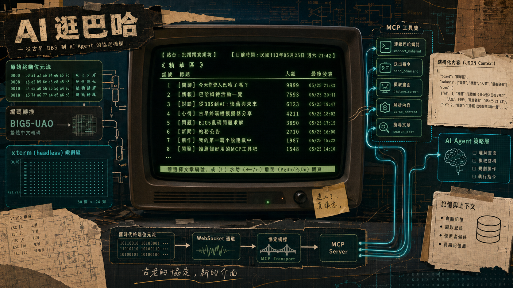

> [!info] 本文由來
> 這是一份由 **Claude Code 整理的草稿**，內容尚未經作者人工審稿，可能有不準確的地方。
>
> 整理依據，
>
> - GitHub repo, [JasChiang/baha-chat](https://github.com/JasChiang/baha-chat) 的 README（若有）、commit 歷史與原始碼
> - Claude Code 工作 session 紀錄, `~/.claude/projects/-Users-jaschiang-claude-----baha-chat/`
> - Codex CLI 工作 session 紀錄, `~/.codex/sessions/2026/`（橫跨 02–04 月）
>
> 文章開頭的 hero 圖由 **Codex CLI 內建的 image_gen 工具**生成（OpenAI gpt-image-2 模型）。

## 起因

巴哈姆特 BBS 是一個運作超過二十年的老牌論壇，畫面是純文字 80x24 終端機介面，靠鍵盤操作，用 Big5 編碼傳輸。想要讓 AI agent 幫忙整理上面的討論串，第一個問題就是，AI 要怎麼「看到」這個畫面、又怎麼「操作」它？

官方沒有任何現代 API 可用，所以唯一的路是直接走 WebSocket 連到 BBS 終端機，在本地模擬一個 80x24 的畫面緩衝，再包成 MCP 工具讓 Claude 呼叫。

這就是 `baha-chat`，一個讓 Claude 可以直接操作巴哈姆特 BBS 的 **MCP server**。

## 主要功能

專案對外提供一組 MCP 工具，讓 AI agent 像人一樣坐在終端機前面，

- **`bbs_connect` / `bbs_auto_login`**，建立 WebSocket 連線、從 `.env` 讀帳密自動登入
- **`bbs_send` / `bbs_send_key` / `bbs_send_ctrl`**，傳送文字、方向鍵、PageUp/Down、Ctrl+P 發文等各種按鍵組合
- **`bbs_get_screen` / `bbs_get_context`**，讀取目前可視的 80x24 畫面，`context` 模式回傳結構化資料，比 `screen` 更省 token
- **`bbs_collect_thread`**，從指定文章出發，沿相關主題連結往後爬，支援關鍵字篩選、作者縮小、GY 下限等條件，回傳適合摘要的結構
- **`bbs_summarize_thread`**，直接產生討論串摘要草稿，不自動發文，讓人審稿後再決定
- **`bbs_reset_screen`**，重置本地終端緩衝，處理畫面漂移或 scrollback 汙染

## 開發過程

整個專案大致分三個階段，每個階段都有一個讓我印象深刻的卡關點。

### 第一個坑，WebSocket Origin header

最早的版本用的是 raw buffer 加 iconv-lite，連線邏輯很簡單，傳 WebSocket 請求到 `wss://term.gamer.com.tw/bbs` 就好。但第一次跑起來是一直 timeout，連都連不上，換了 URL、調了 timeout 都沒用。

後來在 GitHub 上翻到一個用 websocat 連 BBS 的討論，才發現問題出在 Origin header，連線請求一定要帶 `origin: "https://term.gamer.com.tw"`，少了這一行伺服器直接 302 redirect 走，根本不讓進。加上之後就通了，整個除錯過程大概耗了快一個工作階段。

### 第二個坑，從 raw buffer 換成 xterm headless

早期讀畫面的方式很粗糙，把 WebSocket 收到的位元組解碼之後直接存進一個字串 `lastData`，讀畫面就回傳這個字串。每次送按鍵前會清掉 buffer，然後 hardcode 一個 500ms 延遲等畫面更新，完全靠猜時序。

這個方法在畫面穩定時還堪用，但一遇到翻頁、游標跳動、或畫面重繪就會出問題，agent 讀到的內容常常是殘破的。

真正解決是換成 `@xterm/headless`，也就是 xterm.js 的 headless 版本，讓它在記憶體裡維護一個完整的 80x24 終端機狀態。WebSocket 收到資料之後先解碼成 UTF-8 再餵給 xterm，讀畫面時直接從模擬器的 buffer 擷取每一行，拿到的永遠是「當下可視畫面」的乾淨文字，ANSI escape code、游標移動、畫面重繪全由 xterm 在內部處理好了。

這次引入也遇到一個小插曲，`@xterm/headless` v6 沒有獨立的具名 export，`Terminal` 只能從預設 export 取出，import 方式需要特別處理，用 `import xtermPkg from "@xterm/headless"; const { Terminal } = xtermPkg;` 繞過去才跑得起來。

### 第三個坑，Big5-UAO 和 token 最佳化

巴哈 BBS 不是標準 Big5，而是 Big5-UAO 擴充版本，包含日文假名、圖形字元和站內慣用符號。用標準 Big5 轉換這些字元會出現亂碼，所以最後自製了 UAO codec，對照表直接整理自開源專案 [`eight04/pyUAO`](https://github.com/eight04/pyUAO)。沒有這個現成對照表，光靠自己 reverse engineer Big5-UAO 字符對應大概要花好幾天。

另一個從實際使用中跑出來的問題是 token 消耗。讀一次完整的 80x24 畫面要傳很多文字，agent 每個動作都讀一次的話 token 燒得很快。後來的優化方向是兩條並行，一是加了 `bbs_get_context` 工具，回傳結構化 JSON 而不是純文字截圖，實測省了約 80-90%；二是把文章列表解析成結構化資料，附上分頁資訊（當前頁第一筆、最後一筆的文章 ID），讓 agent 不用反覆重讀整個列表就能導覽。

### 從 commit 歷史看演進

除了以上幾個卡關點，commit 歷史裡也可以看到幾個關鍵決策。**security: always hide bbs_send input echo** 解決帳密回顯洩漏問題；**feat: add UAO codec and article screen helpers** 是 Big5-UAO 支援上線；**Add BBS thread summarization tools and agent rules** 則是把「收集討論串」和「直接出摘要」包成兩個獨立工具，並加上 AGENTS.md 行為規則，限制 AI 在什麼情況下才能發文，避免代理自作主張貼文。

## 技術選擇

從 `package.json` 可以看到幾個關鍵依賴，

- **`@modelcontextprotocol/sdk`**，標準 MCP server 框架，讓這個 server 可以接上 Claude Desktop 或任何 MCP-compatible client
- **`@xterm/headless`**，headless 版本的 xterm.js，用來在記憶體裡模擬一個完整的終端機，處理 ANSI escape code、游標移動、畫面緩衝。選它的原因是，我不想自己寫 ANSI parser，xterm.js 已經是業界成熟的實作，headless 版本就是拿掉 DOM 渲染那層，只保留終端狀態機邏輯。
- **`iconv-lite`**，處理 Big5 編碼轉換，搭配自製的 UAO 擴充對照表
- **`ws`**，WebSocket 客戶端，直接連 `wss://term.gamer.com.tw/bbs`

整個資料流是，WebSocket 收到的 Big5-UAO bytes 先用 iconv-lite 解碼成 Unicode，再餵給 xterm headless 模擬器更新畫面狀態，MCP 工具讀取畫面時直接從模擬器的 80x24 buffer 擷取文字，送出指令時則反向編碼回 Big5-UAO 傳給 BBS。

> [!tip] 為什麼不直接用固定延遲等畫面穩定
> 早期版本是每次送按鍵後 sleep 500ms，再讀 buffer。這個方法在畫面穩定時堪用，但 BBS 有些畫面更新很快（例如進板後立刻有提示），有些很慢（例如讀信、下載附件），固定延遲要嘛等太久要嘛讀到一半的畫面。換成 xterm headless 之後，讀畫面的時機是由工具呼叫決定，不需要猜延遲，邏輯更乾淨。

### MCP 工具設計的一個權衡

`bbs_get_screen` 和 `bbs_get_context` 是兩個功能相近的工具，差別在回傳格式，前者是原始文字，後者是解析過的結構化 JSON。

保留兩個工具而不直接廢掉 `bbs_get_screen` 的原因，是有些畫面不好解析成結構（例如文章閱讀模式），這時候讓 agent 看原始文字反而更靈活。`context` 模式主要在「文章列表」「主功能表」這類有固定格式的畫面才能省到最多 token。

## 心得

實際跑過幾輪之後，有一些觀察是在設計階段沒預料到的。

BBS 的編輯器是「鍵盤介面」，agent 操作它的方式和人類一模一樣，要知道游標在哪、要知道現在哪個按鍵有效。這其實比想像中脆弱，例如回覆文章時要先按 `q` 退回文章選讀模式才有「回應」選項，不能在文章閱讀模式直接按 `y`。這類「隱性的操作順序」在文件裡不一定寫得出來，agent 第一次碰都要試錯一輪。

另一個有趣的地方是回文引言的排版邏輯。BBS 回文時可以選擇是否引用原文，引用之後游標落在文件開頭，這時 agent 要把回文內容插到引言之後，必須先跳到檔案末尾，否則內容會插到引言前面，順序整個錯亂。這個行為不算 bug，是 BBS 編輯器的既有設計，但 agent 沒被明確告知的話通常會踩到。

針對長文回覆還有個從實測中跑出來的技巧，BBS 對引言行數有上限，超過就會彈出警告。解法是利用 BBS 的「簽名檔分隔」慣例，在回文內容和簽名之後再加一個 `--`，引言放在第二個 `--` 後面，這樣引言就落在簽名檔區域，不被計入引言統計，不需要手動刪掉引言行。

## 用 Codex CLI 跑起來的幾個插曲

寫完 baha-chat 之後，我用 Codex CLI（GPT-5 模型）在這個 repo 繼續做了一些後續整合，過程中又踩了幾個跟 Claude Code 開發期不同的坑。

### Codex CLI 的設定層級

第一件事是把 baha-chat 接進 Codex CLI 的工具鏈，也就是讓 Codex 在工作時可以直接呼叫 baha-chat MCP。

全域設定在 `~/.codex/config.toml`，我不想污染全域，但也不確定 Codex CLI 有沒有專案層級的設定機制。測試之後發現，在 repo 根目錄放一個 `.codex/config.toml` 就能生效，不會影響全域設定。

```toml
[mcp_servers.baha-bbs]
command = "node"
args = ["/path/to/baha-chat/dist/index.js"]
```

這個設定只在進入這個目錄時生效，很乾淨。

### `bbs_auto_login` 的時序問題

開發期間 `bbs_auto_login` 一直正常，但 Codex 跑起來時偶爾會卡在「錯誤的使用者代號」。追了一輪之後發現是時序問題，auto_login 在 BBS 還沒顯示「請輸入勇者代號」提示之前就先送出帳號，結果字串被吃掉或落在錯誤的輸入框。

正確的流程是「connect 之後，先等到可視畫面出現帳號輸入提示，再送帳號，再等密碼提示，再送密碼」。固定延遲在這裡不夠用，需要讀畫面確認狀態再行動，就是 xterm headless 那一套的邏輯。

### 讀 Chat 板 20 篇文章來調 AI 語氣

把 baha-chat 接好之後，我寫了一個 `post-to-bbs` skill，讓 Codex 可以照一套固定流程進板、讀文章、用接近板上語氣回文。

語氣是個有趣的問題。最初的 preset 是泛用口語，但實際在 Chat 板跑了幾輪之後，板友一眼就認出「AI 發文」，有人直接在文章裡點出「標點位置不對」是辨認 AI 的方式之一。

後來我讓 Codex 直接讀了最近 20 篇文章（64228–64247），做語氣分析後直接修 skill。結論是，Chat 板的典型回文模式是「引述後 1-3 行短回」、`XD`/`XDD` 不定期出現、標點鬆散自然不規則，有時完全沒有句尾標點。這些特徵被寫進 skill 的 `TONE_PRESETS.md`，新增了一個 `chat_meme` preset 給梗串使用。

## 結語

baha-chat 是一個小而完整的 MCP server 實驗，把一個有二十年歷史、只支援終端機介面的系統接進現代 AI 工具鏈。

整個過程最有趣的部分是，Big5-UAO 編碼、80x24 終端模擬、ANSI 控制碼這些「上個世代的技術問題」，放到 MCP 架構裡其實就是把舊協定包成新介面，讓 agent 可以操作，概念上並不複雜，難的是細節。

如果你也在用巴哈姆特 BBS，或對「讓 AI 操作終端機介面」的模式感興趣，可以參考 [JasChiang/baha-chat](https://github.com/JasChiang/baha-chat)。
