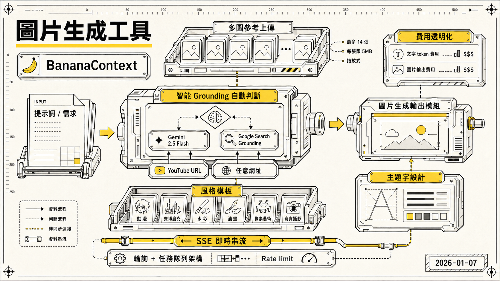

> [!info] 本文由來
> 這是一份由 **Claude Code 整理的草稿**，內容尚未經作者人工審稿，可能有不準確的地方。
>
> 整理依據：
>
> - GitHub repo，`banana-context`（private repo）的 README（若有）、commit 歷史與原始碼
> - Codex CLI 開發 session 記錄（2025/11/25、2025/11/28）
>
> 文章開頭的 hero 圖由 **Codex CLI 內建的 image_gen 工具**生成（OpenAI gpt-image-2 模型）。

## 起因

在用各種 AI 圖片生成服務的過程中，有一個痛點一直困擾著我，輸入提示詞時要自己判斷「這個需求需不需要搜尋最新資料？」，然後手動切換 grounding 開關。這個操作步驟很煩，而且常常忘記。

另一個問題是，我想在生圖時傳入多張參考圖片，但大部分工具支援有限，或是介面很難用。

所以我就做了 **BananaContext**，一個把 Gemini 2.5 Flash 的智能判斷 + 多個圖片生成後端結合在一起的 web 工具。

## 主要功能

### 智能 Grounding 自動判斷

核心設計是讓使用者什麼都不用管，直接輸入提示詞送出就好。

系統在收到提示詞之後，會先交給 **Gemini 2.5 Flash** 分析，它會自動判斷這個請求是否需要搜尋最新資訊。需要的話就觸發 Google Search Grounding，把搜尋結果轉換成視覺化描述再交給圖片生成後端跑圖，不需要的話就直接生圖。整個流程對使用者完全透明。

除了 Google Search，也支援餵 YouTube URL 或任意網址給 Gemini 去解析，讓圖片生成可以帶入特定頁面的上下文。

### 多圖參考上傳

支援同時上傳最多 **14 張**參考圖片，每張限 5MB，介面是拖放式，操作起來蠻順暢的。

### 風格模板

內建多種預設風格模板，動漫、賽博龐克、水彩、油畫、像素藝術、寫實攝影等，後端從 `style-templates/` 資料夾自動掃描所有 `.txt` 檔案動態生成清單。選好之後風格描述詞會自動附加到提示詞後面，不用自己寫一堆風格關鍵字。也可以自訂風格模板存成 `.txt` 放到 `style-templates/` 資料夾。

### 費用透明化

每次生圖完都會顯示這次用了多少錢，文字 token 費用和圖片輸出費用分開列，這對管控 API 成本蠻有幫助的，不會默默燒錢才發現。

### 主題字生成模式

後來加了另一個使用情境，**主題字設計**。使用者填入活動名稱、副標題、主打商品，再上傳吉祥物或商品參考圖，後端會把這些資訊交給 Gemini 2.5 Flash 按照預設的主題字模板生成結構化 JSON，再把 JSON 轉成圖片生成的提示詞交給 fal.ai 跑圖。

這個模式最複雜的部分是吉祥物 IP 保護，提示詞要明確鎖住吉祥物的體色、眼睛顏色、外框顏色、花紋，只允許改配件或表情形狀，不能讓模型自己重新詮釋 IP 外觀。實際上這段提示詞迭代了不少次才比較穩定。

### SSE 即時串流

用 **Server-Sent Events** 做進度更新，生圖過程中可以看到目前跑到哪個階段，比 loading 轉圈好多了。

## 開發過程

這個 project 基本上是純 vibe coding 的產物，大量用 Claude 和 Codex 寫程式，自己主要做架構決策和測試。

開發過程中遇到幾個有趣的問題值得記一下。

**行動端背景斷線問題**是最麻煩的。手機瀏覽器切換 app 之後 SSE 連線會斷掉，生圖結果就不見了。後來改成輪詢 + 任務隊列架構，伺服器端把任務排隊跑，前端定期去問結果，切 app 再回來一樣可以看到。這個 PR 是 Claude 跑的，解法乾淨很多。

改成輪詢架構之後，隨即發現另一個問題，**Rate limit 跟輪詢打架**。前端每 1.5 秒輪詢一次任務狀態，全域 rate limiter 設的是每 IP 15 分鐘 100 次，結果正常用大概 2 分鐘就撞到上限，前端開始回 429、報「查詢任務狀態失敗」。最後的決策是把生成端點套上更嚴格的 `imageGenerationLimiter`（每小時 20 次），讓輪詢端點只走寬鬆的全域 `apiLimiter`，這樣才不會讓 poll 自己把 quota 吃光。

另外是 **Gemini 3 Pro Image Preview 模型設定的問題**，一度不小心改掉 model ID 讓圖片生成一直回空，debug 了一段時間。後來用 Codex 查 commit 歷史找出是哪次改壞的，直接修回正確的 model ID。

**API 回傳雙圖的問題**也花了一點時間。圖片生成 API 有時候會回傳兩串 base64，但實際上只需要一張。最後在後端加了去重邏輯，只保留第一張，費用計算也改成按實際顯示的那張解析度來算，這樣帳目更準確。

初期版本需要使用者手動勾選「使用 Grounding」，v2.0 之後直接拿掉這個開關，改成全自動判斷。

## 技術選擇

### 後端

- **Express.js** + TypeScript，架構簡單不複雜
- **OpenAI SDK** 用來呼叫 OpenRouter API，因為 OpenRouter 相容 OpenAI 介面
- **Multer** 處理多圖上傳
- SSE 用 Node.js 原生支援做就好，不需要額外套件

### 前端

- **React** + **Vite** + TypeScript
- 樣式全用 CSS3，沒有引入 UI library，保持輕量

### API 服務

- **OpenRouter** 作為 API 閘道，統一管理模型切換和計費
- **Google Gemini 3 Pro Image Preview**（透過 OpenRouter）作為預設圖片生成模型，**fal-ai/nano-banana-pro** 為可選後端（主題字模式的預設）
- **Google Gemini 2.5 Flash** 負責智能 grounding 判斷，搭配 Google Search 工具

Gemini 的 grounding 能力很強，搜尋結果品質不錯，圖片品質在這個價位段也蠻有競爭力的。

整個開發期間，[Google Gemini API docs](https://ai.google.dev/gemini-api/docs) 跟 deprecated 文件被翻過幾十次，因為 grounding tool spec、安全分類欄位、回傳格式變動不少，每次接新功能都要對著官方文件跑一次才能確認最新做法。對於還在快速迭代的 API 來說，文件的 commit history 比 stable docs 還重要。

## 心得

整個開發過程最有感的是 AI 在「有明確規格的實作任務」上真的很有效率，給 Claude 或 Codex 一個清楚的 bug 描述加上相關 log，大多數時候可以直接找到問題點並修好。比較需要自己介入的是架構決策，例如輪詢 vs SSE 的取捨、rate limit 策略、主題字模板的結構，這些判斷還是要自己來，AI 頂多幫你列出選項和 tradeoff。

主題字的 IP 保護提示詞是另一個有意思的點。提示詞工程跟一般程式碼不同，很難靠靜態分析判斷對不對，只能實際跑圖才知道模型有沒有照做，所以迭代速度比一般功能慢，也需要更多手動測試。

## 結語

BananaContext 目前是個 private repo 的 side project，主要是自己在用，不過整個 vibe coding 的流程很順，從想法到可用工具大概兩三天就跑起來了。

如果你也對 AI 圖片生成工具感興趣，或是想試試看把 Gemini grounding 嵌進自己的工具流，可以參考這個架構思路，Gemini 的自動判斷能力確實省了不少手動切換的麻煩。
