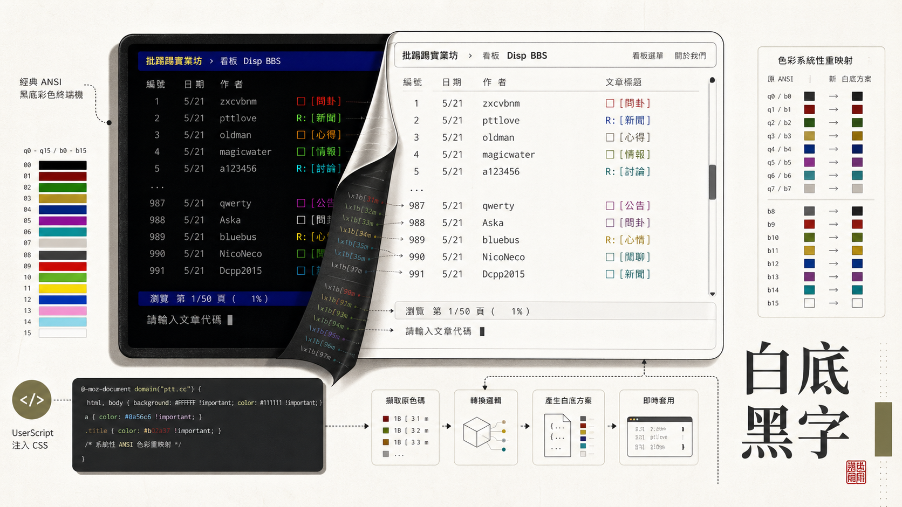

> [!info] 本文由來
> 這篇是整理 GitHub 專案 [bbs-gamer-bw](https://github.com/JasChiang/bbs-gamer-bw) 的開發紀錄，由 Claude 協助結構化成文章後審稿發布。
>
> 文章開頭的概念圖是用 **Codex CLI 內建的 image_gen 工具**生成。

## 起因

巴哈姆特 BBS（`term.gamer.com.tw`）是台灣老牌的 BBS 站，介面沿用傳統的**黑底彩色字**風格，懷舊感十足。但對習慣現代亮色系介面的人來說，長時間盯著黑底螢幕容易造成視覺疲勞。

想說能不能不改動任何伺服器設定、也不依賴瀏覽器擴充套件的客製化機制，單純用一支 UserScript 把整個配色反轉掉。結果發現巴哈 BBS 前端的顏色是透過固定的 CSS class（`q0`–`q15` 代表前景色、`b0`–`b15` 代表背景色）來管理，這讓事情簡單許多，只要針對這些 class 重新映射一次就好。

## 主要功能

這支腳本叫做 `bbs-gamer-bw`（bw 即 black & white，白底黑字的簡稱），核心做了幾件事：

- **白色背景**，將原本的黑色背景（`b0`）改為 `#ffffff`
- **黑色主文字**，原本的白色文字（`q15`）改為 `#000000`
- **ANSI 16 色全面重映射**，將亮色系前景色轉成深色版本（例如亮黃改為深橄欖），確保在白底上仍可清楚辨識
- **背景色淺化**，彩色背景區塊改為對應的淺色版（例如深紅背景改為淺粉紅）
- **游標顏色反轉**，讓游標在白底上依然明顯
- **美化捲軸**，改為淺色系樣式，與整體風格一致

安裝後前往 `https://term.gamer.com.tw/` 即自動生效，不需要任何額外設定。

## 開發過程

整個腳本的開發相當直觀，專案只有兩次 commit：

1. `feat: 新增巴哈姆特 BBS 白底黑字主題 Greasemonkey 腳本`，完成主體功能
2. `docs: 新增 README.md 及效果截圖`，補齊說明文件

最費心的部分是 ANSI 16 色的重映射。原始 BBS 的配色是設計給黑色背景的，直接把背景換白之後，原本亮色的文字（如亮黃、亮白）在白底上幾乎看不見。需要逐一檢視每個 color class，把過亮的顏色降低明度，換成能在白底清楚呈現的深色對應版本。

## 技術選擇

- **UserScript（Greasemonkey / Tampermonkey / Violentmonkey）**，選這個方案的原因是部署最簡單，使用者只需安裝一個管理器、匯入一支 `.user.js` 檔，不需要改任何瀏覽器設定或申請開發者帳號
- **`GM_addStyle` API**，用來把整包 CSS 注入頁面，是 UserScript 生態中最輕量的 CSS 注入方式
- **`@run-at document-start`**，腳本在頁面 DOM 建立前就插入樣式，避免頁面閃爍（先顯示黑底、再切換到白底）的問題
- **純 CSS、無外部請求**，腳本完全在本地運行，不連接任何伺服器，不讀取 Cookie 或 localStorage

## 心得

這個腳本比預期的更細。最初以為把 `b0` 換白、`q15` 換黑就差不多了，實際動手才發現要處理的地方一個接一個，連結顏色、選取反白、游標、捲軸，甚至彈出視窗都要照顧到，不然整個頁面就顯得零零落落，某個地方還是突兀地黑著。

另一個沒想到的細節是 `GM_addStyle` 的備援。乍看之下這個 API 很普通，各家管理器都有支援，但保險起見還是寫了備用路徑，用 `document.createElement('style')` 直接插入，並且在 `document.head` 還不存在的情況下（`@run-at document-start` 真的很早），再包一層 `DOMContentLoaded` 等待。這幾行程式碼加起來不多，但讓腳本在極端環境下也能正常運作。

用 AI 輔助寫腳本的過程很順，從「想要白底黑字」到可運作的版本只花了很短的時間，主要的迭代都在調 ANSI 16 色的對應值，逐一確認每個顏色在白底上看起來不突兀。這種「對照表型」的工作本來很繁瑣，有 AI 協助比對和生成 CSS 讓整個流程快了不少。

## 結語

這個專案規模不大，但解決了一個對特定族群來說很實際的問題，就是讓習慣亮色介面的人也能舒適地逛巴哈 BBS。整個方案的技術門檻不高，關鍵在於找到正確的切入點，巴哈 BBS 用固定的 CSS class 管理顏色這件事，讓 CSS 注入的方法變得乾淨而可維護。

如果你也是巴哈 BBS 的使用者，可以到 [GitHub repo](https://github.com/JasChiang/bbs-gamer-bw) 取得腳本，相容 Tampermonkey、Violentmonkey 及 Greasemonkey。
