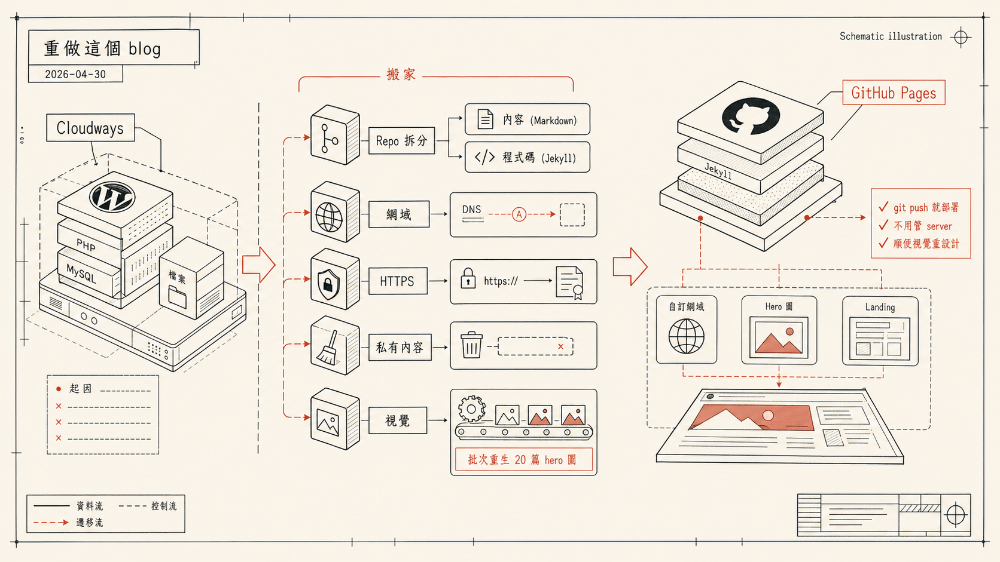

> [!info] 本文由來
> 這是一份由 **Claude Code** 整理的草稿，內容尚未經作者人工審稿，可能有不準確的地方。
>
> 整理依據，
>
> - 我與 Claude Code 工作的 session 紀錄（`~/.claude/projects/-Users-jaschiang-Documents-GitHub-blog/`）
> - 我與 Codex CLI 工作的 session 紀錄（`~/.codex/sessions/2026/04/30/`）
> - GitHub repos: [JasChiang/blog](https://github.com/JasChiang/blog)、[JasChiang/jaschiang.github.io](https://github.com/JasChiang/jaschiang.github.io)
>
> 文章開頭的 hero 圖由 **Codex CLI 內建的 image_gen 工具**生成（OpenAI gpt-image-2 模型）。

## 起因

這個 blog 之前是 WordPress 跑在 Cloudways 上的 Vultr VPS，月費要繳、要管 server、發文還要點 WP 後台。但我寫文章用 Obsidian、用 markdown，每次都還要從 markdown 轉 HTML 再貼進 WP 編輯器，很煩。

加上最近用 Claude Code 串了不少 vibe coding 工具，順手把整套 blog 換掉感覺很合理：靜態站、Markdown 直接發、`git push` 就部署、不用管 server。

定下的目標，

1. 從 Cloudways VPS 搬到 GitHub Pages（免費 + 靜態 + 免維護）
2. 把網域 `jasboughtit.com` 從 Gandi 接到 GitHub
3. 整個視覺重做一次（不要繼續用 Quartz 預設）
4. 順便處理 GitHub Pages root 那個 `jaschiang.github.io` repo 裡的舊內容（有些是公司案的東西，不想公開放在那）

預期半天搞定。實際是一個下午加晚上。

## 主要做了哪些事

| 區塊 | 內容 |
|------|------|
| 搬家 | Cloudways VPS → GitHub Pages + Quartz |
| 網域 | Gandi LiveDNS 用 API 設好 4 條 A、4 條 AAAA、1 條 CNAME，接 GitHub Pages |
| HTTPS | Let's Encrypt 憑證 GitHub 自動 issue + Enforce HTTPS via gh API |
| 私有內容 | 把 `jaschiang.github.io` repo 裡 7 個資料夾搬到新 private repo，git filter-repo 重寫 history |
| 視覺 | 灰藍預設 → Workshop Console → 最終 Schematic illustration |
| Hero 圖 | 用 Codex CLI image_gen 批次重生 20 篇文章的 hero |
| Landing | 寫一個 GitHub Pages root 的個人首頁，連到 blog |

## 搬家，把 jasboughtit.com 接到 GitHub Pages

### Repo 結構選擇

GitHub 對個人 Pages 有兩種 repo：

- **User site**：repo 名稱必須是 `<username>.github.io`，serve 在 `https://<username>.github.io/`
- **Project site**：任何 repo，serve 在 `https://<username>.github.io/<repo>/`

我選了兩個 repo 並存的結構，

- `JasChiang/jaschiang.github.io` → 個人首頁，純靜態 HTML
- `JasChiang/blog` → blog 本體，Quartz 編譯出來的內容

這樣 `https://jasboughtit.com/` 是首頁，`https://jasboughtit.com/blog/` 是 blog。一個自訂網域兩個用途。

### Quartz 設定

Quartz 設 `baseUrl: "jasboughtit.com/blog"`，這樣產出的 sitemap、RSS、og:image 都會帶完整網域。

### CNAME 檔

GitHub Pages 認 repo 根目錄的 `CNAME` 檔。內容就一行 `jasboughtit.com`。GitHub 會自動把這個 repo 綁到該域名。

只在 `jaschiang.github.io` repo 加一個 CNAME 就好，blog repo 會自動繼承，因為它是 user 的 project site。

### Gandi DNS 用 API 自動設定

這段最有意思。一般人在 Gandi web UI 點來點去，我用 Personal Access Token 走 LiveDNS API，一個 curl 就把全部記錄設好，

```bash
TOKEN="..."

# A 記錄 4 條（GitHub Pages IPs）
curl -X PUT -H "Authorization: Bearer $TOKEN" \
  "https://api.gandi.net/v5/livedns/domains/jasboughtit.com/records/%40/A" \
  -d '{"rrset_ttl":600,"rrset_values":[
    "185.199.108.153","185.199.109.153",
    "185.199.110.153","185.199.111.153"
  ]}'

# AAAA 記錄 4 條（IPv6）
curl -X PUT ... -d '{"rrset_values":[
  "2606:50c0:8000::153","2606:50c0:8001::153",
  "2606:50c0:8002::153","2606:50c0:8003::153"
]}'

# www CNAME
curl -X PUT ... -d '{"rrset_values":["jaschiang.github.io."]}'
```

Gandi LiveDNS 速度很快，跑完幾分鐘就全球解析完成。用 8.8.8.8 跟 1.1.1.1 dig 確認 OK。

> [!tip]
> Token 用 Personal Access Token，scope 鎖在這個 domain + `domain:tech` 權限，到期時間設 1 day。用完即過期，比起永久 API key 安全很多。

### HTTPS 憑證

DNS 一通 GitHub 就自動申請 Let's Encrypt 憑證，~5-15 分鐘 issue 完成。

設好憑證後要去 repo settings 勾「Enforce HTTPS」，但**這個欄位在憑證 issue 完前是 disabled 的**。所以要等。

我用 gh CLI 從外部翻啟，省去手動進 settings 頁，

```bash
echo '{"https_enforced":true}' | \
  gh api -X PUT repos/JasChiang/jaschiang.github.io/pages --input -
echo '{"https_enforced":true}' | \
  gh api -X PUT repos/JasChiang/blog/pages --input -
```

兩個 repo 都要設，因為它們都被 custom domain 涵蓋。

## 處理舊 repo 的私有內容

這段是踩到的坑。`jaschiang.github.io` repo 之前是 private，裡面除了我自己想公開的 `ai/`、`marketing/`、`old-version/` 等，還有幾個**公司案的資料夾**，那些不想跟著公開。

但 GitHub Pages 在免費方案下，**只有 public repo 才能啟用**。所以 repo 必須變 public。

### 不可逆的 history rewrite

直接把 repo 改 public 等於連 git history 都曝光。即使現在的工作樹不含敏感檔，**舊 commit 裡還有**。要先處理。

步驟，

1. 先把所有資料夾 `cp -R` 到新建的 private repo `jaschiang-pages-private`，所有歷史先備份起來
2. 用 `git filter-repo` 改寫本機 history，只保留 `.gitignore`：
   ```bash
   git filter-repo --force --path .gitignore
   ```
3. 加新的 `index.html`（landing page）+ commit
4. **force push** 把遠端 history 也蓋掉
5. 改 repo 為 public
6. 啟用 Pages

> [!warning]
> 第 4 步是不可逆的。force push 後遠端只剩兩個 commit（一個 history 重寫節點 + 一個 landing page）。**舊的 SHA 仍可能在 GitHub 上殘留 ~14 天才會被 GC，**這段時間如果有人剛好知道某個舊 SHA，理論上可以 fetch 到，但因為這個 repo 改 public 之前是 private 沒外部曝光，舊 SHA 不會被人知道，風險可控。

## 視覺重設計

這是最折騰的部分，我換了三次方向。

### 嘗試 1，灰藍預設（Quartz default）

Quartz 預設色票、預設字體、預設左側欄 explorer，跑起來不難看，但太「Quartz template」了，沒個性。

### 嘗試 2，Workshop Console（暖琥珀 + 等寬字）

換成 IBM Plex Mono 當 header 字體（呼應 code 字體）+ 琥珀（amber）跟湖綠（teal）的暖色調 + Terminal block 風格的 RecentNotes 卡片，呼應「工坊」氣質。

跑了一段時間覺得**太強硬**。中文標題在 Plex Mono 下會 fallback 到系統字，混搭起來有點亂。對「個人筆記」氣質來說太工程過頭。

### 嘗試 3，Schematic illustration（最後選的）

Hero 圖風格決定了整個 blog 的氣質。我請 Codex 比較了四個方向，

| 方向 | 氣質 |
|------|------|
| Editorial collage | 雜誌長文 feature，紙感拼貼 |
| Risograph zine | 印刷工作室海報，強烈 indie |
| Conceptual metaphor | 一張 punchline，留白多 |
| **Schematic illustration** | 工程藍圖式，axonometric / exploded view，技術圖鑑感 |

選了 Schematic，因為跟我寫的內容（多半是工具開發紀錄）最對盤。視覺像 Stripe Press blog header、Apple WWDC 概念圖那種「工程師把東西拆開給你看」的感覺。

## Codex CLI 批次生 hero 圖

選了 Schematic 之後，要把已發 20 篇文章的 hero 全部重生。這是這次最有趣的工程部分。

### Prompt 三次迭代

**第一版**（太嚴格）：

> 嚴禁任何形式的文字、字母、數字。整張圖必須完全無任何字符。

結果整個圖變成只有抽象視覺，沒文字標籤，跟文章內容對不上。

**第二版**（太自由）：

> 你是 art director，自選風格。可選方向：寫實插畫 / picture-book / editorial / isometric / risograph...

結果反而太自由。`ai-video-writer` 那篇的 hero 直接畫成**棒球比賽**（TPE 5-3 KOR）。文章是講 YouTube 內容自動化工具，被視覺往「video」→「sports」聯想拐走。

**第三版**（最終）：

```
你是 art director。

文章 metadata：
- title: <精確字串>
- date: <精確日期>

視覺風格鎖定 — Schematic illustration / 工程藍圖式：
- 線條繪 + 平塗色塊，不要 3D 渲染、不要 painterly、不要光影立體
- axonometric 或 exploded view
- 米色 / 灰白 / 深墨擇一 + 一個強調色
- 像 Stripe Press blog header、Apple WWDC 概念圖

文字規則（嚴格）：
- 圖中所有中文字必須完全沿用文章原文用詞，禁止自創、翻譯、改寫、簡化
- 標題用文章 title 精煉版（4-8 字）
- 如果圖中要顯示日期，必須使用 metadata 區的 date 值
- 中文必須繁體 zh-TW，禁止簡體與殘體（鏈結→連結、視頻→影片、軟件→軟體、網絡→網路、數據→資料、服務器→伺服器、文檔→文件、信息→訊息、屏幕→螢幕、用戶→使用者、搜索→搜尋、代碼→程式碼、內存→記憶體）

文章：
---
<整篇 markdown 全文>
---
```

第三版 prompt 後，20 篇全部一輪過關，文字幾乎都從文章原文取詞，沒簡中沒殘體。

### Session-id 隔離（重要踩坑）

批次跑 codex exec 的時候，第一版 script 用 `find ~/.codex/generated_images/ -newer marker` 抓圖。問題是，**這會抓到任何 codex session 在那段時間生的圖**。

實際跑到 `ai-video-writer` 那張時，剛好另一個 codex session 也在生圖，結果我這邊抓回來的是對方那張完全不相關的 Panasonic 家電圖，被當成 hero 蓋上去。

修法是改用 session-id 隔離，

```bash
MARKER=$(mktemp)
sleep 1

codex exec --full-auto ... > log

# 找出 THIS codex exec 產生的 rollout jsonl
SESSION_FILE=$(find ~/.codex/sessions -name 'rollout-*.jsonl' \
  -newer "$MARKER" -print0 | xargs -0 ls -t | head -1)
SESSION_ID=$(basename "$SESSION_FILE" .jsonl | sed 's/^rollout-[0-9T-]*-//')

# 只在這個 session 的 generated_images 找
IMG=$(find "$HOME/.codex/generated_images/$SESSION_ID/" \
  -name 'ig_*.png' | head -1)
```

每個 codex exec 自己有獨立的 session-id，對應到 `~/.codex/sessions/.../rollout-*-<session-id>.jsonl` 跟 `~/.codex/generated_images/<session-id>/`。從 jsonl 檔名抓 session-id，然後只在對應的 generated_images 子資料夾找圖，就不會抓到平行 session 的輸出。

### 強制使用文章日期

gpt-image-2 在生「工程文件感」的圖時，會自動加日期欄位（DATE/REV 之類），但**它編造的日期都不是文章真正的日期**。例如某篇文章 date 是 `2026-04-29`，圖右下角寫 `2025.04.20`。

修法是在 prompt 把文章 metadata 顯式拉出來重複強調，

```
文章 metadata（必須使用這些原始值，絕對禁止自行編造或改寫）：
- title: <實際 title>
- date: <實際 date>

文字規則：
- 如果圖中要顯示日期，必須使用上方 metadata 區的 date 欄位值，
  絕對不可自己編造日期
```

把日期值「重複講兩次」（一次在 metadata 區、一次在規則區），模型才會穩定使用正確日期。

## OG image 處理

之前發在 FB 的舊文章，全部 og:image 預覽都是壞的（404）。原因是 Quartz 的 `CustomOgImages` emitter 對 frontmatter 的 `image:` 欄位有個 path 拼接 bug，會在路徑前面多塞一層 `/static/`，

```ts
// 原本（壞掉）
const ogImagePath = `https://${baseUrl}/static/${userDefinedOgImagePath}`

// 修好
const ogImagePath = `https://${baseUrl}/${userDefinedOgImagePath}`
```

修一個字的事，但 FB Sharing Debugger 的 cache 還在，每篇文章要去 https://developers.facebook.com/tools/debug/ 個別點「再次抓取」才會更新。

## Landing page

GitHub Pages root 那個 `jaschiang.github.io` repo 改成單張 `index.html` 當 landing page，內容很簡，

- 標題 + 一句 lede
- 「關於這裡的內容」說明（提醒這 blog 多半是 Claude 協助結構化、有些是 Claude Code 直接草稿、未審稿）
- 「最近在做」一段話
- 「最近寫的」3 篇（用 client-side JS 抓 blog `/blog/index.xml` RSS，自動更新）
- 連結（Blog / GitHub / LinkedIn）
- 右上 dark mode toggle（localStorage 記住偏好）

刻意不放：訂閱數、流量數據、大張個人照、招牌 slogan。

> [!note]
> Landing 的 og:image 是另外用 Codex CLI 生的、跟 blog 文章 hero 同風格的 schematic 圖。Blog 首頁透過 frontmatter 設 `image: https://jasboughtit.com/og-image.png`（絕對 URL）共用同一張，社群分享時兩個入口看起來一致。

## 心得

### vibe coding 真正改變的是哪些事可以順手做

這個 blog 改造，如果在沒有 vibe coding 之前，「想做」跟「真的去做」之間的成本是 GitHub Actions 設定、Cloudflare 還是 Vercel 的選擇、Quartz 怎麼自訂……一堆要學的。

有了 Claude Code + Codex CLI，**這些變成可以順手做的事**。半天到一天能搞定的事，以前可能拖一個月。

關鍵不是 AI 寫程式快，是它降低了「我想嘗試一個方向」的啟動成本。

### Claude Code 跟 Codex CLI 的分工

這次工作中，我大致這樣分，

- **Claude Code**：主要 driver，研究文件、改程式碼、做決策
- **Codex CLI**：當 art director 子任務（image_gen），或當第二意見（程式檢查、refactor 提案）

Claude Code 直接呼叫 Codex CLI 當 subprocess，主要走 `codex exec --full-auto --skip-git-repo-check "<prompt>"`，包成 Bash 呼叫，讓兩個 CLI 接上。詳見 blog 首頁 callout 的說明。

### prompt 寫了會反覆迭代

這次最深感的事情是，**第一次寫的 prompt 從來都不是最終版**。

- 第一版總是太嚴或太鬆
- 看實際輸出，發現某類錯誤
- 修 prompt，加一條規則
- 再跑、再修

例如「文字必須繁體」一條，從原本一句話 → 加殘體對照表 → 加「沿用文章原文用詞」 → 加日期顯式變數 → 加 session-id 隔離。每一條都是踩到坑後才補的。

接受這個迭代節奏，比想要一次寫對更實際。

### 怕不可逆的事，先做安全網

這次最緊張的環節是 history rewrite + force push。做之前先 `git bundle create` 一份本機備份，這樣即使搞砸還能還原。

「不可逆」的恐懼通常被高估，**只要有備份就可逆**。先做備份，然後放心做事，比卡在「會不會壞掉」想很久好。

## 結語

整個過程是「一個下午想到、一個下午做完」的典型 vibe coding 案例。從動念到 push 到 prod，所有步驟都有 Claude Code 在旁邊，問問題、跑指令、寫程式、改 prompt。

剩下能做的還有不少（FB cache 刷新、Search Console 索引提交、Newsletter 訂閱機制等等），但**核心目標都到位了**：blog 換家、視覺新做、以後寫文章就 `git push` 即發布、不再為了發一篇文章打開 WP 後台。

接下來主要會用這套寫文章。如果你看到這篇之後又看到別的「Claude Code 草稿」型的開發紀錄，就是這個 blog 的標準產出流程在跑。
