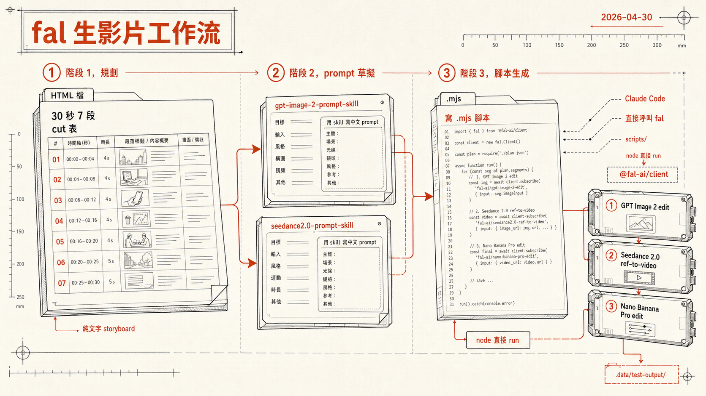

> [!info] 本文由來
> 這是一份由 **Claude Code** 整理的草稿，內容尚未經作者人工審稿，可能有不準確的地方。
>
> 整理依據，
>
> - storyboard-system repo `scripts/` 下的 `.mjs` 腳本（4-24 ~ 4-30 共 20+ 支）
> - Claude Code 在該 repo 的 session 紀錄（`~/.claude/projects/-Users-jaschiang-GitHub-storyboard-system/`），最大那份 4-30 cbf79da7 fal_refs=100
> - `~/.claude/projects/-Users-jaschiang-claude-----video-prompt-skill/` 的 prompt skill 使用紀錄
> - `~/claude/測試區/video-scripts/` 的規劃 HTML 檔
>
> 文中提到的具體案子是某 3C 通路門市為兩個智慧家電品牌做的短影片素材，**品牌與通路名都已遮蓋**（以下用「品牌 A」「品牌 B」「某通路」代稱）。文章開頭的 hero 圖由 **Codex CLI 內建的 image_gen 工具**生成。

## 起因

近期接了一個短影片素材的工作，需要在大約一週內生出兩支不同 AI 風格的家電產品宣傳影片，給某通路跟兩個家電品牌（以下用「品牌 A」「品牌 B」代稱）的聯名門市用。

正常流程是找導演 / 攝影 / 模特、實拍、後製，**時間跟預算都不夠**。所以我把整套搬進 Claude Code 跟 fal.ai，讓 AI 從角色 ref 圖、場景 ref 圖、storyboard 分鏡、到最後的 reference-to-video 生成，一條龍跑完。

整個流程跨三個資料夾，**Claude Code 是貫穿全程的 driver**。我之前寫過 [[storyboard-system|storyboard-system 開發紀錄]] 這支工具本身的開發過程，但這篇是不同的故事 — 不是「用 storyboard-system 工具的 UI」，而是**在那個 repo 裡讓 Claude Code 直接寫腳本呼叫 fal**。

## 全貌，三個階段

```
階段 1，規劃                階段 2，prompt 草擬          階段 3，腳本生成
─────────                  ──────────                  ──────────
~/claude/測試區/           ~/claude/.../               ~/GitHub/
  video-scripts/             video-prompt-skill/         storyboard-system/
                                                           scripts/

3C 通路 30 秒企劃          gpt-image-2-prompt-skill    gen-brand-a-15s-parta-home.mjs
品牌 A 60 秒 7 段          seedance2.0-prompt-skill    gen-brand-a-fridge-open-ref.mjs
...                                                      gen-brand-a-bridge-morph.mjs
                                                         gen-brand-a-storyboard-sheet*.mjs
                                                         (20+ 支腳本)

純規劃、HTML 檔             用 skill 寫中文 prompt       Claude Code 寫 mjs，
                                                       node 直接 run，
                                                       走 @fal-ai/client，
                                                       呼叫 Seedance 2.0 +
                                                       GPT Image 2 + Nano Banana
```

每個階段都有 Claude Code，但角色不同。

## 階段 1，規劃，純文字 storyboard

這階段 Claude Code 沒呼叫任何 AI 模型，**只在做文字結構化工作**。

我給它幾個 input，

- 客戶要的訊息要點（產品功能、目標族群、調性）
- 影片時長（30s / 60s）
- 必須出現的視覺元素（門市實景、產品擺位、主視覺色調）

它輸出一份 HTML 規劃檔，結構大致是，

```
影片 A — 30 秒，7 段
  CUT 1 (0.0 → 1.5s) 開場 — 主角推門進入門市
  CUT 2 (1.5 → 3.5s) 店員引導到產品區
  CUT 3 (3.5 → 6.5s) 產品 hero shot 1
  CUT 4 (6.5 → 11s)  使用情境演示
  ...
```

每個 cut 包含時長、畫面描述、運鏡、主視覺、音效暗示。**這份 HTML 是後續所有階段的 spec**，不對它就一錯到底。

關鍵設計，

- 切 cut 時就先把時長加總到 30s / 60s（不要在最後階段才發現超時）
- 每個 cut 都註明「**人物角度**」（正面 / 側面 / 背影），因為這直接影響後面 ref 圖怎麼生
- 每個 cut 都註明「**有無對話 / 旁白**」，影響是否需要嘴型對得上的 reference

這階段 Claude Code 表現很穩，**比我自己寫得結構化**。

## 階段 2，用 skill 草擬中文 prompt

到這階段才開始進入「跟 AI 模型講話」。但**還沒呼叫模型**，是寫好 prompt 待用。

我有兩支自己安裝的 Claude Code skill，

- **`gpt-image-2-prompt-skill`** — 寫給 OpenAI GPT Image 2 的圖片生成 / 編輯 prompt
- **`seedance2.0-prompt-skill`** — 寫給 ByteDance Seedance 2.0 的中文影片 prompt

skill 的本質是**結構化 prompt 範本**。給它「我要拍什麼」，它套用模型最佳的 prompt schema，輸出一份可以直接餵給模型的中文（或中英混合）prompt。

例如 Seedance skill 教你，

- ≤15 秒：不講故事，做一個「不可能的瞬間」，前 2 秒抓人
- \>15 秒：分段，每段獨立 prompt，後製拼接
- 多模態 reference 是 Seedance 2.0 強項，盡量利用
- 中英混合比純中文穩定（運鏡術語用英文 wide / dolly / pan，主體與情境用中文）
- @ 引用必須用官方命名 `@图片1` ~ `@图片9`、`@视频1` ~ `@视频3`

skill 把這些「平台特性」內建，我寫 prompt 時不用每次回去翻 fal 文件。

> [!note]
> Skill 內建的範例是簡體中文（即夢平台原生語言），但實際輸出 prompt 我會請 Claude Code 改成繁中（除了 `@图片1` 這類官方命名格式不能改）。Claude Code 一次設定好後續所有 prompt 都會跟著用繁中描述。

## 階段 3，寫 .mjs 腳本，Claude Code 直接呼叫 fal

**這階段是這次工作流最有 vibe coding 感的部分**。

storyboard-system repo 之前是我做來「串接各家 AI 影片 / 圖片模型的整合工具」（[[storyboard-system|工具本身的開發紀錄]]）。這次要做素材時，我**沒打開那個工具的 UI**，而是直接打開 Claude Code 在 storyboard-system repo cwd，請它**寫 .mjs 腳本**呼叫 fal。

理由：UI 適合「一張一張生、視覺驗證」；腳本適合「一次跑 4-6 個 cut + 多個變體 + 失敗重試」這種批次。

腳本長什麼樣，

```js
#!/usr/bin/env node
// gen-XX-15s-parta-home.mjs
// Seedance 2.0 reference-to-video — 15-second part A

import { fal } from '@fal-ai/client'
import fs from 'node:fs/promises'

const SEEDANCE_REF = 'bytedance/seedance-2.0/reference-to-video'
const OUT_DIR = '.data/test-output'

const REFS = {
  protagonist:  '.data/.../front-female-protagonist-casual-v1.png',
  home:         '.data/.../home-interior-v1.png',
  appliance:    '.data/.../appliance-hero-ref.png',
  // @图片1 ~ @图片N
}

const PROMPT = `[15 秒一鏡到底，多 cut whip-pan 接駁]
0.0-1.8s   foyer，主角推開門進入...（中英混合 prompt）
1.8-2.1s   whip-pan 1
2.1-3.6s   walk-in 到客廳沙發
...
`

const result = await fal.subscribe(SEEDANCE_REF, {
  input: {
    prompt: PROMPT,
    reference_image_urls: Object.values(REFS),
    duration: 15,
    resolution: '1080p',
    seed: 42,
  },
  logs: true,
})

await fs.writeFile(
  `${OUT_DIR}/output.mp4`,
  Buffer.from(await fetch(result.data.video.url).then(r => r.arrayBuffer()))
)
```

用法是，

```bash
node scripts/gen-XX-15s-parta-home.mjs
```

跑下去 1-3 分鐘等 fal queue 完成，輸出落到 `.data/test-output/`。

## 為什麼用腳本不用 UI

| 情境 | 腳本 | UI |
|------|------|-----|
| 一次跑 4-6 個 cut | ✅ 一個 for loop 就好 | ❌ 一張一張點 |
| 同 prompt 不同 seed 跑變體 | ✅ for 迴圈 + seed 陣列 | ❌ 改 seed 重點 |
| 失敗自動重試 | ✅ try / catch + retry | ⚠️ 手動重點 |
| 批次同樣 ref 換 prompt | ✅ 改腳本一行 | ⚠️ UI 重輸入 |
| 第一次 explore 視覺方向 | ❌ 寫腳本太重 | ✅ UI 適合試 |
| 需要視覺即時驗證 | ⚠️ 跑完才看 | ✅ 立刻看 |

我自己的決策規則：**前 1-2 張用 UI 探方向**（用 storyboard-system tool 或 fal web）、**確定方向後寫腳本批次跑**。

## 一週生出來的腳本長相

實際 4-24 ~ 4-30 之間在 storyboard-system/scripts/ 累積的腳本（部分），

```
gen-brand-a-fridge-open-ref.mjs           — 冰箱開門 reference 圖（gpt-image-2/edit）
gen-brand-a-cut3-seated.mjs               — 第 3 段坐姿 ref（gpt-image-2/edit）
gen-brand-a-home-interior-no-styler.mjs   — 居家內景 ref，去掉風格器（gpt-image-2/edit）
gen-brand-a-15s-parta-home.mjs            — Part A 15 秒主影片（Seedance 2.0 ref-to-video）
gen-brand-a-15s-from-storyboard.mjs       — 從 storyboard 直接吐 15 秒影片
gen-brand-a-storyboard-sheet*.mjs         — 整張 storyboard sheet 視覺化（多版本）
gen-brand-a-bridge-morph.mjs              — Part A → B 過場 morph
gen-brand-a-merged-bridge-partb.mjs       — Part B 接 Part A 後段
gen-brand-a-4s-partb-store.mjs            — Part B 4 秒門市段
gen-brand-a-4clips.mjs                    — 4 個獨立 clips 批次跑
run-mascot-endcard-seedance.mjs      — 結尾吉祥物 endcard
pad-hem-strip-ref.mjs                — 服裝飾條 padding（為了過 fal 3:1 比例上限）
fal-fetch-request.mjs                — 拉 fal job result 的 helper
gen-brand-a-character-refs.mjs            — 男店員 / 女主角 character library
gen-brand-a-variants.mjs                  — 角色 3 種服裝變體（外出 / 居家 / 休閒）
（共 20+ 支）
```

數字統計，

| 模型 | 呼叫次數（跨所有 .mjs） |
|------|---------|
| `openai/gpt-image-2/edit`（圖片編輯） | 39 |
| `fal-ai/nano-banana-pro/edit`（圖片編輯備選） | 8 |
| `bytedance/seedance-2.0/reference-to-video`（影片） | 跨 9 支腳本，實際 fal subscribe 呼叫 ~20 次 |

**最常用的不是影片模型本身，而是 GPT Image 2 edit**。原因是影片需要大量先準備好的 reference 圖（角色 ref 各角度、場景 ref 各角度、商品 ref 等），ref 圖品質決定影片品質，**前期 ref 製作的呼叫量遠多於最終 video 呼叫**。

## 踩過的坑

### 1. fal 對單張 ref 圖的比例上限是 3:1

某次我傳一張長條形的服飾飾條 ref（1504×432，比例 3.48:1）給 gpt-image-2/edit，fal 直接回 422 拒收。寫了 `pad-hem-strip-ref.mjs` 把圖旋轉並 padding 到 3:1 內，再餵進去就過。

### 2. Reference 太多會被合併壓縮

Seedance 一次最多 9 張 reference，我塞太多，模型會自動合併概念，反而導致**特定細節（例如 logo 顏色）失真**。後來改成「每張 ref 對應一個明確視覺角色」（@图片1=主角、@图片2=場景、@图片3=道具），不混。

### 3. Whip-pan 接駁比 cross-fade 穩

15 秒的多 cut 影片，我原本想用 cross-fade 接駁不同場景，結果模型生出來「家具會在淡入淡出時融化」（layout 不連續引起的 artifact）。改成快速 whip-pan（0.3 秒鏡頭甩動 + motion blur）後，**所有場景接駁都自然很多**。

### 4. 角色一致性靠 ref 鎖，不靠 prompt 描述

我一開始把主角的長相細節寫進 prompt（「米色粗針織毛衣 + 暖灰長褲、25 歲、長髮微捲」），不同 cut 跑出來的人臉還是會飄。後來改成**先用 gpt-image-2/edit 生一張「主角 canonical reference」圖**，每個 cut 都把這張當 `@图片1` 餵進去，prompt 只描述「主角做什麼」，**角色一致性顯著提升**。

### 5. fal API key 環境變數

`@fal-ai/client` 預設讀 `FAL_KEY` 環境變數。我把 key 放在 repo 根的 `.env.local`，腳本最前面 `dotenv` 載入。`.env.local` 在 `.gitignore`，但要小心**腳本裡不要寫死 key**。

## 心得

### Claude Code 在這套工作流的實際角色

它不是「按下生成按鈕那一下」。它在做，

- **規劃階段**：把粗糙的客戶 brief 結構化成可執行的 cut 表
- **prompt 階段**：根據 skill 套出最適合該模型的 prompt schema
- **腳本階段**：根據 cut 表寫 .mjs，串好 ref 圖、prompt、模型參數
- **跨階段一致性**：同一個角色在多個 cut 裡用的 ref 是同一張，由它記住對應關係
- **看到失敗結果決定要重試 / 換 prompt / 換模型**

最後一條最重要。**生成失敗時不只是「重跑」**，而是要分析「為什麼失敗（ratio 過大？ref 衝突？prompt 描述歧義？）」再對症下藥。Claude Code 在這個診斷迴圈很有幫助。

### 為什麼不直接寫一個整合工具就好

我手上已經有 storyboard-system 這套整合工具。但這次案子直接寫腳本反而更快，因為，

- **每個案子的視覺需求都不一樣**：通用 UI 反而限制變化
- **腳本可以版本控制**：寫得好的腳本可以 fork 改參數重用
- **批次跑容易**：UI 一次跑一張、腳本可以 4-8 個 parallel

換句話說，**通用工具負責「常見情境」，腳本負責「特殊案子」**。這兩個不是替代關係，而是互補。

### 中文 prompt 的微妙點

跨 3 個模型（GPT Image 2、Nano Banana Pro、Seedance 2.0），中文渲染穩定度差別很大，

- **GPT Image 2 / edit**：中文字渲染預設偏簡體，要強制繁體得在 prompt 加殘體對照表 + 強制原文用詞
- **Nano Banana Pro**：對中文敏感度中等，繁簡都會出
- **Seedance 2.0**：對中文 prompt 友善，純中文也跑得穩。但實務上**混一點英文反而更穩**（運鏡術語用英文，主體用中文）

如果哪天有人問我「用 fal 做中文家電影片該選哪個」，我大概會說：**ref 圖用 GPT Image 2，影片用 Seedance 2.0**，原因是這兩個模型**理解中文敘事的角度最對盤**，輸出最少需要改 prompt 重跑。

## 結語

這次工作流跑完最大感受是，**Claude Code 把「能不能做」跟「做得快不快」這兩件事的瓶頸都搬到不同位置**。

以前自己拍要找團隊；後來用 AI 影片但要熟工具 UI；現在用腳本批次跑，瓶頸變成**寫 prompt 的清晰度**跟**規劃 cut 表的合理性**。**生成本身**反而是最確定、最可重複的環節。

對行銷或內容工作者來說，這套組合（fal + Claude Code + 一些 .mjs 腳本）應該還會繼續是接下來幾個月的主力工作流。
