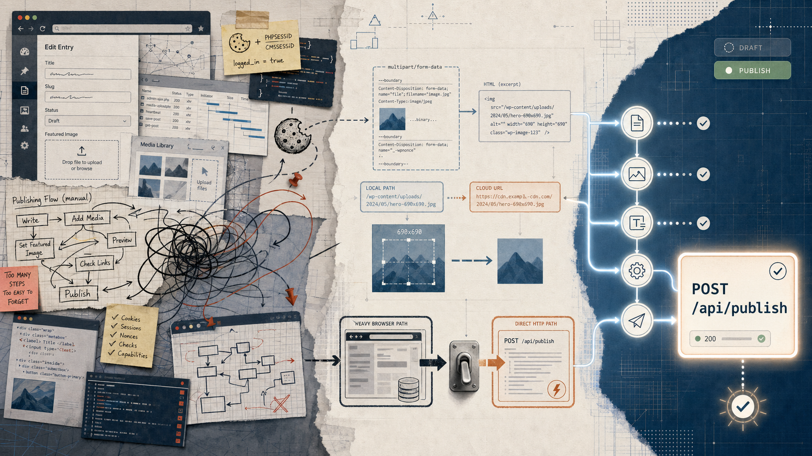

> [!info] 本文由來
> 這篇整理自 GitHub repo 的 README、commit 歷史、原始碼，以及開發當時的 Codex CLI 對話紀錄，由 Claude 協助結構化後審稿發布。
>
> 原始開發發生在 2026 年 1 月。後續 Skill 的測試與調整延續到 1 月中旬。
>
> 文章開頭的 hero 圖由 **Codex CLI 內建的 image_gen 工具**生成（OpenAI gpt-image-2 模型）。

## 起因

我所在的公司有一套內容管理後台，行銷人員每次要發文都要手動打開後台、填標題、貼內文、上傳縮圖、選分類、設發布時間，然後按送出。一篇文章頂多五分鐘，但如果一週要發十幾篇，加起來就是不小的時間成本，而且這種重複操作特別容易出錯。

我一直想做一個工具，讓這個流程可以從外部直接呼叫 API 觸發，這樣就可以接上 LLM 工具，做到從「AI 生成文章草稿」到「直接推上後台」的完整自動化。問題是，公司內部 CMS 沒有對外文件，也沒有開放的 API，想串接得自己想辦法。

## 主要功能

這個工具的核心是一個本地跑的 HTTP 服務（Express，預設 port 3000），對外暴露一個 `POST /api/publish` 端點，接受 `multipart/form-data`。只要傳入標題、摘要、HTML 格式的正文、分類標籤、發布時間，工具就會自動處理登入認證、建立文章、上傳縮圖，搞定整個發布流程。

幾個我用起來比較實用的功能：

- **自動處理文章內圖片**，偵測正文裡的本地圖片路徑（``），自動上傳並把路徑替換成線上 URL，這樣在本地寫好的文章直接推上去，圖片也不會壞掉。啟用方式是傳 `processImages=true` 加上 `imageBasePath`
- **支援草稿與正式發布兩種狀態**，`status` 傳 `draft`（下架）或 `publish`（上架），可以先推上去當草稿，確認沒問題再在後台點上架
- **排程發布時間**，用 `publishTime` 欄位指定未來的時間（格式 `YYYY/MM/DD HH:mm`），不指定的話預設用當下時間
- **多分類支援**，`categories` 傳 JSON 陣列，可以一次指定多個後台分類 ID
- **縮圖兩種來源**，可以直接上傳圖片檔（`thumbnail`）或傳線上圖片網址（`thumbnailUrl`），如果是網址，工具會自動下載再上傳

## 開發過程

最有趣的部分是研究公司 CMS API 結構這段，這幾乎是全部讓 Claude Code 來做的。

我的做法是把後台流程整段交給 Claude Code 自己跑。第一版用 **Playwright** 啟動真實瀏覽器，把登入、開新文章、填資料、上傳圖片、送出整個流程模擬一遍。這樣最保險，畢竟一開始完全不知道哪些欄位是必要的、哪個流程順序不能換。Claude Code 邊跑邊看每一步發出的請求與後台回應，再從中分析請求的順序、格式、認證方式，還有後台回應裡藏的各種隱性欄位。

Playwright 版跑起來是跑起來了，但每次發一篇要等 15 秒左右，記憶體吃很多（約 500 MB），部署也麻煩。

有了 Playwright 版作為參考之後，Claude Code 再把整個流程改寫成純 HTTP 請求版，用 **axios + tough-cookie** 直接管理 session 和 cookie，模擬瀏覽器行為但不啟動瀏覽器。因為已經清楚 CMS API 的認證機制和請求結構，速度從 15 秒降到約 3 秒，記憶體降到約 50 MB，部署也簡單多了。現在 Playwright 版留著當備用方案（也方便日後流程變動時拿出來重跑一次採樣），平常主要跑 HTTP 版（`npm start`，對應 `src/index-http.js`）。

## 技術選擇

整個工具用 Node.js 寫，對外是一個標準的 REST API 伺服器。選 Node.js 主要是因為這類 HTTP 整合工作 JS 的生態很成熟，`axios` 加 `axios-cookiejar-support` 加 `tough-cookie` 就能輕鬆管理 session 和 cookie，處理登入認證與 session 管理。上傳圖片用 `form-data` 組 multipart，接收端用 `multer`，整個 I/O 鏈都在 Node.js 生態裡走完。

對外的 API 設計刻意做得很乾淨，輸入就是文章的幾個基本欄位，不暴露任何公司 CMS 內部的細節，這樣接上 LLM 工具的時候，提示詞只要描述「標題、摘要、內文、分類」就夠了，不需要知道後台是怎麼運作的。

Playwright 版保留下來是有意為之的決策。研究 API 結構的過程中難免有些後台行為不確定，有個「人工模擬」的備用版本，出問題時可以打開瀏覽器視覺化除錯，會方便很多。CLEANUP_PLAYWRIGHT.md 有列出如果真的想清掉 Playwright 的完整步驟，但預設保留。

## 心得

### 縮圖尺寸是個隱藏規格

工具第一次跑通後，我去後台確認，文章是進去了，但縮圖顯示不對。後來發現後台對縮圖有一個隱性規格，圖片必須是固定的正方形尺寸（690x690），偏了就算上傳成功也會跑版。

這種「沒寫在任何文件裡、自己手動操作時從來不會注意」的細節，是串接沒有 API 文件的系統時最常踩到的地方。解法是在 Skill 的發文腳本（`publish.js`）裡加入自動處理，在上傳前先用 macOS 內建的 `sips` 指令讀尺寸，不是 690x690 就自動裁切輸出新檔再上傳，原圖不動，暫存檔發完即刪。用 `sips` 是因為它是 macOS 內建的，不需要額外裝 ImageMagick 或 Sharp，但也因此這個縮圖處理只能在 macOS 上跑。

### Playwright arm64 / x64 衝突

另一個踩到的坑是架構問題。開發機是 Apple Silicon，Playwright 在某個狀態下預期找 x64 的 headless Chromium，而機器上只有 arm64 的快取，導致瀏覽器一直啟動失敗。

這個問題在「單獨跑專案」時從來沒出現，卻在我改成用 Codex Skill 觸發時才冒出來，因為執行環境稍微不同（Skill 的執行路徑不同，Playwright 重新解析 Chromium 位置）。修法是在 `auth.js` 裡加一個 `SENAO_CHROMIUM_EXECUTABLE_PATH` 環境變數，強制指定 arm64 的執行路徑，讓 Playwright 不要自己猜。

這類「換了一層呼叫方式就壞」的問題，如果沒有 Claude Code 幫忙在 log 裡找線索，自己排查可能要花很久。

### 把工具包成 Skill，讓 AI 可以直接觸發

工具能跑之後，我做了一件事，把整個發布流程包成一個 Codex Skill（放在 `/Users/jaschiang/Documents/GitHub/my-claude-skills/senao-one-click-publish/`，再用軟連結接到 `~/.codex/skills/`）。這樣我在 Codex CLI 裡說「幫我發這篇文章」，它就會呼叫 skill，skill 負責接收文章內容、把 Markdown 轉成 HTML、處理縮圖、呼叫發布工具，整個流程不用我再手動介入。

包成 Skill 時有一個設計選擇，就是 skill 本身不包含發布工具的程式碼，只負責呼叫。工具的路徑用環境變數 `SENAO_PROJECT_ROOT` 指定（放在 skill 資料夾下的 `.env`），這樣做的好處是，兩個部分可以獨立更新，如果工具邏輯改了，skill 不需要跟著動；而且對外開源的話，別人只要照說明設好環境變數，就能接上自己的環境。

Skill 的 `publish.js` 腳本負責，接收 JSON payload，判斷輸入是 Markdown 還是 HTML（自動偵測或由 `contentFormat` 欄位指定），處理縮圖尺寸（690x690 自動裁切），再組成請求打到本地的 `/api/publish` 端點。

### Headless 除錯，視覺確認很有用

有一次我跑完腳本，程式回報成功，但去後台找不到那篇草稿。在不確定是不是真的有寫入的情況下，我讓 Claude Code 改成 `headless=false` 重跑一次，打開真實瀏覽器視窗，這樣可以親眼看到每一步操作，確認登入成功、頁面有跳轉、表單有填入、確實有儲存。

後來找到的原因是後台列表預設只顯示某個狀態，草稿落在另一個分頁，不是沒寫進去。但這個「拿出 headless=false 視覺確認」的動作，在排查不確定的整合問題時很好用，比一直看 log 直觀多了。

### 兩個環境變數容易搞混

有一個細節值得記下，這個工具有兩套環境變數，主專案的 `.env`（放帳號密碼和 base URL），以及 Skill 資料夾的 `.env`（放 `SENAO_PROJECT_ROOT` 指向主專案路徑）。兩個 `.env` 都要設好，任何一個漏掉都會導致發文失敗，且錯誤訊息不一定直觀。

實際上 `index-http.js` 啟動時會先做環境變數驗證，如果 `SENAO_USERNAME`、`SENAO_PASSWORD`、`SENAO_BASE_URL` 三個其中有缺，會直接 exit 並印出清楚的錯誤，不會讓你跑到一半才爆。這個 fail-fast 設計有幫我省掉幾次排查時間。

## 結語

這個工具本身不大，但它代表的是一種工作流思維，把 AI 生成的東西真正接上業務系統，而不是停在「生成完貼上去」這一步。Claude Code 在其中扮演的角色不是寫功能，而是分析 API 結構，把我自己看 Network tab 費力拼湊的過程，直接壓縮成可以跑的程式碼。

對我來說，這類「讓 AI 幫你串接沒有文件的系統」的能力，可能才是 vibe coding 最有用的地方，不是生成樣板程式碼，而是去搞定那些原本要花很多時間才能弄懂的整合細節。

值得補充一點，公司同個 CMS 我實作了兩套並行的版本。一套就是這個獨立 HTTP 服務（cms-publisher），讓任何 LLM 工作流都能直接呼叫 `POST /api/publish` 把文章塞進去；另一套整合在 [[article-suite|article-suite]] 內部，做為文章工作台的「最後一哩」，跟商品卡 / schema 注入 / 縮圖等流程綁在一起。兩套程式碼是分開維護的（article-suite 內建了自己刻的 HTTP 客戶端版本），不是同一份，但靠著各自的 README 和環境變數，兩條路都還能維持運作。
