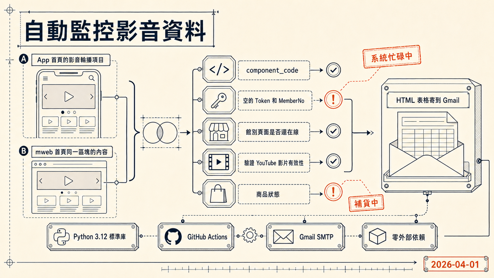

> [!info] 本文由來
> 這篇是我整理自己做這個小工具的過程，由 Claude Code 協助對照 repo commit 歷史與工作 session 紀錄草稿後，我審稿修訂發布。
>
> 文章開頭的 hero 圖由 **Codex CLI 內建的 image_gen 工具**生成（OpenAI gpt-image-2 模型）。

## 起因

我所在的電商公司 App 首頁有一個影音輪播版位，會輪流播幾支 YouTube 影片，每支影片點下去會進到對應的品牌館別頁面。品牌館別頁面本身也有一個嵌入影片的版位。

這兩個地方的設定是分開的，App 和行動網頁（mweb）的版位設定也各自獨立。問題在於，**內容上下架完全沒有通知機制**，可能發生這些狀況而不自知：

- 首頁影片連結到的館別已下架
- 館別頁面的嵌入影片不見了
- App 設定的連結是館別網址，但 mweb 設定的是 YouTube 直連（格式不一致）
- App 和 mweb 導向不同的館別

這類問題會讓使用者點下去之後看到異常頁面，或者 App 和 mweb 呈現不一致。人工定期去檢查不實際，所以我想寫一個自動監控腳本。

## 主要功能

這支腳本（`check_hn_videos.py`）每天自動執行以下檢查：

1. **抓取 App 首頁的影音輪播項目**，包含 YouTube 影片 ID、Tab 標籤、點擊連結的館別代碼
2. **抓取 mweb 首頁同一區塊的內容**，做 App vs mweb 比對
3. **逐一檢查館別頁面是否還在線**，以及館別內的嵌入影片是否還存在
4. **驗證 YouTube 影片有效性**，透過 YouTube oEmbed API 確認影片沒有被私有或移除
5. **檢查館別頁面的商品狀態**，若商品缺圖、缺名稱或出現「補貨中」則標記異常

有差異或異常時，腳本會整理成 HTML 表格寄到 Gmail，並在 email 裡直接附上對應的後台管理連結，讓收到信的人可以直接點進去修改，不用再自己找。

## 開發過程

### 第一步，搞清楚 App 怎麼拿資料

App 本身沒有公開文件，一開始不確定資料從哪裡來。我透過研究 App 端如何取得首頁資料，找到 App 公開呼叫的資料 API 介面，確認了 request 格式、response 資料結構，以及首頁各版位的識別代碼（`component_code`）。

這一步 Claude Code 幫了不少忙，能在 App 端的公開網路請求裡搜尋關鍵字，找出 API 端點和相關的資料結構。

比較意外的發現是，所有 API 都吃一個 POST 參數傳入使用者身份，但 guest 身份只需要帶空的 Token 和 MemberNo 就能存取，不需要真正登入。

### 第二步，搞清楚 mweb 怎麼爬

mweb 首頁是 HTML，影音版位隱藏在特定的 HTML 註解標記之後，用 regex 找到對應的區塊再解析。館別頁面的影片資訊也全部在 HTML 裡，沒有走獨立 API，所以 API 方式無效，只能爬網頁。

這邊踩了一個坑，館別 API 回傳的 floors 資料是空的，不含影片。一定要爬對應的 mweb 頁面才能看到影片資料。

### 第三步，確認比對邏輯和異常定義

「異常」這個詞要先定義清楚，否則腳本不知道什麼情況要通知。最後整理出幾種情況：

- App 和 mweb 的影片點擊目標連結類型不同（一個是館別 URL，一個是 YouTube 直連）
- App 和 mweb 導向不同的館別
- 館別頁面回傳異常（「系統忙碌中」或 response 過短）
- 館別頁面有影片但影片 YouTube ID 與首頁不一致
- 館別頁面的商品資料有問題

### 第四步，實測之後的發現

工具第一次跑起來，就抓到 mweb 有幾個版位設定錯了，連結直接指向 YouTube 而不是館別頁，和 App 設定不一致。這些都是真實的設定錯誤，修正後 App 和 mweb 才對齊。**兩端設定雖然獨立，但實務上行銷端是同一批人在維護，平時都會同步更新**，所以掃 mweb 跟掃 App 拿到的內容幾乎完全一樣。

這個發現讓監控腳本的價值重點轉了一下，

- **驗證一致性的長期成立**，萬一哪天有人忘了同步，腳本能第一時間抓到
- **YouTube 影片本身的下架或私有化**，這跟兩端設定無關，仍然是真實的監控需求
- **館別頁面異常**（系統忙碌、商品下架、缺圖），跟 App / mweb 兩邊一不一致無關

換句話說，做這支腳本之前我假設「兩端會頻繁分歧」，做完才知道分歧很少。**真正會持續變動的是 YouTube 影片狀態跟館別頁面內容**，工具的價值落在這兩塊，不在 App vs mweb 比對本身。

### 踩到的坑

第一個版本放到 GitHub Actions 跑的時候，整個 job 直接失敗，連 `result.txt` 都沒產生。問題出在 private repo 沒有給 workflow 的 `contents: read` 權限，checkout 就掛了，後續步驟完全沒跑到。加上 `permissions: contents: read` 之後才過。另外 Job Summary 和 Upload artifact 也要防禦這種 checkout 失敗的情況，先檢查檔案存在再執行，否則會連鎖報錯。

還有一個是商品頁的「補貨中」判斷，第一版直接掃整頁 HTML，結果抓到頁面下方推薦商品的「補貨中」文字，誤報。後來改成只看主商品自己的按鈕區塊（`#btn-group`），才能準確判斷當前這件商品是否補貨中。

## 技術選擇

這個專案的選擇很刻意，盡量保持**零外部依賴**：

- **Python 3.12 標準庫**，只用 `urllib.request`、`re`、`html.parser`，不裝 requests、BeautifulSoup 或 scrapy
- **GitHub Actions** 做排程，每天台灣時間早上 09:00 執行一次
- **Gmail SMTP** 寄通知信，用 App Password 認證，不走第三方服務
- 所有 secrets 放在 GitHub repository secrets，腳本本身不含任何認證資訊

不裝外部套件的好處是，GitHub Actions 環境不需要安裝步驟，直接跑。壞處是 HTML 解析全靠 regex，遇到結構異動比較容易壞掉。

## 心得

（TODO 補上實際使用後的心得）

## 結語

這個案子有趣的地方在於，起點是一個很具體的痛點，「內容上下架沒有通知，要人工去查」，然後一路追下去，從研究 App 端 API 呼叫方式、HTML 爬取，到最後落地成一個每天自動寄信的監控流程。

整個過程用了一個主要的 Claude Code session（3/25，共約 6 小時）加一個 Codex session（4/01，約 2 小時），斷斷續續跨了將近一週。比較花時間的是搞清楚 mweb 的 HTML 結構，以及處理 GitHub Actions 環境和商品判斷邏輯的一些細節問題。
