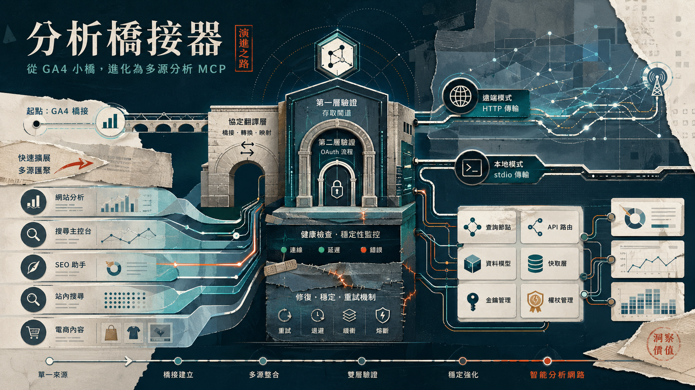

> [!info] 本文由來
> 這是一份由 **Claude Code 整理的草稿**，內容尚未經作者人工審稿，可能有不準確的地方。
>
> 整理依據，
>
> - GitHub repo, [JasChiang/ga4-remote-mcp](https://github.com/JasChiang/ga4-remote-mcp) 的 README（若有）、commit 歷史與原始碼
> - Claude Code 工作 session 紀錄, `~/.claude/projects/-Users-jaschiang-claude-----ga4-remote-mcp/`
>
> 文章開頭的 hero 圖由 **Codex CLI 內建的 image_gen 工具**生成（OpenAI gpt-image-2 模型）。

## 起因

事情從一個很實際的需求開始，我想在 Claude 裡直接問「這週流量怎樣」或「哪個頁面的搜尋曝光在掉」，不想每次都開 GA4 介面或下載 CSV。

最直覺的做法是本機跑一個 stdio MCP，但我更想試的是 **remote HTTP MCP**，原因有兩個。

第一，remote MCP 可以讓我從任何地方，不限單一電腦，直接在 Claude.ai 用，不用依賴本機 process 在不在線。第二，多人或多個 Claude 實例共用同一個 server 比較容易，不用每台機器各自維護 token 與設定。

這個判斷後來被驗證是對的，但代價是 OAuth 複雜度直接翻倍。

## 主要功能

現在的 server 有以下幾組 MCP tools：

**GA4 分析**，基礎報表、realtime、漏斗分析、segment 占比與 segment 內維度排行。

**Search Console**，site 列表、依頁面或查詢字彙的報表、page + query 交叉分析、URL inspection。

**SEO helper**，讀取特定頁面的文章 metadata，以及查 Google Autocomplete 建議字，方便做關鍵字研究。

**站內搜尋 API**，公司電商站的公開 JSON API，涵蓋商品搜尋、autocomplete、文章搜尋、單篇文章抓取。

除了 MCP tools，server 本身也提供幾個 HTTP endpoint，包含 `/healthz`、`/oauth/authorize`、`/oauth/token`、`/oauth/google/callback`，以及一個開發期間留下的 `/debug/tcp`。

## 開發過程

整個演進大概分成五個階段，從 commit 訊息就看得出來。

**第一階段（2026-03-30 初版）**，把最核心的東西打通，OAuth bridge + HTTP MCP endpoint + GA4 基礎工具 + in-memory token store。這個版本比較像 PoC，但跑得起來。

**同一天的第二波**，in-memory store 很快就暴露問題，Render 上的服務一重啟，所有人的 token 就消失，要重新 OAuth。於是立刻接入 Supabase/Postgres，加上 refresh token，再修掉 Google token refresh 後只更新記憶體、沒有回寫 store 的 bug。

**第三階段（2026-03-31）**，資料面擴充，先加 GSC，再加 life SEO helper 工具。同一天也做了一件架構上的決定，把 remote HTTP 與 local stdio 雙模式同時支援。這讓 repo 從「部署到 Render 才能用」變成「本機也能直接掛」，開發與測試的摩擦低很多。

**第四階段（2026-04-09）**，一整串的穩定性修復。這段歷史從 commit 訊息就能還原，Postgres 初始化慢 → 服務啟動崩潰 → 加 connection timeout → 加重試邏輯 → 改成背景持續重試 → 加 `/debug/tcp` 診斷端點，把問題一層一層剝開。

**第五階段（2026-04-10）**，先降低 Supabase auth store 的 DB 壓力（每次請求都 prune 太頻繁），然後接入公司的公開站內搜尋 API，server 正式從 Google analytics bridge 變成混合型商業分析 MCP。

## 技術選擇

### 雙層 OAuth 是最複雜的部分

Remote HTTP 模式的 OAuth 有兩層，不是一層。

第一層是 **Claude 對這台 MCP server 的認證**，用標準的 OAuth 2.0 authorization code flow 加 PKCE，server 自己扮演 authorization server，發行 access token 與 refresh token。

第二層是 **這台 server 對 Google 的認證**，拿到 Claude 打進來的 request 後，server 從 store 取出對應的 Google token，再去打 GA4 / GSC API。

整個 callback 路徑是，Claude 打 `/oauth/authorize` → server 驗完 PKCE 後 redirect 去 Google OAuth consent → Google 回來 `/oauth/google/callback` → server 建立本地 authorization code → Claude 用 `POST /oauth/token` 換 MCP token → 之後每次請求帶 Bearer token。

這段邏輯集中在 `src/routes/oauth.ts`，是整個 repo 裡最需要細心維護的地方。

### Remote 比 Stdio 更適合這個場景，但成本也更高

Stdio 模式乾淨很多，沒有第一層 OAuth，本機 Google OAuth 完一次，token 存在檔案裡，之後每次 MCP client 起 process 就直接用。

Remote HTTP 多了 server 這層，開發維護成本比較高，但可以讓多個 client（或不同電腦上的 Claude）共用同一個已認證的 server，適合已經有 Render/fly.io 這類平台習慣的工作流。

最後讓兩種模式並存，實際上同一套 MCP tools 跑兩個 transport，程式碼沒有重複，算是比較理想的結構。

### Store 設計

Token store 有兩個 driver：memory 跟 postgres。沒有設 `SUPABASE_DB_URL` 的時候用 memory，適合本機開發；設了就自動切到 Postgres，適合 remote 部署。

`/healthz` 的設計也連動到這裡，它反映的是 store 的 ready 狀態，而不是單純 HTTP 200。這讓 Render 的 health check 能真正偵測到 DB 連線問題，而不是假裝沒事。

### 2026-04-09 那串修復

值得單獨提一下這五個 commit，因為它展示了「把一個服務從能跑推進到在平台上活著」的實際過程。

問題根源是 Render + Supabase 之間的冷啟動時序，Postgres pool 還沒暖起來，服務就被 health check 砍掉。解法是先讓 HTTP server listen，不等 DB，再用遞增延遲重試初始化，失敗超過門檻後換成背景每 30 秒重試一次，直到 store ready。`/debug/tcp` 是當時用來直接從 Render 容器測 Supabase pooler 與 Google 443 TCP 連通性的診斷工具，問題排清後留在程式裡沒有移除。

## 更多開發細節

### 站內搜尋 API 是逆向工程出來的

加入電商站內搜尋這個需求，一開始打算用 HTML 爬蟲，但很快就發現太脆。後來在 Claude Code 幫忙下，直接翻站台載入的 JavaScript 檔案，找到站內搜尋的公開 JSON API（搜尋、autocomplete、文章查詢），全部都是公開不需要 auth 的端點，只要帶正確的 `application/x-www-form-urlencoded` body 就能拿到結構化資料。

其中有一個小坑，文章搜尋的參數名不是 `keyword` 或 `q`，而是 `search`，這個是測試過幾個猜測後才確定的。另外單篇文章沒有直接的 endpoint，最後實作成以關鍵字縮小範圍、分頁走訪找到目標 seqId 的 helper。

### 想把 server 接進其他 MCP client 的坑

Remote HTTP MCP 部署上線後，我試了幾個 client，LM Studio、Open WebUI 接本地 LLM 的方式。這段花了不少時間，幾個踩到的點值得記錄。

LM Studio 的 stdio 模式需要先把 Google OAuth token 存成本地 JSON 檔，不走 server 那層 OAuth，第一次跑沒有檔案就直接報錯。Open WebUI 的 remote streamable MCP 模式，MCP server 需要在 `CLAUDE_ALLOWED_REDIRECT_HOSTS` 環境變數裡把 Open WebUI 的 domain 列入許可，否則 OAuth callback 會被擋掉，不會跳 Google consent 畫面。Open WebUI 設定介面右上角的 ID 欄位是它自己的內部識別 ID，不是填 OAuth client ID，這個 UI 很容易誤解。

這些問題排完後，remote MCP 接進 Open WebUI 搭配本地模型的組合是可以跑的，只是當時本地模型的 tool use 品質和 Claude 差距還是很明顯。

### Funnel Report 的 `z.undefined()` 事件

擴充 `ga4_run_funnel_report` 支援 segments 時，為了解決 Zod `z.lazy()` + `.optional()` 在某些版本的 MCP SDK 下產生 `{ allOf: [{ $ref: ... }] }` 這種 JSON Schema 結構，做了一個替代方案，把 schema 改成 `z.union([filterSchema, z.undefined()]).optional()`。

這個改法讓 server 在列出 MCP tool 清單時直接崩潰，錯誤是 `MCP error -32603: Undefined cannot be represented in JSON Schema`，因為 JSON Schema 規範根本沒有 `undefined` 這個型別。

實際的影響是所有 tool 都消失，Claude 顯示 no tool available。修法是改回 `filterSchema.optional()`，`allOf` 包裝的問題留著，因為 MCP SDK 驗證輸入時用的是原始 Zod schema，`allOf` 只影響傳給 Claude 的描述格式，實際功能沒有壞。

### 一個使用情境推動了不少 API 設計

做公司電商站分析時，逐漸釐清了一個具體的分析需求，文章頁面沒有自訂埋碼，唯一能做文章到商品歸因的方式，是文章內的商品連結加 `?content={articleId}` 之類的 query param，透過 `pagePathPlusQueryString` 來追蹤。這個限制反過來推動了 `ga4_run_funnel_report` 的 open funnel 支援，以及 `funnelBreakdown` 讓文章成效可以依路徑拆行，還有對 `pagePathPlusQueryString` 這類維度的明確支援，而不只是 `pagePath`（Funnel API 不接受 `pagePath`，只接受 `pageLocation` 或 `pagePathPlusQueryString`，這個限制直到踩到錯才發現）。

## 心得

把這套 MCP 實際用在分析工作裡，最直接的感受是，過去需要下載報表、對欄位、手動算轉換率的工作，現在可以在對話框裡直接問，幾秒內拿到數字。GSC 和 GA4 交叉分析尤其明顯，哪些 query 帶來 impression 但 GA4 轉換差，以前這種問題要花十幾分鐘，現在一句話就能問出來。

比較誠實的評價是，這套工具比較適合「知道自己想問什麼」的情境，模型不會主動發現問題，它的強項是把你已經知道要看的分析執行得更快。

## 結語

這個 repo 最初只是想把 GA4 接進 Claude，最後卻因為「要讓它在真正的服務上活著」，花了相當多力氣在 OAuth 設計、store 韌性、雙模式支援上。把公司的站內搜尋 API 接進來那段，也算是意外的收穫，從爬蟲思路轉到找 JSON API，讓整個整合乾淨很多。

值得一提的是，整個開發期間主力是用 Claude Code 輔助，commit 訊息的具體程度也反映了這一點，大部分的 commit message 都能直接說清楚「什麼問題、為什麼改、影響是什麼」。這種開發節奏讓 git log 本身就能當文件用。
