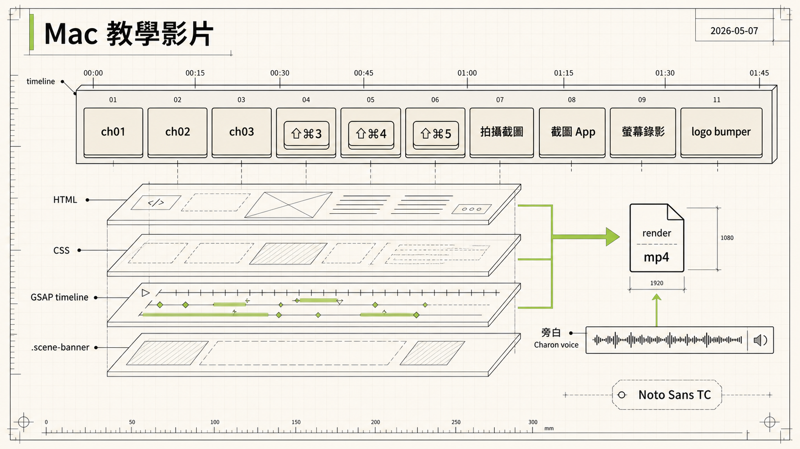

> [!info] 本文由來
> 這是一份由 **Claude Code** 整理的草稿，內容尚未經作者人工審稿，可能有不準確的地方。本文有三個版本，v1 寫於 105 秒成品時，v2 在 4:32 成品時擴寫，v3 在 4:36 教學優化版加上後續迭代。前 8 節描述 v1，第 9-16 節是 v2，第 17 節以後是 v3 的教學導向修改。
>
> 整理依據，
>
> - 工作目錄 `~/claude/hyperframes-projects/mac-tutorial/`，包含 `index.html`、17 段 narration mp3、`design.md`、`assets/narration/semantic_captions.py`、最終 render mp4
> - Claude Code session 紀錄，`~/.claude/projects/-Users-jaschiang-claude----/`，含 6 條從這次工作累積出的長期記憶（HyperFrames 多場景設計、品牌 palette 取色與套用、GSAP from() 多元素陷阱、配圖一律走 codex CLI、HyperFrames render 期 nth-child fail、字幕內容對齊視覺）
> - 三條 user-level skill 從專案記憶提煉出來放到 `~/.claude/skills/`，跨資料夾都能讀到（HyperFrames 跨專案規範、品牌規範、blog 寫作規範）
> - Codex CLI session 紀錄，`~/.codex/sessions/2026/05/06/` 第一輪 mockup 圖生成、`~/.codex/sessions/2026/05/07/` hero 圖生成
>
> 文章開頭的概念圖是用 **Codex CLI 內建的 image_gen 工具**生成。

## 為什麼要試這個

公司有一檔 Apple 教學節目，我手上有一篇腳本逐字稿，內容是把 ⇧⌘3 / ⇧⌘4 / ⇧⌘5 三組快捷鍵跟 QuickTime 螢幕錄影講清楚。

過去這種教學影片要靠剪輯軟體一條軌一條軌拉，文字卡靠 After Effects 模板，配音找錄音棚或 AI TTS 工具。這次想試另一條完全不一樣的路，**讓 HTML/CSS 變成影片合成語言**。

HyperFrames 把網頁當作影片時間軸，每個 scene 就是一個 div，動畫用 GSAP 寫，最後 headless Chrome 抓 frame 餵給 ffmpeg。優點是 vector 永遠清晰、決定性渲染（同樣輸入永遠產出一樣的影片）、而且可以全程跟 Claude Code 用對話迭代。

> 第一輪一個下午從零做到 1:45（74 秒到 105 秒重構過 4 次）。第二輪把腳本還原成完整旁白、加 63 段字幕、拆 sub-scene、修一系列 render-time bug，最終長度落在 4:32。學到的 GSAP 陷阱、字幕設計、render 期 selector 限制全部寫進長期記憶。

## 工具鏈

- **HyperFrames**，把 HTML 變影片合成。`npx hyperframes init` 起新案、`npm run dev` 開 Studio 預覽、`npm run check` 跑 lint+inspect、`npm run render` 出 mp4
- **Claude Code**，全程的 pair programming agent，從寫第一個 scene 到最後 render
- **fal-ai/gemini-3.1-flash-tts**，繁中旁白生成。從 `.env.local` 讀 `FAL_API_KEY` 直接 Claude Code 呼叫，選 Charon voice
- **品牌色取自 logo bumper**，抽幀分析公司 logo 動畫的主色，然後一鍵替換整個 palette

## 重點過程

### 1. 從腳本到 9 個 scene

第一步是把整篇腳本拆成 scene。每個 scene 一段獨立內容，包含自己的 title、key visual、說明文字。

```
s1   片頭                 公司 Apple 教學節目開場
s2   章節 01 拍攝截圖        過場字卡
s3-s5  ⇧⌘3 / ⇧⌘4 / ⇧⌘4+space  三組快捷鍵
s6   章節 02 截圖 App        過場字卡
s7   ⇧⌘5 開啟工具列
s8   章節 03 螢幕錄影        過場字卡
s9   錄影模式 / 設定 / 停止
s10  小提醒 + 結尾
```

每個 scene 在 HyperFrames 寫起來像這樣，

```html
<div id="s3" class="scene clip" data-start="22" data-duration="10.5" data-track-index="2">
  <div class="bg-base"></div>
  <div class="scene-content split">
    <div class="split-left">
      <div class="chapter-tag">擷取 整個螢幕</div>
      <div class="chapter-title-sm">同時按下這三顆鍵</div>
      <div class="keys keys-compact">
        <div class="key"><div class="glyph">⇧</div><div class="label">SHIFT</div></div>
        <div class="plus">+</div>
        <div class="key"><div class="glyph">⌘</div><div class="label">COMMAND</div></div>
        <div class="plus">+</div>
        <div class="key"><div class="glyph">3</div><div class="label">THREE</div></div>
      </div>
      <div class="desc">放開後，<b>右下角</b>會出現縮覽圖...</div>
    </div>
    <div class="split-right">
      <!-- Mac UI mockup goes here -->
    </div>
  </div>
</div>
```

`data-start` / `data-duration` 是 timeline 上的位置。`class="clip"` 告訴 HyperFrames 這是時間軸上的一個元素。Track index 給不同 track 編號，同 track 不能重疊。

### 2. 配圖，從 AI 生 PNG 到全 HTML 模擬

第一版我把 codex CLI 拉進來，用內建 `image_gen` 工具（OpenAI Images API 直連）生 4 張 Mac 桌面 mockup PNG，然後嵌進 scene。

結果不好，回饋很直接，

> 「亂碼了而且圖片這樣放好奇怪，應該是生成可以跟畫面搭得起來的圖，不管是背景圖或什麼都好，畫面如果要更改也要同步更改」

問題有兩個，

1. **HUD 文字疊加亂碼**，我每個 scene 都放了角落 metadata 文字（REC / 03 · WINDOW / SAVE → DESKTOP），多 scene 在 timeline 重疊時，這些 absolute 位置一樣的文字會疊在一起變亂碼
2. **配圖塞中間像貼貼紙**，PNG 直接放 keys 跟說明中間，看起來不像設計裡的一部分

兩個都改，HUD 全隱藏，配圖改成 split layout（左半 copy、右半圖），但更根本的解法是 **直接用 HTML/CSS 模擬 Mac UI**。

```html
<div class="mac-mockup">
  <div class="mac-menubar">
    <div class="apple-mark"></div>
    <span class="bold">Finder</span>
    <span>檔案</span>
    <span>編輯</span>
    <div class="spacer"></div>
    <div class="status-dot"></div>
    <span>16:45</span>
  </div>

  <div class="mac-window" style="top: 60px; left: 36px; width: 260px; height: 170px;">
    <div class="titlebar">
      <div class="traffic"><span class="red"></span><span class="yellow"></span><span class="green"></span></div>
      <div class="title">Notes</div>
    </div>
    <div class="body">
      <div class="row full"></div>
      <div class="row med"></div>
      <div class="row short"></div>
    </div>
  </div>

  <div class="mac-dock">
    <div class="dock-icon"></div>
    <div class="dock-icon alt"></div>
    <div class="dock-icon warm"></div>
  </div>

  <div class="screenshot-thumb">
    <!-- 縮覽圖，用幾個 div 堆出 mini menubar + mini windows + mini dock -->
  </div>
</div>
```

純 HTML 寫的 Mac UI 反而比 AI 生圖好處更多，

- **永遠 vector 清晰**，不會因為 render 解析度變糊
- **可以動畫**，dock icon stagger 進場、視窗滑入、選取框 scaleX 從左上角畫出來、相機游標 SVG fade in
- **完全跟設計系統綁在一起**，改 palette 一鍵套用到整個 Mac UI
- **沒有版權疑慮**，因為畫面裡完全沒有真實截圖或品牌 logo

### 3. logo bumper + 配色取自 logo

第二步插入了一支 8.5 秒的 `logo-final.mp4`（公司開場動畫），夾在片頭跟章節 01 之間。

```html
<video id="logo-video" class="clip" data-start="7.5" data-duration="8.5"
       data-track-index="2" src="logo-final.mp4" muted playsinline></video>
<audio id="logo-audio" class="clip" data-start="7.5" data-duration="8.5"
       data-track-index="3" src="logo-final.mp4" data-volume="1"></audio>
```

HyperFrames 規定 video 必須 muted，音軌要拆成單獨的 `<audio>` element 走另一個 track，這樣才能跟其他音軌獨立 mix。

接著我用 ffmpeg 抽 logo 的幾幀，丟給 Python PIL 量主色，

```bash
ffmpeg -i logo-final.mp4 -vf "select=between(n,0,256)*not(mod(n,50))" \
  -vsync vfr -y /tmp/logo-frame-%02d.png

# 然後 PIL Counter.most_common(3) 量 dominant color
# 結果是 #000030 深海軍藍 + #ffffff 純白
```

第一版整個 palette 套海軍藍。然後我貼了公司官方節目片頭的 reference，講「過場的風格」加上「綠色系」，整個 palette 翻一次，

| Token | 海軍藍版 | 公司品牌綠版 |
|---|---|---|
| bg | `#000030` | `#0a0a0a` |
| accent | `#6c8eff` | `#a3d942`（公司品牌綠）|
| key surface | `#1d2666` 到 `#00072e` | `#2a2a2a` 到 `#0e0e0e` |

換色用一連串 `replace_all` Edit 操作就好，因為我事先有寫 `design.md` 把所有 token 列清楚。

### 4. 章節卡，公司節目視覺語彙的綠金屬橫幅

過場章節卡完全照公司節目片頭的視覺語彙重做，

- 白底全幅
- 頂部四段細條紋，黑 / 綠漸層 / 銀漸層 / 黑
- 大橫幅，**綠 → 銀 → 黑** 95° 金屬漸層
- 中央白色 116px 粗體章節標題
- 下方深灰副標

```css
.banner-panel {
  height: 250px;
  background: linear-gradient(95deg,
    #a3d942 0%,
    #b8e057 22%,
    #d4d4d4 50%,
    #3a3a3a 76%,
    #0a0a0a 100%);
  /* 加一層內襯雜訊條紋 + 對角光暈讓它有金屬感 */
}
.banner-panel::before {
  content: '';
  position: absolute; inset: 0;
  background:
    linear-gradient(110deg, transparent 35%,
      rgba(255,255,255,0.18) 48%, transparent 60%),
    repeating-linear-gradient(95deg,
      transparent 0px, transparent 60px,
      rgba(255,255,255,0.04) 61px, transparent 63px);
}
```

第一版加了一顆「立體陰影黑球」嵌在右側，回饋直接，

> 「為什麼會有立體帶陰影的圓？」

拿掉。記到 `design.md` 的 Don'ts，「章節 banner 不加多餘的 3D 球或 chrome 元素」。

進場用 GSAP 串，條紋逐段 wipe，tag 落入，banner 從左 scaleX wipe，標題上滑，副標淡入。

### 5. 踩到 GSAP from() 多元素陷阱

過程裡最隱蔽的 bug。CH02 跟 CH03 章節卡的標題（「截圖 App」、「螢幕錄影」）整個消失了，但 CH01 正常。

原因是這段，

```js
// 給 CH01 用的，
tl.from(".banner-title", { y: 40, opacity: 0, duration: 0.6 }, 17.0);
```

`.banner-title` 是 broad selector，**同時打到三個 banner 標題**（s2、ch2、ch3）。

GSAP `from()` 預設 `immediateRender: true`，建立時就會把元素 snap 到「from 值」並把「當下值」記成「to 值」。流程變成，

1. CH01 from() 在 parse 時把三個 title 的 opacity 設成 0、記住 to = 1（CSS 預設）
2. CH02 自己的 from() 在 parse 時看到的「當下 opacity」已經被 step 1 改成 0，所以它記住 to = 0
3. CH02 動畫實際播時，「從 0 動到 0」，永遠看不到

修法兩件，

- ID-scoped selector，`#s2-banner .banner-title` 取代 `.banner-title`
- 改用 `tl.fromTo()` 把 from / to 兩端都寫死

```js
tl.fromTo("#s2-banner .banner-title",
  { y: 40, opacity: 0 },
  { y: 0, opacity: 1, duration: 0.6, ease: "power3.out" },
  17.0);
```

這個學到了寫進長期記憶 — 多 scene 合成不要用 broad class selector 寫 `from()`，每個 scene 用自己的 ID-scoped 加 `fromTo()`。

### 6. fal-ai/gemini-3.1-flash-tts 生繁中旁白

前面都搞定後，加旁白。第一次嘗試我把任務丟給 codex sandbox，但 codex 的環境讀不到 `FAL_API_KEY` 也連不上 `fal.run`，整個失敗。

切換策略，直接讓 Claude Code 在本地跑，從 `.env.local` 讀 key、用 Python `urllib.request` 呼叫 `https://fal.run/fal-ai/gemini-3.1-flash-tts`、抓回傳的 audio URL 下載 mp3。

```python
payload = json.dumps({
    'prompt': clip['text'],
    'voice': 'Charon',
    'language_code': 'Chinese Mandarin (Taiwan)',
    'output_format': 'mp3'
}).encode('utf-8')

req = urllib.request.Request(
    'https://fal.run/fal-ai/gemini-3.1-flash-tts',
    data=payload,
    headers={'Authorization': f'Key {key}', 'Content-Type': 'application/json'}
)
audio_url = json.loads(urllib.request.urlopen(req).read())['audio']['url']
urllib.request.urlretrieve(audio_url, mp3_path)
```

Voice 選 **Charon**，深沉穩健男聲，符合 Apple 達人教學主持人的感覺。其他可選的還有 Kore（暖女）、Leda（年輕女）、Puck（活潑男）、Achernar（靜謐女）。

11 段語音第一輪生成出來總長 134 秒，但合成只有 74 秒，根本塞不下。改了兩件事，

1. **腳本縮短**，每段砍掉一半字數，例如 s8（錄影設定）從 19 秒砍到 11 秒
2. **整體 timing 重構**，把每個 scene 按實際語音長度延長，74 秒總長拉到 105 秒。章節卡也從 5.5 秒延到 7 秒，讓標題停留時間夠久

語音整合走 alternating tracks（4 / 5）讓相鄰語音可以稍微重疊不衝突，

```html
<audio class="clip" id="nar-s3" data-start="22"   data-duration="9.68"
       data-track-index="4" src="assets/narration/s3.mp3" data-volume="1"></audio>
<audio class="clip" id="nar-s4" data-start="32"   data-duration="9.96"
       data-track-index="5" src="assets/narration/s4.mp3" data-volume="1"></audio>
<audio class="clip" id="nar-s5" data-start="42.5" data-duration="9.36"
       data-track-index="4" src="assets/narration/s5.mp3" data-volume="1"></audio>
```

### 7. 章節卡的高對比殘影問題

旁白接好後注意到，

> 「章節卡要消失的時候，章節文字沒有跟白色背景一起消失，反而晚了一點才消失」

原因是 HyperFrames 的官方建議是「**transition is the exit**」，下一個 scene 的 fade-in 取代離場動畫。一般情況沒問題，但章節卡是 **白底 + 116px 白色大標 + 強投影**，新 scene（黑底）淡入時，白底先被覆蓋（白到灰到黑），但白色大標的投影對比依然很高，看起來「殘影」式留下半秒才消失。

修法是違反「only final scene 可以 exit fade」這條軟規則，給三個章節卡 wrapper 加 0.4 秒退場 fade，跟下一個 scene 的 fade-in 同步，

```js
// CH01 ends at 22.5, s3 starts at 22, overlap 22-22.5
tl.to("#s2",  { opacity: 0, duration: 0.4, ease: "power2.in" }, 22.1);
tl.to("#ch2", { opacity: 0, duration: 0.4, ease: "power2.in" }, 59.1);
tl.to("#ch3", { opacity: 0, duration: 0.4, ease: "power2.in" }, 74.6);
```

這個是設計規則跟視覺現實衝突時的判斷，規則為了多數情況設計，但高對比章節卡是 edge case，破例反而比較好。

### 8. Render

最後跑 `npx hyperframes render`，

```
[Compiler] Fetched 945 font face(s) for "Noto Sans TC" from Google Fonts
[Compiler] No deterministic font mapping for: Microsoft JhengHei, PingFang TC, SF Mono
Capturing frame 3150/3150 (4 workers)
Encoding video → Assembling final video → 100% Render complete
```

3150 frames、4 workers 平行抓、ffmpeg 編 h264。105 秒影片約 5 到 6 分鐘 render 完，11.5 MB。

字型方面 PingFang TC 跟 Microsoft JhengHei 是 Apple / Microsoft 系統字型，不能再分發，HyperFrames 不能 bundle 進 deterministic render。我寫的 stack `'Helvetica Neue', 'Noto Sans TC', 'PingFang TC', 'Microsoft JhengHei'` 走 fallback 鏈，英文用 Inter（map from Helvetica Neue），繁中用 **Noto Sans TC**（從 Google Fonts 抓 945 個 font face）。

預覽（Studio 在 Mac 瀏覽器）會看到 PingFang TC 因為系統有，render 會 fallback 到 Noto Sans TC。

## 第二輪，從 105 秒到 4:32

105 秒看完一遍，發現節奏太擠，每段內容剛開講就被切掉，旁白也是壓縮過的精簡版。第二輪整個重來，回到完整腳本逐字稿，讓畫面去配合旁白。

### 9. Plan B，把 single scene 拆成 sub-scene

新版的 timing 不是平均分配，是讓**每個 sub-scene 的長度＝實際語音長度**。為了讓畫面有對應內容，把幾個原本 single scene 的章節拆成 sub-scene，

- s4 ⇧⌘4 起手 + s4b 進度／放開（第一個 sub-scene 沿用原 ID，新增的補 b/c 後綴）
- s5 ⇧⌘4+space 高亮 + s5b 放開存檔
- s6 ⇧⌘5 工具列開啟 + s6b 五顆按鈕 + s6c 選項浮層
- s7 錄影模式選擇 + s7b CMD 解說
- s9 小提醒 + s9b 結尾

加上 logo bumper 後總長 4:32（271.5 秒），17 個視覺 scene + 1 個 logo bumper。

過場規則改成**同 track 緊接無 overlap**，每場 `bg-base` 從 frame 0 就 100% opaque 蓋住前場，不再用 alternating track + 0.5s overlap 的 crossfade。原因是章節卡白底高對比，crossfade 時白色大標的 text-shadow 會殘影，hard cut 反而乾淨。

### 10. 字幕系統，63 段語意分組

長旁白 + 4:32 的長度，光靠語音不夠，要字幕。

第一版直覺地按「逗號自動斷句」切，結果像「**計時器**、**儲存位置**、**滑鼠指標**」這種列舉句被切成 3 個小 caption，列舉感整個破碎。

正確做法是先理解整段口白語意，再決定 caption 切點，

- 列舉句（A、B、C）整塊不斷
- 按鍵組合（Shift、Command、N）絕不切在「、」中間
- 動作 + 結果通常一組（「按下…然後放開，就能完成截圖」）
- 句尾完整的 `。 ！ ？` 才換段

最後手刻 63 段 caption，全部走 `data-track-index="6"` 同 track 接續，彼此不重疊。

### 11. Whisper 對齊失敗，回到 ffmpeg silencedetect

字幕要跟旁白音檔對齊，本來打算用 fal-ai/wizper（Whisper-as-a-service）拿 word-level timestamps。

兩條路都卡住，

- fal-ai/wizper 對所有 17 個 mp3 都回 422 Unprocessable Entity，data URI 編碼可能它不收
- 改本地 whisper-cli，跑出來的 JSON 在繁中字邊界 byte 切掉，UTF-8 decoder 直接 raise

最後用 ffmpeg silencedetect 解，

```bash
ffmpeg -i s4a.mp3 -af silencedetect=n=-30dB:d=0.18 -f null - 2>&1 \
  | grep -E 'silence_(start|end)'
```

拿 `silence_end` 當每個 speech segment 的起點，把 caption 切點 snap 到最近的 speech segment 起點。比 char-proportional 估時準很多，特別是停頓後接重音的句子。

### 12. 字幕容器寬度，CSS shrink-to-fit 的陷阱

實作 caption 樣式時看到，

> 「`如果只想截取畫面中的一小部分，請改按 Shift、Command 和 4。`這句，`4。`跑到第二行了耶，是不是字幕容器不夠寬？」

我先試把 `max-width` 從 1500 拉到 1800、再拉到 2400，**還是換行**。

去查根因，

```css
.caption {
  position: absolute;
  bottom: 64px;
  left: 50%;
  transform: translateX(-50%);
  max-width: 2400px;   /* 實際沒生效 */
}
```

CSS shrink-to-fit 算法對 `position: absolute + left: 50%` 元素的「可用寬度」是父容器右半邊（1920 × 50% = 960px），不是 `max-width`。`max-width` 確實限制了上限，但元素自然寬度先被 960px 卡住，根本撐不到 max-width，所以沒派上用場。

修法是加一行，

```css
.caption {
  position: absolute;
  bottom: 64px;
  left: 50%;
  transform: translateX(-50%);
  width: max-content;  /* ← 關鍵 */
  max-width: 1800px;
}
```

`width: max-content` 強制元素依「內容自然最大寬度」撐開，再用 `max-width` 蓋頂。這樣 1300px 寬的中英混合長句就能保持單行，超過 1800 才會被 wrap。

最後在 t=39 / 58 / 92 / 126 / 204 五個點抽幀驗證，全部單行。

### 13. 內容對齊視覺，藍色高亮 vs 品牌綠

s5（按 ⇧⌘4 後再按空白）這段，相機指標移到視窗時 macOS 會把該視窗整個高亮。我為了統一品牌綠把 `.mac-window.highlighted` 的 ring 設成綠色。

回饋一句話打到要害，

> 「01:43 有提到移到想截取的視窗上，視窗就會以**藍色**標示出來，這時候裝飾動畫沒有藍色」

旁白是照 macOS 真實行為寫的，畫面卻擅自改色。修法把 ring 換回 macOS 系統藍 `#0a84ff`，

```css
.mac-window.highlighted {
  box-shadow:
    0 24px 60px rgba(0,0,0,0.7),
    0 0 0 3px rgba(10,132,255,0.7),
    0 0 50px rgba(10,132,255,0.45);
}
```

從這次學到一條規則，**品牌色不要蓋 macOS 系統 UI 的真實色**。藍色高亮、紅色錄影燈、十字游標、相機指標，這些是觀眾的肌肉記憶，旁白也是照真實顏色講的，畫面擅自改色就會跟字幕字面不一致。

### 14. 按鍵 press 動畫，撞到 HyperFrames 的 nth-child render bug

旁白唸到「按下 Shift、Command、3」的那 0.3 秒，希望畫面對應的鍵帽真的有「被按下」的反饋（縮一下 + 綠色 ring flash）。

第一版用 nth-child 對每顆鍵加 stagger 動畫，

```js
tl.to('.s3k:nth-child(1)', { scale: 0.7, ... }, t1);
tl.to('.s3k:nth-child(3)', { scale: 0.7, ... }, t2);
tl.to('.s3k:nth-child(5)', { scale: 0.7, ... }, t3);
```

Studio preview 看起來都對，但 render 出來只有 s7b 的 CMD press 有效，其他全部失敗。Render log 講得很直白，

```
[Browser:WARN] GSAP target .s6tb:nth-child(4) not found.
```

GSAP 在 HyperFrames render 期對 `:nth-child` sub-selector 解不到目標。換 `gsap.utils.toArray('.s3k')[0]` 也救不回來，因為 timeline parse 在 DOM mount 之前。

修法是給每顆鍵獨立 class，

```html
<div class="key kn1">⇧</div>
<div class="key kn2">⌘</div>
<div class="key kn3">3</div>
```

```js
tl.to('.s3k.kn1', { scale: 0.7, ... }, t1);
```

`tl.from(".s3k", { ..., stagger: 0.12 })` 對整組 stagger 是正常運作的，問題只在 nth-child / nth-of-type 這類 sub-selector。這個 render-time quirk 寫進 user-level skill，下次直接知道避開。

### 15. 動態變化層，避免長畫面靜止

旁白一段塞到 12 到 15 秒，靜止畫面看久會無聊。加幾個低成本的微動態，

- **Ken Burns slow zoom** 蓋在所有 Mac mockup 上，1.0 → 1.04 八秒緩推，不搶戲
- **Sequential highlight** 在 s6b 五顆按鈕上做順序綠光呼吸（整個螢幕、所選部分、整個螢幕、所選部分、選項），跟旁白唸到哪顆對應
- **s7 拖曳手把脈動** 暗示「可拖曳調整」，不打斷靜止構圖
- **s3 縮覽圖右下角自動存檔動畫** 從游標移過去落到桌面，呼應旁白「自動儲存到桌面」
- **s5 相機指標 SVG 移動** 從中央慢慢飄到目標視窗上方再變成相機 icon

這些都是用 GSAP 短 tween 加在現有 element 上，沒新增 scene，就讓畫面持續有微小變化。

### 16. v2 Render

```
Capturing frame 8160/8160 (4 workers)
```

272 秒 × 30fps = 8160 frames，render 完約 14 分鐘，最終 mp4 28 MB、1920×1080、h264 + aac。比 v1 影片長 2.6 倍但檔案只大 2.4 倍，因為靜止畫面多 + Mac mockup 是純 HTML/CSS 沒視訊壓縮負擔。

## 第三輪，教學優化導向

v2 拿給人看完發現一個問題，**工程做得不錯但教學效果普通**。例如旁白唸到「指標周圍出現黑色圓圈」，畫面只是把那段文字寫在 bullet list 裡，沒實際 demo。每個動作要有「對應視覺」呼應，呈現實際 macOS 真實樣貌，內容才完整不破碎。第三輪整個重做視覺層。

### 17. Mac mockup 從深色換淺色（macOS Sonoma 風）

原本 mockup bg 是 `#1f2814 → #0e0e0e → #000` 暗綠黑漸層，跟 scene 黑底融在一起對比差，視覺上「Mac 螢幕」跟「外框舞台」沒區分。

換成 macOS Sonoma 桌布的冷藍灰，

```css
.mac-mockup {
  background: linear-gradient(165deg, #d4dce8 0%, #b8c4d4 50%, #8e9aac 100%);
}
```

連帶調整，

- menubar `rgba(245,245,247,0.85)` 淺色 + 深色文字
- mac-window 白底 0.96 + 淺灰 titlebar + 深灰文字
- dock 白色玻璃 + 飽和品牌色 icons（綠／藍／橘）
- mac-grid 白線改深色淡格線
- screenshot-thumb 同步淺色化
- popover、context menu、screenshot toolbar **維持深色**（macOS 系統下這些原本就是 frosted dark glass）

整支影片視覺現在是**「黑色外框舞台 + 淺色 Mac 螢幕內容」**的 layered 結構，跟真實看 Mac 螢幕的視覺一致。

順帶修了兩個 macOS 真實感小坑，

**紅綠燈圖示橫排**。原本 `.traffic span` 用 `display: block` 變成垂直堆疊，`display: inline-block + flex parent` 才橫排。

**視窗高亮從 ring 改成整片藍色 overlay**。⇧⌘4+Space 在真實 macOS 是把整片視窗用半透明藍蓋上，不是只圍邊。改 `::after` pseudo-element 蓋滿整片，

```css
.mac-window.highlighted::after {
  content: '';
  position: absolute;
  inset: 0;
  background: rgba(10,132,255,0.32);
  pointer-events: none;
  z-index: 10;
}
```

### 18. 拿掉 Ken Burns，改成內容對齊動畫

v2 的 Ken Burns 緩推（每個 mockup `scale: 1 → 1.05` linear over scene duration）是**通用裝飾**，跟教學內容無關。拿掉，每個 scene 換成跟旁白同步的具體動作。

- **s3 ⇧⌘3** 拍照閃光（白光蓋滿 mockup 0.06s peak）→ 縮覽圖往**右邊**滑出（不是右下對角，符合真實 macOS）→ 桌面右上角浮現 `Screenshot 14.30.png` 檔案 icon
- **s4 ⇧⌘4** 十字游標**跟著選取拉開**從左上角移到右下角（leading point），拖完閃光 + 縮覽圖出現
- **s5 ⇧⌘4 → Space** 鍵按下時序，⇧⌘4 三鍵幾乎同時（press 時間 77.0/77.3/77.6）→ 停 →  Space 獨立後按（82.0），用動畫講清楚「先後不是同時」
- **s6 ⇧⌘5** 工具列從**底部滑上來**（y: 220 → 0），對應旁白「打開工具列」
- **s6c Control + 左鍵** 完整序列，cursor 移到 thumb → Control 按下 → menu 浮現，不再 scene 開頭就全部出現
- **s8 click-pulse** 真的有 cursor + 兩道擴散黑圓圈呼應「點按時周圍出現黑色圓圈」，不只是文字 bullet

GSAP timing 全用 silencedetect 從旁白 mp3 抓出實際語音邊界，每個動作 lead 0.1 到 0.3 秒於對應旁白文字。

### 19. 縮覽圖要反映實際截取結果

v2 的縮覽圖是**通用 mini mockup**，不管什麼快捷鍵都長一樣。v3 改成反映實際截取的內容，

**s3 ⇧⌘3 整螢幕的縮覽圖**鏡像 s3 桌面排列。Notes 視窗在左上（小框）+ Safari 在中右（大框）+ 跟桌面一樣部分重疊 + 上下含 menubar 跟 dock。

**s4 ⇧⌘4 區域選取的縮覽圖**只呈現「選取範圍內的內容」，不含 menubar 跟 dock（不在選取裡），左邊是 Notes 視窗 body 切片（無紅綠燈，因為 Notes titlebar 不在選取裡），右邊主體是 Safari 視窗（含紅綠燈 titlebar + 內容）。

```
selection: top:90 left:200 w:320 h:200
- Notes 範圍切到: 200-250 (50px wide) of body, 不含 titlebar
- Safari 範圍切到: 240-520 of titlebar + body, 含紅綠燈
```

新手看就懂「⇧⌘3 截全部」vs「⇧⌘4 截一塊」的差異從成品就能看到。

### 20. 教學細節 polish

零碎但都有教學意義的小修，

- **結尾加 cheat sheet 4 組快捷鍵總覽**（2×2 卡片排版），把整支講過的 7 組組合濃縮成「⇧⌘3 截全螢幕」「⇧⌘4 自由選取」「⇧⌘5 截圖 App / 錄影」「⌘⌃Esc 停止錄影」4 組記憶點
- **s6c desc 加「= 右鍵選單」**註記。Mac 新手不知道 Control + 左鍵 就是右鍵，補一行視覺註解
- **s8「選項」設定四件事**從兩行（含 `<br>`）改單行，文字節奏跟視覺都更俐落
- **s7b 鍵順序對齊旁白**。原本畫面是 `⌃ + ⌘ + Esc`，但旁白唸「Command、Control、Esc」順序不一樣。修為 `⌘ + ⌃ + Esc`，press 動畫時間 200.7 / 202.1 / 202.8 對齊語音段
- **s7 → s7b 死空氣修掉**。s7a 旁白結束在 188.9，s7b 開始在 194.5，中間 5.6 秒沒聲音很尷尬。s7 縮 21s 到 17s，gap 變 1.6 秒
- **「按一下就能結束錄影」字幕** silencedetect 抓錯邊界給了 0.35 秒，肉眼來不及讀。實測語音 198.94 到 200.40，拉到 1.46 秒
- **s9 Apple TV 黑畫面 demo**新增。旁白說「拍出來會是黑畫面」，畫面以前只有純文字。加一個小 Apple TV 視窗 + 紅 ⊘ + 「截圖被封鎖」標籤
- **拖曳的十字游標**過去靜止在右下角，現在跟著選取框從左上角拉到右下角（leading point 隨 selection scale 0→1）

中間還繞了一圈 ch4「小提醒」章節卡，新增了 + 跑完發現 4:32 → 4:37 反而拖節奏，跟 s9 內容重複，砍掉省 7.5 秒。

### 21. 品牌 overlay + 片尾 stinger

最後兩件「上架前」的事，

**全片左上角持續顯示品牌 logo**。1920×1080 透明 PNG，整張蓋上 `` clip。但中間 logo bumper 期間（15-23.5s）疊上去會跟 bumper 動畫衝突，所以拆兩段，

```html


```

**片尾接 5.9 秒 stinger**。`assets/jingle.mov` 是 ProRes 1920×1080 + PCM 音軌，5.9 秒，公司品牌動畫。直接 video clip + audio clip 接在 s9b 結束後。

```html
<video id="jingle-video" data-start="270.5" data-duration="5.9" ...
       src="assets/jingle.mov" muted playsinline></video>
<audio id="jingle-audio" data-start="270.5" data-duration="5.9" ...
       src="assets/jingle.mov" data-volume="1"></audio>
```

**踩到一個 ProRes preview 不顯示的坑**。HyperFrames preview server 用瀏覽器播 video，瀏覽器解不了 ProRes，所以 preview 看不到 jingle 畫面只聽得到聲音。一度以為壞了，後來實測 ffmpeg render 沒事（headless 是 ffmpeg 在 decode），最終 mp4 jingle 視覺正常。

### 22. v3 Render

```
Capturing frame 8295/8295 (4 workers)
```

276.5 秒 × 30fps = 8295 frames，render 完約 12 分鐘，最終 mp4 **29 MB、1920×1080、h264 + aac、4:36**。比 v2 多了品牌 overlay + jingle 但檔案大小幾乎不變，因為大部分畫面靜止 + 純 HTML/CSS 構成沒視訊壓縮負擔。

## 整段下來學到什麼

**HyperFrames 把影片合成變成一個前端工作**。我可以用熟悉的 HTML / CSS / GSAP 的肌肉記憶寫，不用學 After Effects 的 expression 或 Motion 的 keyframe。改一個顏色就是 search & replace，改一段時序就是改 `data-start`，加一個元素就是寫一個 div。

**Claude Code 不是被動工具，是 pair programming agent**。整個過程我跟它的對話比寫 code 多。它會記得你之前說過「配圖一律走 codex CLI」「不要 inline 圖片 card」「公司品牌綠 #a3d942」，下一輪不用再交代。當我提到「過場章節文字太快消失」，它會自己診斷出 GSAP `immediateRender` 的陷阱、給出 ID-scoped 加 fromTo 的修法、並且把這個學到的東西寫進長期記憶。

**fal 的 TTS 直接 Claude Code 呼叫比走 codex sandbox 簡單**。Codex sandbox 的網路與 env 限制讓它呼叫不到 `fal.run`，但 Claude Code 在本地跑沒有這問題，從 `.env.local` 讀 key、Python urllib 發 POST、下載 mp3，30 秒搞定 11 段。

**規則是參考不是教條**。HyperFrames 的「no exit animations except final scene」是好規則，但白底高對比章節卡這種 edge case，破例加 exit fade 反而比較好。同樣，「不要每 scene 放 HUD」是這次踩坑後才寫進記憶的規則，下次直接知道走 single persistent overlay。

**字幕設計是內容工作不是純技術工作**。auto-split 在工程上最簡單但語意最破碎。手刻 63 段反而是必要投資，因為觀眾讀字幕的節奏直接影響理解。同理，旁白提到顏色／icon／區域，畫面就要真的對應，這是「字幕對齊視覺」的硬規則。

**Render 期跟 Studio preview 不能畫等號**。HyperFrames render 用 headless Chrome 抓 frame，跟 Studio preview 用同一份 HTML 但 timing 跟 DOM mount 行為不一樣。`:nth-child` 在 preview 沒事，render 全部 fail。Per-element 動畫一律給專屬 class／ID，render 後逐幀驗證不能省。

**Project memory 升級成 user-level skill**。當你在多個資料夾做同類型工作（不只一個 HyperFrames 專案、不只一個品牌的內容），把累積的規範從專案記憶提煉成 `~/.claude/skills/<name>/SKILL.md`，下次在其他資料夾也讀得到。這次提了三條 skill 出來。

**工程做完不等於教學做完**。v2 lint 0 errors、render 順利、字幕對齊、動畫流暢，但 v3 才意識到「靜態的 4 件事 bullet」跟「動態的 click pulse demo」對新手吸收度差很多。每個旁白裡描述具體動作的句子（「點按時黑色圓圈」「相機指標」「拖曳邊線」「右下角縮覽圖」），畫面都該有對應 demo。看似多此一舉的視覺呼應其實是教學影片的本職。

**所有裝飾都該服務內容**。Ken Burns 在 v2 像是「我有做動畫」的補丁，但跟教學沒關係。拿掉之後每個動作都有意義，反而視覺更豐富。減法比加法重要。

**ProRes preview ≠ render output**。瀏覽器無法解 ProRes，但 ffmpeg 可以。Studio preview 看到「沒畫面只有聲音」不代表 render 出來會壞。final mp4 要看才知道。

## 整支影片結構

最終 v3 版本的 timeline，

```
0:00.0 — 0:15.0    s1    片頭（15s）
0:15.0 — 0:23.5    logo  公司 logo bumper + 原音（無 brand overlay）
0:23.5 — 0:33.0    s2    章節 01，拍攝截圖（白底綠金屬橫幅）
0:33.0 — 0:54.0    s3    ⇧⌘3 整螢幕（拍照閃光 + 縮覽圖右滑 + 桌面 .png 檔案）
0:54.0 — 1:12.0    s4    ⇧⌘4 部分螢幕，十字游標跟著選取拉開（Sonoma 淺色桌布）
1:12.0 — 1:25.5    s4b   Space 移動 / Esc 取消
1:25.5 — 1:51.5    s5    ⇧⌘4+space 單一視窗（整片半透明藍 overlay + 相機指標）
1:51.5 — 1:58.0    s5b   +Option 沒陰影對比
1:58.0 — 2:05.5    ch2   章節 02，截圖 App
2:05.5 — 2:18.5    s6    ⇧⌘5 工具列從底滑上
2:18.5 — 2:30.5    s6b   五顆按鈕順序綠光呼吸
2:30.5 — 2:43.5    s6c   Control + 左鍵 → menu（cursor 移到 thumb 才浮現）
2:43.5 — 2:53.5    ch3   章節 03，螢幕錄影
2:53.5 — 3:10.5    s7    錄影模式（兩種模式 + 拖曳手把脈動）
3:10.5 — 3:29.5    s7b   ⌘⌃Esc 停止 + 按鍵 press 同步旁白
3:29.5 — 3:56.5    s8    錄影設定（4 項 + click pulse 黑圓圈 demo）
3:56.5 — 4:05.5    s9    Apple TV 黑畫面提醒
4:05.5 — 4:10.5    cs    cheat sheet 4 組快捷鍵總覽（2×2 卡片）
4:10.5 — 4:30.5    s9b   結尾 + Like / Subscribe
4:30.5 — 4:36.4    jingle 公司 stinger（品牌 logo + slogan）
```

旁白都是 Charon voice 的繁中講解，63 段字幕用 silencedetect 對齊到 speech segment 起點，左上角全程顯示品牌 logo（除 logo bumper + jingle 期間）。

## 結語

這個工作流現在已經能複用，

- 拿到任何腳本逐字稿，拆 scene，寫 HTML，畫面長度配合旁白不是反過來
- 抽品牌 logo 主色，寫 design.md，套到所有 token
- 章節 banner 用 reusable `.scene-banner` class
- Mac UI 或任何 UI 模擬都用 HTML/CSS（不要塞 PNG），淺色 mockup + 黑色外框舞台對比清楚
- TTS 用 fal-ai/gemini-3.1-flash-tts 直接 Claude Code 跑
- 字幕手刻語意分組，timing 用 ffmpeg silencedetect 對齊 speech segment 起點
- Per-element 動畫用唯一 class／ID，不用 `:nth-child`
- 字幕容器 `width: max-content; max-width: NNN`，不要只設 max-width
- 內容對齊視覺，旁白提到的顏色／icon／動作要在畫面真的有對應 demo
- 縮覽圖反映實際截取結果（全螢幕鏡像桌面、區域選取只有選取範圍內容）
- 結尾加 cheat sheet 整理快捷鍵，新手記憶點
- 品牌 overlay 整支顯示 + 片尾 stinger 跟 logo bumper 同層級
- ProRes 視訊在 preview 看不到，render 用 ffmpeg 才正確 — final mp4 一定要看
- render 之前 `npx hyperframes lint && npx hyperframes inspect` 把錯誤掃乾淨
- render 完逐幀驗證關鍵動畫，不能只看 Studio preview

從這次三輪迭代估，下次同類型教學從拿到腳本到出 mp4 大約 3 到 5 小時，含旁白、字幕、教學優化。**實際手敲操作約 3 小時**（其餘為等 render 跟 TTS 跑完的時間，可同步做其他事）。

> 這支影片的最終 mp4，**4 分 36 秒、1920×1080、h264 + aac、29 MB**。
> 整個專案的決策軌跡都讓 Claude Code 整理在 `~/claude/hyperframes-projects/mac-tutorial/`，包括 `design.md`、6 條長期記憶、3 條 user-level skill。
