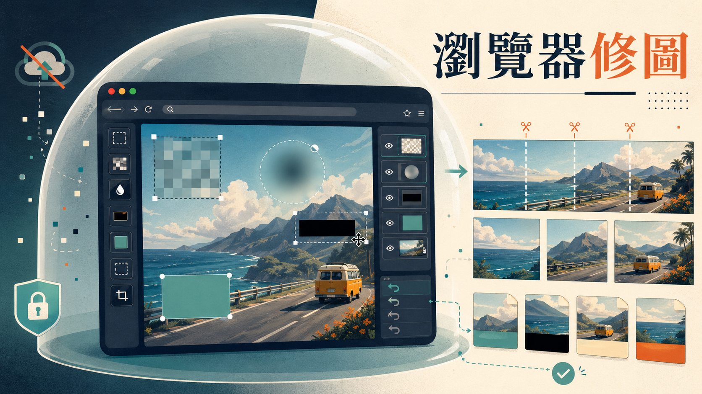

> [!info] 本文由來
> 這篇是整理自 GitHub repo 的 commit 歷史、原始碼，以及開發過程中的 Codex CLI session 紀錄，由 Claude Code 協助結構化成文章後審稿發布。
>
> - GitHub repo, [JasChiang/image-tool](https://github.com/JasChiang/image-tool)
> - Codex CLI session 紀錄，2026-04-16
>
> 文章開頭的 hero 圖由 **Codex CLI 內建的 image_gen 工具**生成（OpenAI gpt-image-2 模型）。

## 起因

處理截圖是一件很日常的事，要貼到文件或分享給別人之前，常常需要把畫面上的某些資訊遮起來，帳號、手機號碼、訊息內容之類的。

現有的工具大多有幾個問題，要嘛要下載桌面軟體，要嘛要把圖片上傳到某個服務，後者的隱私疑慮讓我一直不太舒服。所以就起了自己做一個的念頭，條件很簡單，**純前端、不上傳、可以直接丟到 GitHub Pages**。

## 主要功能

工具分成兩個模式，編輯和切版。

**編輯模式**做的是局部遮蔽。可以一次載入多張圖片，在圖上拖曳框選要遮蔽的區域，選完後套用效果。效果有四種可選，馬賽克、模糊、黑條、純色遮蓋，也可以調整強度或顏色。選區清單會列在側邊，可以單獨刪除或全部清除。

除了遮蔽之外，也做了幾個基本變形，裁切、旋轉、水平垂直翻轉。還有原圖比較的切換，可以隨時看遮蔽前後的差異。

輸出格式支援 PNG、JPEG、WebP，可以設定品質，也可以把所有載入的圖片一次打包成 ZIP 下載。

**切版模式**是後來加的功能。可以在圖片上加橫線和直線，把圖片切成若干區塊，再把切片打包成 ZIP 下載，主要用途是把長截圖切成社群發文用的分割圖。

## 開發過程

整個 repo 一共七個 commit，可以從紀錄看到工具從無到有的過程。

第一個 commit `Create mosaic image editor` 是最初的版本，只有馬賽克功能。第二個 commit `Add image slicing tool` 加入了切版分頁。接著 `Configure Pages deployment` 設定好 GitHub Actions 自動部署到 Pages。

之後的幾個 commit 都是在打磨細節，`Improve slicing workspace controls` 改善了切版操作的體驗，`Add adjustable workspace and grid sizing` 讓工作區和格線大小可以調整。`Fix mosaic file reload and stepwise undo` 修了重新載入檔案時的 bug，也讓復原功能變成逐步的，每次操作都可以單獨回退。

最後一個 commit `Expand static image editor workflow` 把整體的 UI 流程整合得更完整，把之前的散件串在一起。

## 技術選擇

整個工具只用了三個 devDependency，Vite、TypeScript、playwright-core（用來做 e2e 測試）。沒有 React、沒有 Vue，沒有任何 UI 框架。

圖片處理全部靠 Canvas API，馬賽克的做法是把選區分成 cell，對每個 cell 取像素平均色再填回去，模糊則是用 Canvas 的 `filter: blur()`，都是瀏覽器原生支援的能力。

工具邏輯用 `EditorTool` 介面統一，每個工具都實作 `apply` 和可選的 `applyBatch`，`apply` 處理單一選區，`applyBatch` 處理同一張圖的多個選區，讓批次套用效果可以只 draw 一次圖。控制器層負責選區管理、undo/redo 狀態、UI 綁定，工具本身保持純粹，只管怎麼算出一張 canvas。

這樣的架構讓加新工具很容易，只要實作 `EditorTool`，控制器那邊一行就可以掛進去。README 裡也提到未來可以往筆刷選取、多邊形選取、社群尺寸模板的方向擴充。

## 心得

整個工具幾乎是跟 Codex CLI 一起做的，我負責需求，它負責實作。但最有趣的不是「AI 幫我寫了程式碼」這件事，而是整個開發過程裡幾個讓我印象很深的片段。

**一個讓人誤以為是 GitHub Pages 問題的 bug**

工具上線之後，我注意到馬賽克功能偶爾會失效，選了區域、按下套用，什麼都沒發生。重新整理頁面之後，重新上傳同一張圖，又好了。這個症狀讓我直覺懷疑是 GitHub Pages 免費方案的問題，某種靜態服務的限制或快取問題。

把問題描述給 Codex 之後，它很快指向一個完全不同的地方，`<input type="file">` 沒有在每次選完後清空 `value`。瀏覽器的行為是，如果你選了一個檔案、關掉視窗、再重選同一個檔案，`change` 事件根本不會再觸發。失敗之後重選同一張圖，就像什麼都沒做一樣。

這個 bug 和 GitHub Pages 完全無關，是純前端邏輯問題。但它製造的症狀，刷新之後就好了、用不同圖片就正常，很容易被誤解成平台或環境的問題。Codex 對到真正的原因之後，一行修正就解掉了，commit `676d73c`。

**「功能要考量的是，這個只能架設在免費的 GitHub Pages 上」**

這是我在那個對話裡說的一句話，後來變成整個開發方向的核心限制。

我問 Codex 除了馬賽克和切版以外還能加什麼，它列了一份清單，去背、浮水印、文字標記、臉部自動遮蔽…功能很多，但每一個建議後面它都會自己加一句，「這個完全適合 GitHub Pages 的純前端模式」，或是「這個要注意，前端實作會比較重」。

這個限制，不能有後端、不能讓圖片上傳到任何地方，反而讓工具的設計非常集中。最後加進去的裁切、旋轉、翻轉、多格式匯出、批次 ZIP，全部都是純 Canvas API 就能做到的事。沒有一個功能需要後端，沒有一張圖片會離開瀏覽器。

**UI 全面重寫那一次**

在逐步復原做完之後，我請 Codex 通盤考量 UI/UX 可以怎麼調整。它回了一份蠻完整的分析，把目前幾個互動問題點出來，選取狀態和已套用歷史混在一起、選區只有數字沒有列表、套用中沒有鎖定防止重入。

我的回應大概是，「直接都幫我做完，如果功能會變得太複雜，你可以完全改造 UI」。

它就真的重寫了。從單一工具面板改成左側工具區、右側多圖縮圖列加主畫布的結構，一次可以載入多張圖，在縮圖列切換，批次下載 ZIP。選區從計數器變成有座標和尺寸的清單，每一筆都可以單獨刪除。所有這些全部在一個 session 完成，commit `b17b1e6`。

這種「整體升級」的方式，比「逐步加功能」有效很多。重新設計一次的結果，比在舊 UI 上一直加開關，最終得到的東西更一致。

## 結語

[image-tool](https://jaschiang.github.io/image-tool/) 現在已經部署在 GitHub Pages，不需要安裝任何東西，用瀏覽器開就能用。圖片不離開本機，隱私上可以放心。

如果你也常需要處理截圖，可以試試看。
