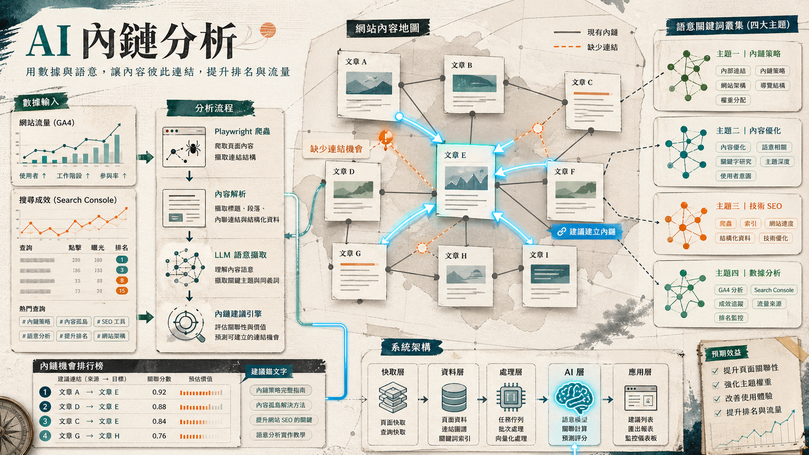

> [!info] 本文由來
> 這篇是我整理開發 `internal-link` 這個內部工具的過程與設計思路，由 Claude 協助結構化成文章後審稿發布。
>
> 原始開發紀錄建立於 2025 年底。
>
> 文章開頭的概念圖是用 **Codex CLI 內建的 image_gen 工具**生成。

## 起因

做內容 SEO 很常遇到一個問題，文章寫了很多，但彼此之間的內部連結（internal link）幾乎是空的。

內鏈對 SEO 很重要，一方面讓 Google 更容易爬取站內頁面，另一方面能把流量在站內導流，讓讀者從一篇文章連到相關文章或商品。

問題是，站內文章一多，要人工去找「這篇文章應該連到哪些頁面」根本做不完。你需要知道站內有哪些文章、哪些商品、哪些關鍵字跟當前文章相關，全靠人腦記憶和搜尋效率非常低。

於是我用 vibe coding 的方式，直接打造一個工具來解決這個問題。

## 主要功能

這個工具做的事情，拆開來看有三塊。

**第一塊，找出值得優化的文章。** 先接 GA4 和 Google Search Console 的 API，撈出最近一段時間的文章流量、點擊、曝光、排名數據。再用一套排序演算法幫文章打分，分成三類，高流量、有潛力、需要改善，讓你知道要從哪些文章開始優先補內鏈。

**第二塊，分析文章缺少哪些連結機會。** 選定一篇文章後，工具會用 Playwright 爬取文章內容，同時記錄文章裡現有的內部連結。接著把文章丟給 LLM，提取具有語意關聯的關鍵詞，分成產品、品牌、技術規格、延伸主題四類，並給出信心度分數。

**第三塊，推薦可以連結的站內頁面。** 根據提取到的關鍵詞，搜尋站內相關文章和商品，最後生成一份連結建議清單，包括建議連結的位置（錨文字）、對應的目標頁面，以及推薦原因。

## 開發過程

整個專案用 monorepo 結構，用 pnpm workspaces 管理三個套件，後端用 Express + TypeScript，前端用 Next.js 14，中間再抽一個 `@internal-link/shared` 放共用型別定義。

提交紀錄不多，但每一次都是跳躍式的進展。初始 commit 完成基礎架構後，緊接著補上商品搜尋與推薦、前端顯示調整，然後大幅強化了 GA4/GSC 的文章分類邏輯和建議行動（action suggestions），最後一次提交則集中在關鍵詞提取的優化和爬蟲穩定性。

整個流程基本上是，遇到什麼問題就解決什麼，沒有事先規劃非常完整的 spec，而是邊做邊長。

### 從空目錄開始設計

這個工具在動工前，目錄是完全空的。我先用 Claude 做了一輪完整的架構設計，把功能需求、站內頁面結構、技術考量全部整理成一份設計文件，讓 AI 輸出建議的技術棧、模組切分、API 設計、資料流程，然後再整批交給 Claude Code 實作。

這樣做的好處是，一開始就把「需要解決什麼」想清楚，後面實作時要調整的地方少很多。架構設計文件本身也成了後續 prompt 的 context，讓 AI 在每次對話都能對齊同一套設計語言。

### LLM prompt 演進

開發過程花最多時間的地方之一是 LLM prompt 設計。

最初只是很直白地叫模型「提取關鍵詞」，但效果不好，模型常常只列出文章裡字面出現的詞，缺乏語意層次。

後來重新定義任務，要模型扮演 SEO 內容分析師，不只提取文章裡出現的詞，更要推論讀者的潛在需求和延伸閱讀興趣。關鍵詞分成四類，產品名稱、品牌、技術規格、延伸主題，每個關鍵詞都要給出信心度分數，並且排除文章裡已經有連結的部分。加入了明確的分類規則和正反例，效果才穩定下來。

這個演進過程讓我意識到，對 LLM 下任務就像對工讀生交辦事情，「提取關鍵詞」跟「扮演 SEO 分析師，照這四個維度分析，輸出 JSON 格式」，產出的品質差距非常大。

### Playwright 踩坑

爬蟲部分，選 Playwright 而非 cheerio 等靜態 parser，是因為站內頁面有動態渲染的部分，直接抓 HTML 拿不到完整內容。

但 Playwright 在不同頁面結構下的穩定性需要反覆調整。早期版本遇到的問題是，某些頁面會先回傳骨架 HTML、內容再非同步填入，`page.waitForSelector` 可以抓到元素，但文字還沒進來。後來換成 `waitForLoadState('networkidle')` 搭配指定選擇器的雙重等待策略，才把這個問題消掉。

加上 SQLite 快取（24 小時 TTL）之後，重複分析同一篇文章的速度才變得可以接受，不用每次都重新跑一遍 Playwright。

爬蟲本身也加了請求節流，每次呼叫之間隨機等待 1 到 3 秒，最大並行數限制在 2，避免短時間大量請求讓對方伺服器有壓力。

## 技術選擇

幾個關鍵技術選擇值得記錄一下。

**LLM 呼叫用 OpenRouter** 而不是直接打某家廠商 API。好處是可以彈性切換模型，不被單一服務商綁住。目前主要用 Claude Haiku 和 Gemini Flash，成本低、速度快，適合關鍵詞提取這種「需要大量呼叫、但不需要最強模型」的場景。如果哪天需要更高品質的分析，只要改一個 model 字串就能換模型，不用動其他程式碼。

成本控制也是用 OpenRouter 的原因之一。除了選輕量模型，分析時也會把文章截斷到合理長度，只送必要的上下文給 LLM，不用每次都傳整篇全文。

**快取用 SQLite** 而不是 Redis 或其他外部服務。這是個刻意的選擇，工具目前是內部使用、單機部署，SQLite 夠用、零運維成本、部署也簡單，不需要額外起一個 Redis 服務。快取資料表設計上記錄了爬取時間和 TTL，到期自動重新爬取，平時直接命中快取。

**Playwright 做爬蟲** 而不是 cheerio 等靜態 parser。站內部分頁面是動態渲染，需要執行 JavaScript 才能拿到完整內容，所以選了 Playwright。代價是速度比靜態 parser 慢，這也是為什麼快取機制不可或缺。

**前後端分離，port 各自獨立**。後端跑 9001，前端跑 9000，開發時用 `pnpm dev` 一鍵同時啟動，不用每次開兩個 terminal。前後端分離也讓 LLM API key 留在後端，不會暴露在前端。

## 心得

這個專案讓我最有感的一點是，用 AI 做架構設計和用 AI 寫程式，是兩件不同的事，但可以串在一起用。

先花時間做好需求梳理和架構設計，把各個模組的職責、介面、資料流都定義清楚，後面交給 Claude Code 實作的時候，AI 對任務邊界有清楚的理解，不用一直補充背景，出錯的地方也更容易定位。

另一個觀察是，這種工具型專案特別適合 vibe coding，因為功能邊界清楚，可以拆成很小的單元一步一步做，每一步都有明確的驗收標準，不像做產品設計那樣需要不斷調整方向。

## 結語

這個工具目前已經可以跑完整個分析流程，從輸入文章 URL 到拿到連結建議清單。

前端 UI 還沒全部完工，批量處理也還沒做，但核心的分析管道是通的。

對我來說，這個專案最有意思的地方不是工具本身有多厲害，而是用 vibe coding 的方式，一個人從零打出一個整合了 GA4、GSC、LLM、Playwright 的系統，只用了幾次提交。這件事在以前需要一個小團隊花幾個月，現在一個人用幾天就能做出可用的版本，這個效率差距才是真正值得記錄的事情。
