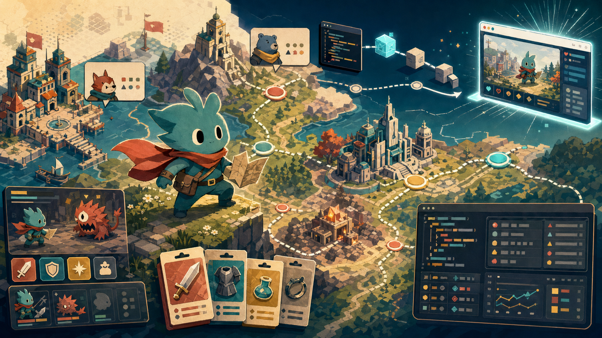

> [!info] 本文由來
> 這篇是把開發過程的 commit log 整理成文章，由 Claude Code 協助結構化後審稿發布。
>
> 原始素材（程式碼與 commit 歷史）建立於 2026 年 4 月。
>
> 文章開頭的概念圖是用 **Codex CLI 內建的 image_gen 工具**生成（OpenAI gpt-image-2 模型）。

## 起因

行銷遊戲（gamification）在品牌活動裡不是新鮮事，但通常要外包、要預算、要等廠商排期。我想試試看，用 vibe coding 的方式，自己快速做一個能跑在瀏覽器上的 RPG 原型，讓品牌吉祥物成為主角，把行銷活動的商品素材轉化成遊戲裝備，這是我所在公司的 marketing project。

需求很明確，規模刻意壓小，玩家不需要安裝任何東西，打開網頁就能玩。

## 主要功能與玩法

整個遊戲的核心概念，是把商品目錄「RPG 化」，玩家透過探索地圖、與城鎮 NPC 對話、進行回合制戰鬥，自然接觸到各類商品資訊。

主要場景包括：

- **Title（標題畫面）** — 品牌吉祥物入場動畫 + 開始按鈕
- **WorldMap（世界地圖）** — 地圖風格、多個節點構成的可步行覆蓋圖，多個品牌館別轉化為遊戲關卡，以數個大城市為主線目標
- **City（城市場景）** — Visual Novel 風格對話，城市各有劇情與 NPC
- **Battle（戰鬥場景）** — 隨機遭遇的回合制戰鬥，商品資料驅動角色能力值
- **Ending（結局場景）** — 通關後展示角色裝備總覽

商品資料、城市劇情、地圖節點、敵人屬性分別存在 `data/` 下的四支 JSON（`products.json`、`story.json`、`counties.json`、`enemies.json`），由 `GameData` singleton 在遊戲啟動時一次載入，讓所有場景共享同一份資料，不需要重複讀檔。

## 開發過程

從 commit log 看，這個專案大概分成幾個階段。

**第一階段，搭骨架。** 初始 commit 建立了 Godot 專案結構、匯入素材（品牌吉祥物去背、商品圖）、完成主場景的 idle 動畫和裝備卡渲染。這部分用 Python script 做前置處理，去背切 sprite，確保素材品質。

**第二階段，加內容。** Visual Novel 玩法最先完成，5 個城市、世界地圖、對話樹、結局場景一起進來。這時候遊戲已經可以「通關」了，雖然還沒有戰鬥。

**第三階段，做地圖。** 把平面的城市清單換成真正可以走動的覆蓋地圖，多個節點、路線連線、各館別 flavor text，視覺感瞬間差很多。同時加入了走路動畫和 HUD 圖示。

**第四階段，加戰鬥。** 回合制戰鬥引入後，整個「RPG」的感覺才完整起來。隨機遭遇、敵人資料表、傷害計算都在這一輪實作。

**最後，清理。** 移除了 README 裡不適合出現在 public repo 的人員聯絡資訊。

整個從零到可玩，大概是 11 個 commit 的跨度。

## 技術選擇

**為什麼用 Godot 4？**

主要考量是，Godot 4 的 Web 匯出可以輸出標準 HTML/JS/WASM，不需要後端，靜態檔案直接托管。GitHub Pages 免費且整合 Actions，是零成本部署的最直接選項。

一個小坑是，Godot 4 的多執行緒 web 匯出需要瀏覽器支援 `SharedArrayBuffer`，而 GitHub Pages 預設不送 `Cross-Origin-Opener-Policy` header，所以要在 `export_presets.cfg` 關掉 thread，改用單執行緒模式。這個設定如果沒調好，遊戲會在瀏覽器直接黑畫面。

**字型。** 預設的 Godot 字型不支援 CJK，中文會全部變豆腐。解法是打包 Noto Sans TC 的子集字型，從 11MB 壓到 600KB 出頭（隨著新增對話與地名，中途二次子集後最終約 620KB），確保遊戲內的中文正常顯示。

**自動部署流程。**

```
git push main
  → GitHub Actions 觸發
  → barichello/godot-ci Docker image（已含 Godot 4.3 + 匯出範本）
  → godot --headless --export-release "Web"
  → upload-pages-artifact → deploy-pages
```

每次 push 後約 1-2 分鐘上線，整個流程不需要在本機安裝任何 CI 工具。

**資料驅動設計。** 商品資料、城市設定、敵人屬性全部存在 `data/` 下的 JSON 檔案，遊戲邏輯不 hardcode 任何商品名稱。要更新商品清單，只需要換 JSON，不需要動 GDScript。`GameData` autoload singleton 在遊戲啟動時一次載入，其他場景直接用 `GameData.items` 存取，架構乾淨。

## 心得

這個專案讓我最有感的一點，是 vibe coding 在「做給自己用的工具」和「做給別人玩的東西」之間，節奏差很多。

做內部工具的時候，需求是我說了算，介面能用就好，跑起來就算完成。但做遊戲不一樣，玩家不會去看 code，他們只感受得到「好不好玩」和「畫面好不好看」。所以每做完一個場景，我自己玩過之後，往往還要再花時間調細節，例如動畫時序、對話框的出現節奏、地圖上的走路速度，這些都沒辦法靠 AI 直接給一個「正確答案」，得靠自己感覺。

素材前置處理的坑比預期多。吉祥物圖去背、切 sprite、確保每一幀的大小一致，這些看起來像是「處理完就好」的雜事，但素材品質直接影響遊戲在瀏覽器裡的觀感。一開始我以為 Python script 跑完就能直接用，但跑出來的素材有邊緣鋸齒、尺寸不統一的問題，前後多做了幾輪調整。

資料驅動的設計決定讓後期很省力。一開始把商品資料、城市設定、敵人屬性都抽到 JSON 的時候，感覺像是在做多餘的事，但後來要更新商品清單、調整城市劇情的時候，完全不需要去動 GDScript，直接改 JSON 然後推上去就上線了。這個模式值得繼續用在同類專案。

## 結語

這個專案讓我確認了一件事，Godot 4 在「快速做出可跑在瀏覽器的遊戲原型」這個場景，是非常實用的工具。加上 GitHub Actions CI/CD，從有想法到有連結可以分享，門檻比想像中低很多。

行銷遊戲的設計挑戰，不在技術，而在如何讓遊戲機制和品牌資訊自然結合，讓玩家在玩的過程中接受資訊，而不是感覺在被強迫看廣告。這個原型還有很多可以繼續做的方向，排行榜、更多姿勢動畫、手機觸控優化，但 MVP 已經驗證了技術可行性。
