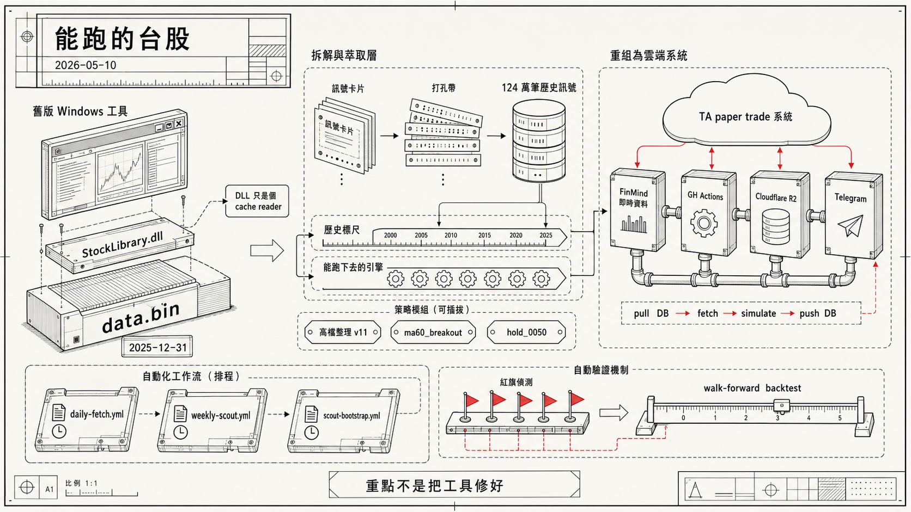

> [!info] 本文由來
> 這篇是我 2026/05/10 一晚跟 Claude Code 對話蓋出來的個人專案 `skyrocket-py` 的開發過程整理。session 紀錄在 `~/.claude/projects/`，整個 build 從晚上六點到凌晨一點，最後合計 17 個 git commits、23 個 CLI 指令、約 3700 行 Python。整理成這篇文章是想記錄一下「拿到一個半成品工具，怎麼決定不要硬用、改成自己重蓋」的判斷流程。
> 
> 文章開頭的概念圖是用 **Codex CLI 內建的 image_gen 工具**生成。

## 起頭，一份停在 12/31 的台股工具

朋友前幾天傳給我一個 Windows app 叫 SkyrocketSimulator，說作者寫得不錯，叫我可以拿來試試看。我打開資料夾看了下，主程式 + 一支 358KB 的 `StockLibrary.dll` + 一個 800MB 的 `data.bin`。光看大小就知道，這份 `.bin` 才是這套工具的核心，DLL 是表演用的殼。

實際打開來跑，介面也算清楚，有六套作者私房策略 (底部季線突破 / 高檔整理 v11 / 整理起漲 v1 / 大盤抄底 / 持有元大台灣 50 / 底部月線突破)，有資金分配、有風控、有 paper trade。然後我做了第一件「好像很無聊但其實很重要」的事，**我去看 data.bin 的最後一筆 K 棒是哪一天**。

```
2025-12-31
```

今天是 2026/05/10。**這份「分析工具」的資料停在 4 個多月前**。再看 file mtime，作者 2026/3/29 確實有手動更新過一次，但那次只是「把資料推進到 12/31」就沒下文了。

當下我只有一個念頭，**這套東西不能拿來當下選股**。它能告訴我的最新訊號永遠是 2025/12/31 那天的，等於拿著 4 個月前的舊報紙下單。

但策略架構看起來還是有東西，多策略並聯 + 三條帳戶層級警報線 (空方波段 / 日 KD 死叉 / 週 KD 死叉) 強制清倉這個風控設計挺乾淨。我想搞清楚作者怎麼想的，然後自己做一套**接即時資料**的版本。

## 第一個關鍵發現，作者的演算法不在 DLL 裡

我用 ilspycmd 把 `StockLibrary.dll` 拆開看，全部 200 多個 `.cs` 檔案，沒做混淆，命名都很乾淨。`StockLibrary.TradingCore.Strategies` 命名空間下有十幾個策略類別，看起來資訊量很豐富。

然後我打開最重要的那個 `OperationStrategy.cs`，找到 `CalculateRating` 方法，這應該是「這檔股票今天該打幾分」的核心邏輯。

```csharp
public virtual double CalculateRating(StockData sd, int idx)
{
    return -1.0;
}
```

每一個策略子類別 override 出來的 `CalculateRating` 也都長這樣，全部 `return -1.0`。

我愣了一下才反應過來。**作者的真實演算法根本不在發布的 DLL 裡**。DLL 只是個 cache reader。真正的 `Rating` 是 `data.bin` 裡某個 `PreCalculateTable` 早就算好寫進去的，DLL 只是讀出來顯示。

換句話說，作者的工作流程是這樣的，

1. 作者在自己機器上有一支沒釋出的「批次計算工具」，跑作者私房演算法
2. 把全市場 2,234 檔股票 × 7 套策略 × 6,000 個交易日的訊號全部算出來
3. 連同 OHLCV、除權息、減資資料一起包進 data.bin (約 800MB)
4. 把 data.bin + 一個只會 lookup 的 DLL 一起發布

**所以即使我把這份 DLL 完整拆開來看，也拿不到作者的真實打分公式**。我只能拿到他預先算好的「結果」，無法拿到「過程」。

我選擇兩條路同時走，

### 路 1，先把 cache 解出來

至少把作者過去 25 年的歷史訊號都撈出來，**之後當參考**。

### 路 2，自己用標準 TA 重寫

按照「策略名字」對應的標準台股技術派做法，用 pandas + 公開 indicator library 重寫。**不假裝是作者的版本**，誠實標示為「TA-baseline」。

這兩條路可以同時做，撈出來的作者訊號是「歷史標尺」，自己重寫的策略是「能跑下去的引擎」。對照之後我就會知道我寫的這套跟作者差多少。

## 把 data.bin 的格式還原

`CommonDataManager.cs` 裡有完整的 binary read 邏輯。.NET 的 `BinaryReader` 規格我不熟，查了一下，

- `ReadString` 是 7-bit-encoded varint length prefix + UTF-8
- `ReadInt32` / `ReadInt64` 是 little-endian 固定 byte 數
- `ReadDouble` 是 8 byte IEEE-754
- `ReadBoolean` 是 1 byte

整個 data.bin 的 layout 反推出來是這樣的，

```
Header
  date_count: i32
  dates[]:    i32 (yyyymmdd 格式)
  next_date_count: i32
  next_dates[]: i32

每一檔 stock data
  ts:   string (varint length-prefixed UTF-8)
  name: string
  type: char   (Stock=0 / ETF=1 / Index=2)
  
  daily_count + 36 bytes/筆 OHLCV
  dividend_count + 24 bytes/筆 除權息
  cap_reduction / par_value_change / etf_split / trading_halted (各種事件)
  
  pre_table_count
  for each strategy:
    strScreen, strOperation: string
    pre_data_count
    for each day:
      check:  bool (1 byte)     ← 是否觸發 BUY
      rating: f64  (8 bytes)    ← 打分
      ExtraPreCalculateTableRead 客製欄位 (大部分策略沒, 整理起漲 v1 有一個 1 byte bitmask + N doubles)
```

寫成 Python parser，用 `struct.unpack` 把整個 800MB 走一輪。我以為要跑很久，**結果 30 秒就解完了**。124 萬筆訊號全部抽出來，存進一個 130MB 的 SQLite，分類成 31 檔股票 × 7 套策略 × 平均 5,750 天。

最後一個交易日 (2025/12/31) 整個 universe 只有一個 BUY 訊號，**2330 高檔整理 v11，rating 0.6445**。

那一刻我發現，作者的這份 cache 真的很有用，**就算我自己策略還沒寫，光有作者的歷史訊號當 reference 就夠開始驗證了**。

## Python 端的架構決策

接下來是真正的工程部分。我有幾個選擇要做。

### 資料源，FinMind 免費版 vs 升級

FinMind 免費版限制 600 req/hr，**還權後價** (`TaiwanStockPriceAdj`) 是付費 endpoint，我們只能用 raw price (`TaiwanStockPrice`)。

代價是除權息日會出現「人工跳空」，指標會誤判。但對「相對比較」沒影響 (我跟作者用同一份 raw 資料)，paper trade 階段先這樣跑。

升級費用是 NT$699/月，年費約 NT$8,400。對我目前 NT$10 萬的 paper 階段是 8% 的本金純成本。**先不付**。

### 排程，本地 cron vs GH Actions vs Cloudflare Workers

我家 Mac 不可能 24/7 開著，本地 cron 排除。Cloudflare Workers 雖然跟我已經在用的 R2 整合最自然，但 Workers free tier 單次執行只有 30 秒，付費版也只有 5 分鐘，weekly scout 的全市場掃描根本塞不下。

最後選 GH Actions。**免費版 private repo 2,000 分鐘/月**，daily fetch 1 分鐘 × 22 個工作日 + weekly scout 100 分鐘 × 4 = 大約 422 分鐘/月，用量約 21%，**還有大餘裕**。

### DB 持久化，commit 回 repo vs Cloudflare R2

GH Actions runner 是 ephemeral 的，跑完就銷毀。資料庫必須存在外面。

把 SQLite commit 回 git repo 是最簡單做法，但 5MB DB 每天 push 一次，一年 git history 會炸到 2GB。**過度污染**。

最後用 Cloudflare R2，免費 tier 10GB 對 5MB DB 是無限期免費。每天 GH Actions 的流程是「pull DB → fetch → simulate → push DB」，整個資料庫就在 R2 上維持單一真相。

### 通知，Telegram 單向推

我選 Telegram 而不是 LINE，原因是 LINE Notify 已經停服，LINE Bot 設定比 Telegram 麻煩很多。

安全模式上有個重要設計，**bot 只發訊息，從不接收**。我跟 ChatGPT 那種會回覆對話的 bot 不同，這個 bot 的程式碼**根本不去讀** incoming messages。

意思是別人就算搜到我的 bot username 主動跟它對話，那些訊息會在 Telegram 上堆著但我的程式從不去看，等同丟進垃圾桶。chat_id 是寫死的，發訊息只會發給我。**單向推播本身就是最強的安全模式**，不需要驗證身份、不需要白名單、不需要密碼。

## 自動化的三條 workflow

最後落地的 GH Actions 是這個結構，

```
daily-fetch.yml      cron 每平日 17:30 (台灣時間)
  ├─ pull DB from R2
  ├─ FinMind 抓今日 K
  ├─ simulate-day (paper trade 模擬)
  ├─ 跑訊號 + metrics + health check
  ├─ push DB 回 R2
  └─ 推 Telegram 每日報告

weekly-scout.yml     cron 每週日 19:00 (台灣時間)
  ├─ 掃 1,000 檔高流動性股票
  ├─ 跑全部策略, 找 score >= 60 的候選
  └─ 推 Telegram 週候選清單

scout-bootstrap.yml  workflow_dispatch 手動觸發
  ├─ 一次性, ~4.5 小時
  ├─ 全市場 2,718 檔抓 60 天 OHLCV
  ├─ 按平均 turnover 排序, 留 top 1,000
  └─ 寫進 R2 上的 scout_universe.json
```

訊號這邊用三套，

- **底部季線突破** (`ma60_breakout`)，從 MA60 下方反彈站上
- **高檔整理 v11** (`vcp_consolidation`)，BB 收斂 + 線性回歸 R² 低 + 突破前高
- **持有 0050** (`hold_0050`)，長期趨勢跟蹤 + KD 死叉退場

每天的 Telegram 訊息長這樣，

```
📊 每日訊號 | 2026-05-08
📈 +1.23% · vs 0050 -0.45% · DD -2.1% · 勝率 67%

🟢 進場訊號 (明日開盤執行)
  • 0050 持有 0050 分數=100 收盤=97.00

📁 持倉, (空手)

💰 帳戶
  現金,    100,000
  總值,    100,000  (+0  +0.00%)
```

## 自動驗證機制，紅旗偵測

這是我在最後一兩個小時加上去的，**避免「賺錢沒賺錢」這種錯誤的問題框架**。

短期內的 P&L 數字幾乎沒有統計意義，但你看到正報酬會自我感覺良好，看到負報酬會手癢改參數。所以我加了一個 metrics 模組，自動跑八條紅旗規則，

| 條件 | 紅旗 |
|---|---|
| 跑 30 天以上 vs 0050 落後 5%+ | 📉 策略可能沒 alpha |
| 最大回撤 > 10% | ⛔ 警報沒擋住 |
| 回撤比 0050 多 3%+ | ⚠️ 風控失效 |
| 交易頻率 > 10 筆/週 | 🔥 門檻太鬆 |
| 3 週 0 交易 | 🥶 門檻太緊 |
| 連續 5 筆虧損 | 📛 策略失靈 |
| 勝率 < 40% 且 R/R < 1.5 | ⚠️ 期望值不利 |
| 一檔股票佔 70%+ 交易 | 🎲 集中度過高 |

紅旗會自動出現在每日 Telegram 訊息底部。沒紅旗就繼續忽略，有紅旗才回去看數字。

我用過去 2 個月歷史回測驗證系統，結果讓我笑出來，

```
期間 2026/03/02 - 05/08:
  總值 +2.65% (看似正向)
  vs 0050 同期 +20.7% (我們落後 18%)
  集中度 0050 佔 83% (等於只在賭一檔)
  
2 條紅旗自動觸發 ✅
```

如果沒有這個 health check，我可能會看到 +2.65% 覺得「策略 work」，**實際上是輸大盤一截**。系統自己抓到了問題。

## walk-forward backtest，找到作者的 alpha 在哪

最後我做了一件最有趣的事。把作者的 124 萬筆 BUY 訊號和我自己的訊號都丟進 walk-forward backtest，計算「**買進後 5/10/20/60 天的真實報酬**」，含真實滑價 + 手續費 + 證交稅 (約 0.78% round-trip)。

跑出來最重要的一條，**作者的 alpha 全部集中在「高檔整理 v11」**，

```
高檔整理 v11 (作者版本):
  689 個訊號 (大樣本)
  60 天勝率: 63.4%
  60 天平均報酬: +7.77%
  
其他策略:
  持有 0050: 60d 勝率 52% / +2.14%   (普通)
  底部季線突破: 60d -1.23% / 13 筆樣本太少 (基本沒 edge)
  ETF 波段 / 持有元大台灣 50 正 2: 0 訊號
  作者實際在用的就是高檔整理 v11
```

而我的版本對照下來，

```
我的 vcp_consolidation: 60d 勝率 51% / 平均 +4.85%
  → 訊號量只有作者 13% (92 vs 689), 命中作者的訊號 0.3%
  → 條件太嚴, 但我抓到的訊號跟作者抓的不太重疊
  → 1 個月 paper 跑完, 應該鬆綁參數靠近作者

我的 hold_0050: 60d 勝率 62% / +4.19%
  → 比作者好 (作者 52% / +2.14%)
  → 因為我加了 MA120 趨勢過濾, 把作者「永遠 BUY」的雜訊過濾掉
  → 不要動

我的 ma60_breakout: 60d +2.79%
  → 兩邊都不好, 沒 edge
  → 1 個月後直接拿掉這套
```

這個結果讓我重新校正期待，**不是「作者厲害我不厲害」，而是「不同策略各自有不同程度的 edge，混合使用會比照搬作者更好」**。我的 hold_0050 反而比作者好，是因為我用 MA120 趨勢線把雜訊過濾掉了。

## 跟使用 Claude Code 的關係

整個 build 全程用 Claude Code 對話。Claude 寫了大部分的 Python，我做的事只有，

1. 在每個架構決策點告訴它我的偏好 (例如不要 commit DB 回 repo, 不要 Mac 依賴, 用 Telegram 不用 LINE)
2. 看到結果不對的時候提供反饋 (例如 bot 還沒收 chat_id, R2 chat_id 變成空字串, Markdown 被底線 break, 0050 同期顯示 -33% 是 raw price 沒還權的偏誤)
3. 處理需要登入帳號的部分 (Cloudflare 註冊、GitHub Secrets、Telegram BotFather)

Claude 表現比較好的部分，

- 一旦給定 spec，把整個 binary parser 寫對
- 知道要用 R2 而不是直接 commit (我提的, 但它一聽就懂)
- 主動提醒「不要過度反應小樣本」「驗證標準應該是 vs 0050 而不是絕對報酬」這種反直覺但對的觀念
- 寫完後主動建議寫 `CLAUDE.md` 給未來其他 LLM session 看

不太好的部分，

- 第一次傳 token 時要寫進 .env，被 harness 安全機制擋下來，我得自己 paste
- 不時會 over-engineer (例如我說「順便加個 OTC 支援」它把整個 universe property 重構成「動態載入所有 sub-list」)
- 過度禮貌，每隔幾個 commit 都要說「真的真的真的收工了」結果繼續被 user 拖去做新東西

整體來說，這種「**有清楚目的、邊界明確、需要量大的 plumbing code**」最適合 vibe coding。我大概省了 80% 的時間。如果是傳統做法，光是把 binary parser 寫對 + 對齊 + debug 大概就要 1 整天。

## 接下來要做的事

```
[現在 - 1 個月]   什麼都不做, 看每天 Telegram, 紅旗冒出來才回去看
[1 個月]          第一次 review, 跟 Claude 說「看看績效」
                 有紅旗就調參數, 沒紅旗就繼續跑
[3 個月]          第二次 review, 開始有統計意義
[6 個月]          決策點, 切真錢 or 不切
                 切真錢就把 config.trading.auto_execute 改 false
                 從那天起 Telegram 只發訊號, 我自己去券商下單
                 下完單跑 trade-buy CLI 回報給系統
[1 年+]          完整年度績效回顧
```

整套系統 push 在 `skyrocket-py` (private repo)，code 大約 3,700 行 Python，跑在 Cloudflare R2 + GitHub Actions + Telegram 三個免費服務上，月固定支出 NT$0。

## 結語

開始之前我以為「拿到作者的工具但資料 stale」是個問題，做完發現**真正的問題是作者沒釋出他的真實演算法，DLL 只是個 cache reader**。

知道這點之後，整個專案的定位也清楚了，**這不是「Python 版作者工具」，而是「以作者命名框架為起點，自己寫的 TA paper trade 系統 + 跟作者歷史訊號比對校準的工具」**。

最後讓我比較有信心的不是任何一個策略本身，而是這套**自動驗證機制 + 紅旗偵測 + walk-forward backtest**。它讓我可以放心讓系統跑 1-3 個月，期間不需要每天看績效自我驚嚇，等真的有問題它會主動告訴我。

剩下要做的就是等。等 1 個月後手機提醒「跑了 30 天，紅旗 X 條，建議 Y」，那時候再決定要不要動策略、要不要切真錢。

如果你也有一份「半成品工具」想拿來用但發現它資料 stale 或者邏輯黑箱，這套思路或許能參考。**重點不是把工具修好，而是想清楚你真正需要的是什麼，再決定要不要重做**。
