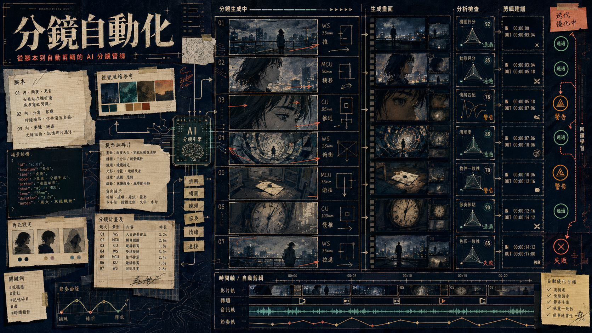

> [!info] 本文由來
> 這篇是我整理自己在開發 storyboard-system 這個工具的過程與心得，由 Claude 協助結構化成文章後審稿發布。
>
> 原始素材建立於 2025 年初，持續開發迭代至 2026 年。
>
> 文章開頭的概念圖是用 **Codex CLI 內建的 image_gen 工具**生成。

## 起因

在 [[vibe-coding-tools|Vibe Coding 工具盤點]] 那篇，我有提到分鏡圖系統排在第五個。這篇是更深入的單篇紀錄。

做這個工具的起因很直接，我需要拍短影音，但每次從「想法」到「能給製作方看的分鏡腳本」之間，都要花掉大量時間。傳統流程是先寫文字腳本、再手畫或用 Figma 排分鏡、再找人生成圖，光這段就很耗神。

所以我想用 AI 把這條管線接起來，輸入「這支影片要拍什麼」，剩下的讓工具幫我處理。

## 主要功能

系統分成四個階段，對應專案的四個頁面。

**階段一，分鏡腳本生成**

透過 OpenRouter 呼叫 Claude Sonnet，輸入故事大綱後生成結構化的 JSON 分鏡腳本。每個鏡頭包含場景描述、運鏡指示、對話、時長，以及 `renderLane`、`productionRisk`、`deliveryIntent` 等 production-ready 欄位。

比較特別的是**參考圖 AI 系統**，可以上傳角色、商品或環境圖，AI 會自動識別並在生成提示詞時注入 `<CharacterName>` 標籤，確保整部影片的角色外觀一致，不會因為 prompt 措辭不同就跑偏。

**階段二，一致性圖片生成**

用 Fal AI 的 Nano Banana Pro 模型逐場生成靜態分鏡圖。支援 Image-to-Image，可以把參考圖直接帶進去做風格固定。支援 16:9、9:16、1:1 三種比例與 1K/2K/4K 解析度，批次生成並內建自動重試。

**階段三，AI 影片生成**

目前接了兩個模型，Kling 2.6 Pro 和 Seedance 1.5 Pro，都走圖生影（Image-to-Video）確保鏡頭間的視覺延續。內建 20+ 種運鏡與動作提示詞輔助，包含 Zoom、Pan、Tilt 等常見鏡頭語言。

**階段四，Gemini 分析與 Blender 匯出**

這段是整個流程的尾聲。用 Gemini 2.0 Flash 分析生成的影片，自動標記每個鏡頭的最佳入點與出點，並建議轉場和調色效果。接著輸出一份 Blender 5.0 的 Python 腳本，執行後自動把所有素材組裝到 VSE（Video Sequence Editor）時間軸，加好轉場，連算圖都可以 headless 跑。

## 開發過程

整個系統是用 **Vibe Coding** 方式建的，也就是用 Claude Code 輔助開發，大部分程式碼由 AI 生成，我負責定義需求、驗收行為、調整架構方向。

從 commit 記錄可以看到幾個明顯的演化脈絡。

### 圖片生成模型的更替

早期主力是 Fal AI 的 nano banana pro，在開發過程中換成了 **GPT Image 2**（透過 fal.ai 的 `openai/gpt-image-2` 端點呼叫，不是直接打 OpenAI API）。這個決策有個小插曲，我當時問 Claude 說「GPT Image 2 官方承認跨 session 會 drift，這條打不贏 nano banana pro 嗎」，結果 Claude 引用了一篇 apidog 的第三方文章，被我逼問出處後才承認來源不是官方，查了 OpenAI Cookbook 才確認正確的做法。後來乾脆在 code 裡做了 `VISIBLE_IMAGE_MODELS` 白名單，把 nano banana pro 預設隱藏，沒有特別指定一律走 GPT Image 2。

GPT Image 2 有個和 nano banana pro 不一樣的參數系統，不是填 width/height 就好，而是要符合「邊長是 16 的倍數、長邊不超過 3840、長寬比不超過 3:1」這些限制，超出去 fal 的 API 會直接回 422。後來寫了一個 `toGptImage2ImageSize()` 函式統一換算，把 `aspectRatio`（16:9、9:16、1:1）加 `resolution`（1K/2K/4K）的組合自動轉成合法的像素尺寸。

### 角色庫的一致性踩坑

這是整個系統裡最反覆調整的部分。

最初的做法是上傳角色的多個視角（正面、側面、四分之三等），每張圖上傳的時候各自呼叫一次視覺模型分析，生成各自的 `identityCore` 和 `mustKeepFeatures`。問題是，每次分析都是獨立的，Gemini 沒辦法跨視角對照，導致正面視角說「左眼藍色、右眼綠色」，四分之三視角描述出來的左右就搞反了。角色庫裡如果同時有角色的 5 個視角加商品的 2 個視角，湊起來就是 7 張參考圖，觸發了「超過 3 張衝突 reference」的邏輯，反而什麼都送不進去。

後來的解法是把分析流程改成**批次單次呼叫**，所有視角一起送進 Gemini，讓它一次輸出一份 canonical 身份描述，per-view 的角度差異另外補充。同時把 `identityCore` 和 `mustKeepFeatures` 從每個 view 裡面提升到 CharacterLibraryItem 的頂層，後續生成時優先讀頂層的 canonical 版本，向下相容舊資料。

另一個坑是提示詞裡的 CJK 文字曾經被 hard filter 靜默丟掉，因為某段程式碼假設 identityCore 一定是英文。加了一道翻譯層，中文描述先翻英文再注入，翻不了就 fallthrough 直接用原文。

### 影片生成的 reference-to-video 切換

影片生成一開始只有「起幀圖生影片」，就是先生靜態分鏡圖，再把圖餵給 Kling 2.6 做 image-to-video。後來接了 Seedance 2.0 和 Kling O1 的 reference-to-video 模式，差別在於可以直接把多張角色參考圖一起送進去，不需要先有一張分鏡圖，模型自己從 reference cluster 推斷視覺一致性。Seedance 2.0 最多接 9 張，Kling O1 最多 7 張。

切換過程中我問了一句「為什麼你不是用 reference 跑？」才發現某個生成路徑根本沒走到 reference 模式。翻了程式碼才確認，reference 模式需要明確傳 `referenceImageUrls`，但當時的 UI 沒有把 scopedRefs 收集進去。

提示詞的結構也調整過，Seedance 的最佳實踐是「不要描述圖裡已經看得到的靜態外觀，只描述應該怎麼動」，這和圖片生成的邏輯完全反過來。圖片生成要把角色描述得越詳細越好，影片生成如果還在提示詞裡重複描述外觀，反而會干擾模型，浪費 token。

### 一致性驗證器的加入

跑了幾個真實專案之後，我發現純靠眼睛看結果是否一致太慢了，特別是批次生成十幾個鏡頭的時候。於是加了一個 `SceneConsistencyReport` 型別，每個 scene 可以掛一份機器分析報告，用 Gemini 2.0 Flash 對生成結果和原始參考圖做比對，輸出 `pass / warn / fail` 分級加差異描述。這個設計讓工程層面可以加 blocker，強迫你在出錯的鏡頭修好之前不能繼續生後面的影片。

晚期的迭代還集中在**工程品質補強**，引入 structured API error envelope、LLM usage log、API 路由統一的 error 處理。這些對 vibe-coding 出來的系統格外重要，因為 AI 生成的程式碼往往在 error handling 最隨便，要另外花力氣補。

## 技術選擇

技術選型對齊我慣用的 stack，沒有為了新穎而新穎。

| 層次 | 選擇 | 原因 |
|------|------|------|
| 框架 | Next.js 15 + App Router | API Routes 與前端同 repo，本機跑不需要部署 |
| 語言 | TypeScript 5 | 複雜的 JSON 結構需要型別保護 |
| 狀態 | Zustand + LocalStorage | 簡單、持久化不需要後端 |
| 資料庫 | SQLite (better-sqlite3) | 本機工具不需要雲端 DB |
| AI 圖片 | `@fal-ai/client` SDK | 官方 SDK 的 error handling 比直接打 REST 好處理 |
| AI 影片 | Fal AI (Kling / Seedance) | 目前品質與價格的平衡點 |
| 腳本 | OpenRouter → Claude | 彈性切換模型，不綁死單一 provider |
| 影片處理 | fluent-ffmpeg | 本機音軌合成、旁白混音 |

LocalStorage 做持久化這件事，算是 vibe-coding 工具的典型選擇，因為部署成本為零。但資料量一大就需要考慮遷移，這個系統後來加了 SQLite 就是因為專案多了之後 localStorage 開始不夠用。

圖片模型的選擇上，GPT Image 2 和 nano banana pro 的核心差異在於，GPT Image 2 有語意理解能力，可以根據文字指令做 inpainting（mask 合成），nano banana pro 則在 4K 原生解析度和更寬的長寬比支援上有優勢。實際用下來，GPT Image 2 的 reference 模式在多角色、多商品同框時表現更穩，成為主力選擇。

## 心得

這個系統在 vibe-coding 的脈絡下有一個有趣的現象，AI 幫你生出來的程式碼本身就是在生 AI 的 prompt，所以你在 debug 的時候，有時候不確定是「程式碼的問題」還是「prompt 的問題」還是「模型這次跑歪了」。這三層同時在動，很難切開。

我的做法是盡量把 prompt 結構化，把固定的部分（角色描述、場景設定）和動態的部分（鏡頭指示、動作）分開管理，讓每次迭代可以只改一層，其他層不動。這不是什麼特別高深的原則，但在一個多模型的複雜系統裡，這個紀律很容易因為「先湊合跑起來」就放棄，後來再補很麻煩。

另一個心得是，fal.ai 的佇列在高峰期可以排到 1400 號，throughput 大約每分鐘 18-25 張，所以批次生成的等待時間完全不可預期。系統裡做了自動重試和進度輪詢，但用體驗上還是要能接受「送出去，等一下回來看」的節奏，而不是「點下去立刻有結果」。

## 結語

storyboard-system 目前對我來說是一個「堪用但還在演化」的狀態，整條管線從腳本到初剪都能跑，但每個環節還有很多可以打磨的地方。

最大的收穫不是工具本身，而是在建這個工具的過程中，對 AI 影片生成管線的邏輯有了更直接的理解，哪些環節 AI 擅長、哪些需要人工介入，寫在文件裡遠不如自己做一遍來得清楚。
