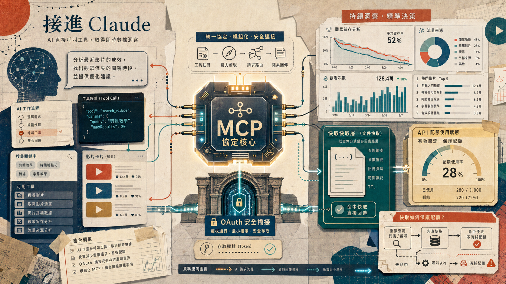

> [!info] 本文由來
> 這是一份由 **Claude Code 整理的草稿**，內容尚未經作者人工審稿，可能有不準確的地方。
>
> 整理依據，
>
> - GitHub repo, [JasChiang/youtube-analytics-mcp-server](https://github.com/JasChiang/youtube-analytics-mcp-server) 的 README（若有）、commit 歷史與原始碼
>
> 文章開頭的 hero 圖由 **Codex CLI 內建的 image_gen 工具**生成（OpenAI gpt-image-2 模型）。

## 起因

我在管理一個 YouTube 頻道，時常需要查影片表現、流量來源、搜尋字詞。過去的做法是，打開 YouTube Studio，點很多層，把數字截圖下來，再貼進 Claude 對話框問分析。

這個流程太繞了。

既然 Claude 支援 MCP（Model Context Protocol），讓 AI 直接透過工具呼叫去拿資料，為什麼不乾脆把 YouTube API 包成 MCP server，讓 Claude 自己去拿資料、自己分析？

這就是 `youtube-analytics-mcp-server` 的起點。

## 主要功能

這個 MCP server 把 **YouTube Data API v3** 與 **YouTube Analytics API v2** 包成一組 tools，Claude 可以直接呼叫。主要功能包含：

- **影片管理**，列出、搜尋、讀取影片詳細資料，以及更新標題、描述、標籤、分類
- **Analytics 查詢**，讀取單支影片或整個頻道的觀看數、留存率、流量來源
- **搜尋字詞分析**，看哪些關鍵字帶進流量
- **配額追蹤**，即時掌握當日 API 用量，避免超出每日上限

支援兩種運行模式，**stdio** 模式適合本機開發，直接在 Claude Desktop 的 MCP 設定裡啟動；**HTTP 模式** 則是把 server 部署到 Render，透過 OAuth bridge 讓 Claude.ai 的 Custom Connector 遠端接入。

## 開發過程

最早的版本（`Initial commit`）只有基本的影片列表和 analytics 查詢，用 stdio 模式跑，OAuth token 存在本機的 `.youtube-tokens.json`。

後來加了**大量搜尋**功能，然後發現一個問題，每次問「最近表現最好的影片是哪幾支」，Claude 都會去呼叫 `youtube_list_videos`，每次都消耗配額，每日 10,000 點很快就用完了。

這促成了 **Gist 快取**的設計，把影片清單快取進一個 GitHub Gist，`youtube_list_videos` 和 `youtube_search_videos` 優先讀 Gist，API 呼叫只在快取不存在或刷新時觸發。這個設計後來也和另一個工具（`ai-video-writer`）共用同一份 Gist 格式，讓兩邊資料保持一致。

再後來，我希望能在不同裝置上用 Claude.ai 查，而不是只有本機，所以把 server 改成支援遠端 HTTP 模式，加了完整的 OAuth bridge，讓 Claude connector 透過標準 OAuth 流程授權，Google refresh token 不用暴露在 Render 環境變數裡。最後用 Supabase Postgres 持久化 token，這樣 Render 重啟後 session 不會掉。

## 技術選擇

幾個有趣的決策點值得記錄。

**為什麼做成 MCP 而不是直接寫腳本接 API**

直接接 API 的腳本，每次問問題都要我手動決定要呼叫哪個 endpoint、傳什麼參數。做成 MCP server 之後，Claude 自己決定要呼叫哪個 tool、怎麼組合多個 tool 來回答問題。問「最近三個月哪支影片的流量來源最多是站外搜尋」這種問題，Claude 會自動拆成多個 tool call，這是手寫腳本很難做到的。

**Gist 快取的設計**

YouTube Data API 的配額以每日 10,000 點為上限，`list` 類操作每次消耗 1-100 點不等。Gist 快取把「哪些影片存在」這份靜態資料存進 GitHub Gist，讀取時走 GitHub API（不消耗 YouTube 配額），只有需要即時資料（analytics、留存率）時才打 YouTube API。

另一個細節，Gist 快取刻意不做 in-memory cache，每次都從 GitHub API 重新抓，原因是 MCP server 可能是多個 Claude session 共用，讓 Gist 成為唯一的 source of truth 比較乾淨，也方便其他工具（例如 `ai-video-writer`）同時寫入更新。

**OAuth bridge 而不是直接把 token 塞進環境變數**

remote 模式最直觀的做法是把 Google refresh token 放進 Render 環境變數，但這樣有兩個問題，一是 token 洩漏的風險，二是如果 token 失效（例如授權被撤銷），要重新部署才能更新。

OAuth bridge 的做法是讓 server 自己走一次 Google OAuth，拿到 token 後存進 Postgres，之後 Claude connector 拿到的是 server 自己發的 MCP token，Google token 完全不對外。Access token 到期時 server 自動用 refresh token 換新的，並回寫 store。

## 心得

（TODO 補上）

## 結語

這個 server 現在已經是日常工作流的一部分，查頻道表現、找表現差的影片、分析流量來源，全部在 Claude 對話裡完成，不用再跳去 YouTube Studio 翻資料。

MCP 的價值不只是「讓 AI 能存取更多資料」，而是讓 AI 能自主決定怎麼組合資料，回答那些原本要手動拼湊的問題。
