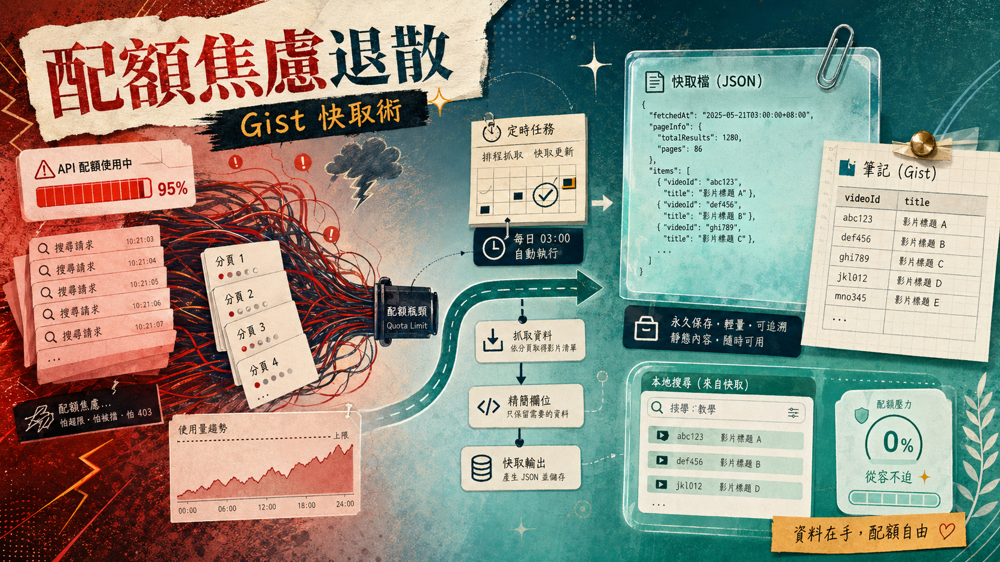

> [!info] 本文由來
> 這是一份由 **Claude Code 整理的草稿**，內容尚未經作者人工審稿，可能有不準確的地方。
>
> 整理依據，
>
> - GitHub repo, [JasChiang/youtube-analytics-simple-cache](https://github.com/JasChiang/youtube-analytics-simple-cache) 的 README（若有）、commit 歷史與原始碼
>
> 文章開頭的 hero 圖由 **Codex CLI 內建的 image_gen 工具**生成（OpenAI gpt-image-2 模型）。

## 起因

在做 YouTube 頻道後台工具的時候，有個需求很常見，就是「讓使用者在前端用關鍵字搜尋自己的影片」。

第一個直覺是直接打 YouTube Data API，輸入關鍵字，拿回結果。問題是 YouTube API 的每日配額只有 **10,000 點**，而一次 `search.list` 就要消耗 **100 點**。如果頻道有 1,500 支影片、分 30 頁取完，一次全量掃描就燒掉 3,000 點，佔單日配額的 30%。

更慘的是，如果前端每次搜尋都打 API，那配額根本撐不住一個早上。

解法不難，但要繞個彎，「把影片清單存起來，讓前端搜本地資料就好」。

## 主要功能

`youtube-analytics-simple-cache` 是一個輕量工具，核心很簡單。

- **只抓 videoId 和 title**，不多抓觀看數、標籤等欄位，壓低 Gist 檔案大小
- **每天自動跑一次**，透過 GitHub Actions 排程，不需要跑 API server
- **快取存進 GitHub Gist**，前端直接從 Gist raw URL 讀取，完全不消耗 YouTube API 配額
- **首次執行自動建立 Gist**，後續更新同一個 Gist，Gist ID 存在 GitHub Secrets 裡管理

快取格式長這樣，乾淨到不能再乾淨。

```json
{
  "version": "1.0",
  "updatedAt": "2026-01-07T08:40:00.000Z",
  "totalVideos": 1500,
  "videos": [
    { "videoId": "abc123", "title": "影片標題" },
    { "videoId": "def456", "title": "另一個影片" }
  ]
}
```

1,500 支影片大約只佔 75 KB，遠低於 Gist 的 10 MB 上限。

## 開發過程

這個 repo 從 [[ai-video-writer|ai-video-writer]] 專案裁剪出來，原本的版本功能比較多，這次只保留「快取影片清單」這條線。

開發時最花時間的不是邏輯本身，而是 OAuth token 的處理。YouTube API 需要 OAuth 2.0，access token 短暫有效，每次執行前都要先用 refresh token 換一個新的。這段流程在 Actions 裡跑沒有問題，但要讓 CI 環境也能用，就得把 `YOUTUBE_CLIENT_ID`、`YOUTUBE_CLIENT_SECRET`、`YOUTUBE_REFRESH_TOKEN` 全部存進 GitHub Secrets，啟動時再注入環境變數。

Gist 的部分也有一個小細節，第一次執行時 Gist 還不存在，腳本會自動呼叫 `POST /gists` 建立，之後就用 `PATCH /gists/:id` 更新同一個。`GIST_ID` 第一次先留空，Actions 執行完後從 log 裡複製 ID 回填到 Secrets，之後就全自動了。

## 技術選擇，為什麼是 Gist 加 Actions

有幾個替代方案當時也考慮過。

**方案一：直接存進 repo**。Actions 把 JSON commit 回 repo，前端從 raw GitHub 讀。這樣做沒問題，但每天一個 commit 會讓 git log 很吵，而且 commit 的時間點不好控制。

**方案二：用 S3 或 R2**。功能上沒問題，但要多開一個雲端服務帳號、設定 bucket、管 key，對這個小工具來說太重了。

**Gist 的優點**剛好符合這個場景，免費、有 raw URL 可以直接 fetch、不需要額外服務、PATCH 更新很容易、GitHub Personal Access Token 只要勾 `gist` 一個權限就夠。

**Actions 的排程**用 cron 設在台灣時間每天 22:40 執行（UTC 14:40），一天消耗約 3,000 點配額，剩下 7,000 點留給其他操作，配額壓力幾乎消失。前端搜尋完全從 Gist 讀取，配額消耗歸零。

整體架構就是，Actions 定時跑 Node.js 腳本，腳本呼叫 YouTube API 分頁抓完整影片清單，整理成 JSON 後 PATCH 上 Gist，前端從 Gist raw URL 讀快取，在本地做 `filter` 搜尋。

## 心得

TODO 補上

## 結語

這個工具解決的問題很具體，YouTube API 配額有限，但影片清單不需要即時性，每天同步一次就夠。用 Gist 當靜態快取、用 Actions 當排程器，幾乎零成本就把問題繞開了。

如果你也有 YouTube 頻道，需要在自己的工具裡做影片搜尋，這個架構值得參考。
